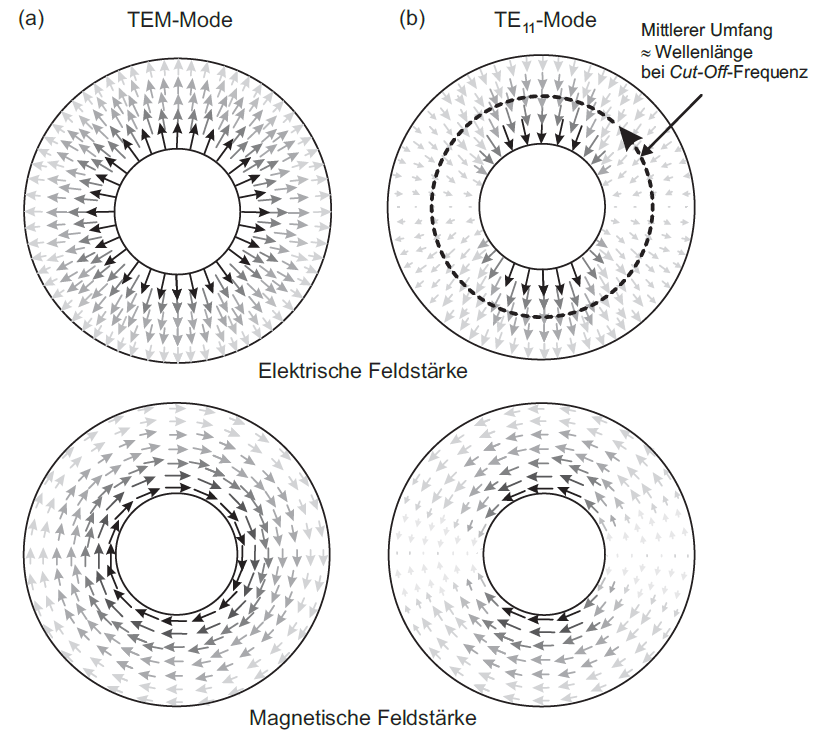

# Transversale EM-Welle

> [!info] Transversal ist der gegensatz zu Longitudal
> Beispiel: Die Schallwelle ist eine Longitudalwelle

- Sonderfall einer elektromagnetischen Welle, bei der in Ausbreitungsrichtung sowohl das [elektrische](../Elektrotechnik/Elektrisches%20Feld.md) als auch das [magnetische Feld](../Elektrotechnik/magnetisches%20Feld.md) verschwindet.
- Magnetische und elektrische Felder ausschließlich in Ebenen senkrecht (transversal) zur Ausbreitungsrichtung.
- Bildet sich als geführte Welle z. B. zwischen Außen und Innenleiter eines verlustlosen Koaxialkabels aus.
- Auch die ebene Welle ist ein Beispiel für TEM-Wellen.

