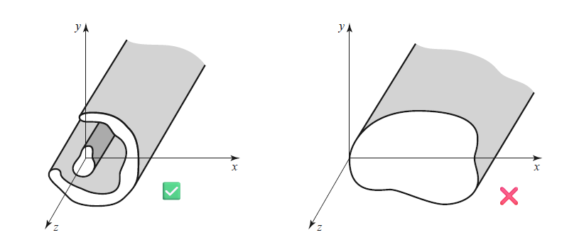

# Transversale EM-Welle

%%[🖋 Edit in Excalidraw](../_assets/Excalidraw/Transversale%20Elektromagnetische%20Welle%202025-11-15%2019.18.18.excalidraw.md)%%

- Sonderfall einer elektromagnetischen Welle, bei der in Ausbreitungsrichtung sowohl das [elektrische](../Elektrotechnik/Elektrisches%20Feld.md) als auch das [magnetische Feld](../Elektrotechnik/magnetisches%20Feld.md) verschwindet.
- Magnetische und elektrische Felder ausschließlich in Ebenen senkrecht (transversal) zur Ausbreitungsrichtung.
- Bildet sich als geführte Welle z. B. zwischen Außen und Innenleiter eines verlustlosen Koaxialkabels aus.
- Auch die ebene Welle ist ein Beispiel für TEM-Wellen.

> [!hint] Für den TEM Fall gilt:
> Die Wellengrößen zeigen normal zur Ausbreitungsrichtung. 
> 
> $$
> \begin{gather}
> \mathbf{ E } \perp \mathbf{H} \perp \hat{\mathbf{z}} \implies E_{z}=H_{z}=0 \\ \\
> \mathbf{E}=\begin{pmatrix}
> E_{x} \\ E_{y} \\ 0
> \end{pmatrix} \qquad
> \mathbf{H}=\begin{pmatrix}
> H_{x} \\ H_{y} \\ 0
> \end{pmatrix} \\
> \end{gather}
> $$
> - $k=\beta$ ([Wellenzahl](../Physik/Feldtheorie/Wellenzahl.md) = Phasenkonstante)
> - Die Richtung in die sich die Leistung bewegt ist mit dem [Poynting Vektor](HF-Technik/Poynting%20Vektor.md) gegeben:
> 
> $$
> \mathbf{S} = \mathbf{E}\times \mathbf{H} = \begin{pmatrix}
> 0 \\ 0 \\ S_{z}
> \end{pmatrix}
> $$

## Lösungen für TEM Wellen

> [!question]- Es gelten die Grundlagen der [Modellbildung](Leitergeometrie.md#Modellbildung) für Leitergeometrien
> Referenzen beachten.

Für TEM Wellen gilt, dass $\mathbf{\underline{ E }} \perp \mathbf{\underline{H}} \perp \hat{\mathbf{z}} \implies E_{z}=H_{z}=0$. Mit  (3.3a) $\overset{ H_{x} }{ = }$ (3.4b) folgt

$$
\beta^{2} E_{y} = \omega^{2}\mu\epsilon E_{y} \implies \beta = \omega\sqrt{ \epsilon\mu } = k
$$

Mit $\beta=k$ folgt, dass $k_{c}=0$. Mit $k_{c}=0$ sieht man auch, dass die Felder in (3.5) einen $\frac{0}{0}$ Ausdruck liefern, sodass nicht man nicht die Annahme trifft, dass die Felder im TEM Fall verschwinden.

> [!important] Interpretation
> Die kleinste Wellenzahl für TEM Wellen ist 0, bedeutet dass Lösungen der Wellengleichung bis zur Frequenz null gültig sind (Elektrostatik bzw. Gleichspannung).

Die Wellenausbreitung wird allgemein durch die [Helmholtzsche Differenzialgleichung](Helmholtzsche%20Differenzialgleichung.md) beschreiben:

$$
\left( \frac{ \partial^{2} }{ \partial x^{2} } + \frac{ \partial^{2} }{ \partial y^{2} } + \frac{ \partial^{2} }{ \partial z^{2} } \right) \mathbf{E} +k^{2}\mathbf{E}=0
$$

Die Feldkomponenten $E_{x}$ und $E_{y}$ ändern sich für den TEM Fall nur in $z$ Richtung ($\frac{ \partial  }{ \partial x } = \frac{ \partial }{ \partial y } = 0$). Für die [Helmholtzgleichung](Helmholtzsche%20Differenzialgleichung.md#Lösung%20der%20Wellengleichungen) gilt dann z.B. für die $E_{x}$ Komponente:

$$
\frac{\partial^{2} E_{x}}{\partial z^{2}} = - k^{2} E_{x}
$$

Eingesetzt in die Allgemeine Helmholtz DGL für die $E_{x}$ komponente

$$
\left( \frac{ \partial^{2} }{ \partial x^{2} } + \frac{ \partial^{2} }{ \partial y^{2} } \right) E_{x} = 0 \tag{3.10}
$$

Das Selbe ergebnis erhält man auch für $E_{y}$. Die beiden Feldkomponenten lassen sich wieder in den Vektor $\mathbf{e}(x,y)$ des transversalen Anteils aus der [Modellbildung](#^ANNAHMEN) zusammenfassen.

> [!success] Das Ergebnis lässt sich wieder mit dem Laplace Operator schreiben
>
> Man erhält die [Laplacegleichung](../Mathematik/Analysis/Vektoranalysis/Laplacegleichung.md) mit $\nabla^{2}_{xy} = \frac{ \partial^{2} }{ \partial x^{2} } + \frac{ \partial^{2} }{ \partial y^{2} }$ als dem Laplace Operator in zwei Transversale richtungen $x$ und $y$.
> 
> $$
> \nabla^{2}_{xy}\mathbf{e}(x,y) = 0
> $$
> 
>  Mit der gleichen vorhergehensweise erhält man für das $H$-Feld
> 
> $$
> \nabla^{2}_{xy}\mathbf{h}(x,y) = 0
> $$

Man kann erkennen, dass für beide Felder nicht nur die Wellengleichung, sondern auch die Laplacegleichung erfüllen. Die Laplacegleichung beschriebt in der Elektrostatik das Verhalten des skalaren [potenzials](../Elektrotechnik/elektrische%20Spannung.md) in Quellfreien regionen.

> [!important] Man erkennt in (3.10), dass die Zeitabhängigkeit, die in $k$ enthalten war entfallen ist.
> Mit dem Entfall der Zeitabhängigkeit kann man darauf schließen, dass diese Gleichung auch in der **Elektrostatik** gilt. Die Transversalen Felder der TEM Welle sind daher die selben wie die statischen Felder, die zwischen zwei leitern existieren.

Mit der Elektrostatischen betrachtung lässt sich erschließen, dass ein Feld nur zwischen **zwei** Leitern existieren kann. TEM Moden müssen aus zwei Leitern bestehen. In **einlieter** Modellen ist es nicht möglich, eine Elektrostatische Lösung für die Wellen zu erhalten, da das Feld innerhalb des Leiters bei Gleichspannung gleich 0 ist (Im Leiter ist überall das gleiche Potenzial).

Aus der Elektrostatik ist bekannt, dass das Elektrische Feld ein [Gradientenfeld](../Mathematik/Analysis/Vektoranalysis/Wegunabhängig.md) des skalaren Potenzials $\varphi$ ist.

$$
\mathbf{e}(x,y) = -\nabla_{xy}\varphi(x,y)\tag{3.13}
$$

mit dem [Gradienten](../Mathematik/Analysis/Vektoranalysis/Gradient.md) $\nabla_{xy} = \begin{pmatrix} \frac{ \partial }{ \partial x } \\ \frac{ \partial }{ \partial y } \end{pmatrix}$

- Das [Gaußsche Gesetz (MW3)](../Elektrotechnik/Maxwell.md) besagt $\nabla \cdot\mathbf{D} =\nabla\cdot\epsilon\mathbf{E} = \rho=0$ für ein ladungsfreies Gebiet.
- Definition des [Laplace Operators](../Mathematik/Analysis/Vektoranalysis/Laplace%20Operator.md): $\nabla\cdot\nabla = \nabla^{2}$.

 Für diesen Fall:

$$
\nabla_{xy} \cdot \epsilon\mathbf{e}(x,y) =0\implies \nabla_{xy}^{2}\varphi(x,y) = 0
$$

Außerdem gilt, dass der [Rotor eines Gradientenfeld gleich null](../Mathematik/Analysis/Vektoranalysis/Rotor.md#^S1) ist und es folgt mit MW2:

$$
\nabla_{xy} \times \mathbf{e}(x,y) = -j\omega\mu h_{z} \hat{\mathbf{z}} = 0
$$

### Feldwellenwiderstand

Aus 3.3a bzw. 3.4a lässt sich der Feldwellenwiderstand als verhältnis der Wellenamplituden berechnen:

$$
\begin{align}
Z_{\text{TEM}} &= \frac{E_{x}}{H_{y}} = \frac{\omega\mu}{\beta} = \sqrt{ \frac{\mu}{\epsilon} } = \eta \\
 &= \frac{E_{x}}{-H_{y}} = \sqrt{ \frac{\mu}{\epsilon} } = \eta
\end{align}
$$

Im Allgemeinen gilt dann für TEM-Wellen der Zusammenhang:

$$
\mathbf{h}(x,y) = \frac{1}{Z_{\text{TEM}}} \hat{\mathbf{z}}\times \mathbf{e}(x,y) \tag{3.18}
$$

> [!important] Wichtig
> - Der Feldwellenwiderstand ist der selbe wie der für Ebene Wellen in einem **Verlustlosen Medium**. Diese hängen aussschließlich von den **Materialeigenschaften** ab.
> - Die charakteristische Impedanz $Z_{0}$ einer Transmissionline **ist etwas anderes**: Diese bringt eine propagierende **Spannungswelle** und die **Stromwelle** in beziehung und ist abhängig von der **Geometrie** und dem **Material**.

### Analyse von TEM-Moden

Um die Leiterkenngrößen von TEM Wellen zu ermitteln, kann folgende Herangehensweise vorgenommen werden:

1. Laplacegleichung $\nabla_{xy}^{2}\varphi(x,y) = 0$ für $\varphi$ Lösen. Die Lösung wird einige unbekannte Konstanten haben
2. Konstanten finden, indem bekannte Spannungen auf der Leitung als Randwerte eingesetzt werden.
3. $\mathbf{e}(x,y)$ aus (3.13) und $\mathbf{E}$ aus (3.1a) berechnen.
4. $\mathbf{h}(x,y)$ aus (3.18) und $\mathbf{H}$ aus (3.1b) berechnen.
5. [Spannung](../Elektrotechnik/elektrische%20Spannung.md#^DEF) $U$ aus $\mathbf{E}$ Berechnen. Strom mit dem [Amperesches Gesetz](../Elektrotechnik/elektrischer%20Strom.md#Amperesches%20Gesetz) aus $\mathbf{H}$ berechen.
6. Die charakteristische Impedanz ist gegeben durch 
$$
Z_{0} = \frac{U}{I}
$$
7. Die Ausbreitungskonstante is gegeben durch
$$
\beta = \omega\sqrt{ \epsilon\mu }
$$

---

# Allgemeine TE- TM- und TEM-Lösungen

