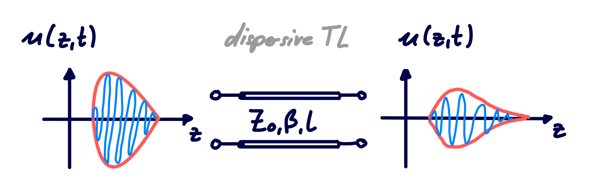

---
tags:
aliases:
  - Lossy Line
  - Heaviside Bedingung
keywords:
  - Heaviside Bedinugng
subject:
  - VL
  - Grundlagen der Hochfrequenztechnik
semester: WS25
created: 4th February 2026
professor:
  - Reinhard Feger
release: false
title: Verlustbehaftete TL
---

# Verlustbehaftete Transmission Lines

> [!question] [Verlustlose TL](Verlustlose%20TL.md), [Transmission Line](Transmission%20Line.md)

## Eigenschaften von Verlustbehafteten TL

- **Dämpfung**: Die Leistung der Welle auf der Leitung wird gedämpft
- **Dispersion**: Ein Signal mit verschiedenen Frequenzanteilen wird verzerrt

## Modell für Lossy TL

Gesamte Fortpflanzungskonstanten $\gamma$ muss berücksichtigt werden.

$\gamma$ lässt sich umformen auf

$$
\begin{align}
\gamma &= \sqrt{ (j\omega L')(j\omega C') \left( 1+\frac{R'}{j\omega L'} \right)\left( 1+ \frac{G'}{j\omega C'}\right)  } \\
&= j\omega \sqrt{ L'C' } \sqrt{ 1-j\left( \frac{R'}{\omega L'}+\frac{G'}{\omega C'} \right)  - \frac{R'G'}{\omega^{2}L'C'}  } \tag{1}
\end{align}
$$

Man erkennt, dass $\gamma$ stark nichtlinear mit $\omega$ zusammenhängt.

## Geringe Verluste

Für geringe verluste lässt sich $\gamma$ vereinfachen, indem der quadratische Term vernachlässigt wird.

- $R'\ll \omega L'$
- $G'\ll \omega C'$
- $\implies R'G' \ll \omega^{2}L'C'$

$$
\gamma \approx j\omega \sqrt{ L'C' } \sqrt{ 1-j\left( \frac{R'}{\omega L'}+\frac{G'}{\omega C'} \right) }
$$

Eine Weitere Vereinfachung lässt sich durch eine [Taylorreihenentwicklung](../Mathematik/Analysis/Taylorreihe.md) ermöglichen um den Wurzelterm wegzubekommen (siehe [Beispiel Wurzelfunktion](../Mathematik/Analysis/Taylorreihe.md#Beispiele)).

$$
\gamma \approx j\omega \sqrt{ L'C' } \left( 1-\frac{j}{2} \left( \frac{R'}{\omega L'} +\frac{G'}{\omega C'} \right) {\color{gray} +O(2)} \right) 
$$

Aufteilen in Real und imaginärtiel liefert wieder die form $\gamma = \alpha + j\beta$:

$$
\alpha \approx \frac{1}{2} \left( R' \sqrt{ \frac{C'}{L'} } + G' \sqrt{ \frac{L'}{C'} } \right) =\frac{1}{2}\left( \frac{R'}{Z_{0}}+G' Z_{0} \right) 
$$

$$
\beta \approx \omega \sqrt{ LC }
$$

Mit der charakteristischen Impedanz:

$$
Z_{0} = \sqrt{ \frac{R'+j\omega L'}{G'+j\omega C'} } \approx \sqrt{ \frac{L'}{C'} }
$$

> [!quote] High frequency, Low Loss Approximations for Transmissionlines

## Verzerrungsfreie Leitung

> [!question] [Dispersiv](../Elektrotechnik/Materialgesetze.md)

Für ein $\beta$ welches nicht linear mit der Frequenz zusammenhängt ($\beta \neq \mathrm{const}\cdot \omega$) wird sich auch die [Phasengeschwindigkeit](../Physik/Feldtheorie/Phasengeschwindigkeit.md) mit der Frequenz ändern, da sich $\omega$ nicht mehr kürzt in

$$
v_{p} = \frac{\omega}{\beta}
$$

Bei nicht dispersiven TL hat jede frequenz die korrekte phasengeschwindigkeit um die Form des Signals beizubehalten. Bei dispersiven TLs überholen wellen mit mit verschiedener frequenz die anderen Anteile und führt am Leitungsausgang zu einem verwaschenen signal.

### Kompensation des Effekts

Die Verlustgrößen $R'$ und $G'$ lassen sich nicht unbedingt frei wählen. Durch die Geometrie kann jedoch $L'$ und $C'$ eingestellt werden. Um die Verzerrung zu kompensieren wählt man:

> [!satz] **S)** Heaviside Bedingung
> 
> $$
> \frac{R'}{L'} = \frac{G'}{C'}
> $$

> [!hint]- Um diese Bedingung zu erfüllen, wird in der Praxis oft $L'$ erhöht, indem die Leitung bespult wird.
> Entlang der Leitung werden in bestimmten abständen serielle Spulen (loading coils) platziert
> 
> - [Bespulte Leitung - Wikipedia](https://de.wikipedia.org/wiki/Bespulte_Leitung)

In diesem fall hat die Leitung einen linearen Phasenterm bezogen auf die Frequenz und die dispersiven Effekte der Leitung entfallen. Einsetzen in (1) leifert:

$$
\begin{align}
\gamma &= j\omega \sqrt{ L'C' } \sqrt{ 1-2j \frac{R'}{\omega L'} - \frac{R'^{2}}{\omega^{2}L'^{2}} } \\
&=j\omega\sqrt{ L'C' } \left( 1-j\frac{R'}{\omega L'} \right) \\
&= R \sqrt{ \frac{C'}{L'} } + j\omega \sqrt{ L'C' } = \alpha + j\beta
\end{align}
$$

> [!hint] Keine annäherung von $\gamma$ mehr.

- $\beta = \omega \sqrt{ L'C' }$ ... Linearer zusammenhang zwischen $\omega$ und $\beta$. Daher nicht mehr dispersiv.
- $\alpha = R'\sqrt{ \frac{C'}{L'} }$ ... Keine abhängigkeit von $\omega$.

## Lastanpassung / Leitungsabschluss

Ziel der Lastanpassung ist es, so viel der Eingespeisten Leistung $P_{\text{in}}$ wie möglich an der Last $Z_{L}$ umzusetzen.

Annahme: Der Verlust ist so gering, dass $Z_{0}$ näherungsweise Real ist.

Die Strom und Spannungswellen auf der Leitung sind dann:

$$
U(z) = U_{0}^+ (e^{ -\gamma z } + \Gamma e^{ \gamma z }) \qquad I(z) = \frac{U_{0}^+}{Z_{0}} (e^{ -\gamma z } - \Gamma e^{ \gamma z })
$$

Der Reflexionsfaktor entlang der Leitung ist

$$
\Gamma(l) = \Gamma(0)e^{ -2\gamma l } = \Gamma(0) e^{ -j 2 \beta l } e^{ -j 2 \alpha l }
$$

Die Eingangsimpedanz der Leitung bei $z=-l$ ist

$$
Z_{\text{in}} = \frac{U(-l)}{I(-l)} = Z_{0} \frac{Z_{L} + Z_{0} \tanh(\gamma l)}{Z_{0} + Z_{L} \tanh(\gamma l)}
$$

> #incomplete Berechnung der Verlustleistung