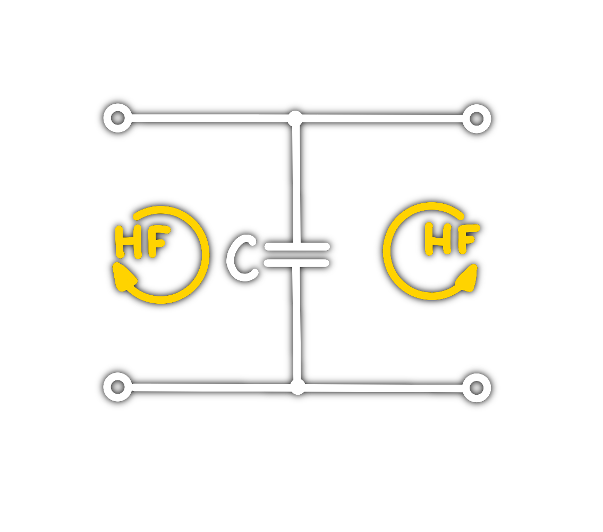

# Abblockkondensator

> [!INFO] Resonanzverlauf  
> 

Da die [Impedanz](../Elektrodynamik/Impedanz.md) eines Kondensators bis zur Resonanzfrequenz sinkt, können HF-Störungen auf Versorgungsleitungen mit Gleichsignalen oder NF-Signalen durch einen Parallelgeschalteten [Kondensator](../Elektrodynamik/Kapazität.md) (Kurzschluss-geblockt) werden.  
  
Für das NF-Signal: [Kapazität](../Elektrodynamik/Kapazität.md) ist ein Leerlauf  
Für die HF-Störung: [Kapazität](../Elektrodynamik/Kapazität.md) ist ein Kurzschluss

- Die HF Störung kann nicht in die Schaltungsteil eindringen bzw diesen verlassen.
- Störungen werden reflektiert, nicht absorbiert
	- [Reflexionsfaktor](../HF_Technik/Reflexionsfaktor.md) im Kurzschluss: $r_{KS}=-1$
	- ggf. gibt es Probleme mit Resonanzen innerhalb der Schaltung
- Versorgungsleitungen kurz halten (siehe 4-Pol [Kondensator](../Elektrodynamik/Kapazität.md) [a])
- 3-Leiter Anordnung mit 3 Kondensatoren zum KS gleich und Gegentaktsignalen [b])

# Tags

[EMV](Elektromagnetische%20Verträglichkeit.md)