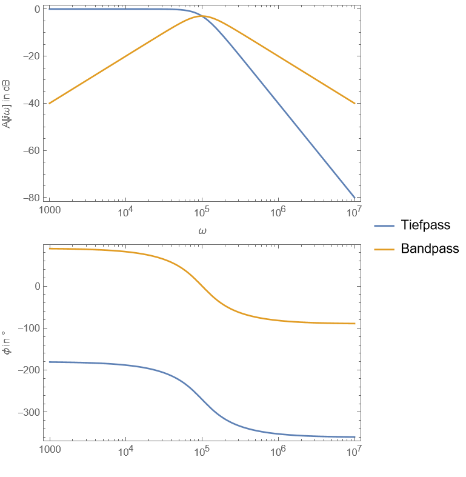
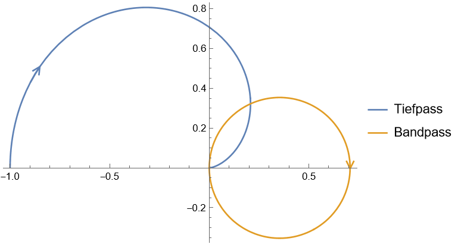

---
tags:
  - Baugruppen/Filter
  - tikz/circuitikz
aliases:
  - Tow-Thomas
  - Biquad
keywords: 
subject:
  - VL
  - Einführung Elektronik
semester: WS24
created: 13. Dezember 2024
professor:
---
 

# Biquad Filter Topologie nach Tow-Thomas

Ein Tow-Thomas Filter ist eine schaltungstechnische Realisierung eines [Integratorfilters](OPV-Integrator.md#Integratorfilter).

Dieser Filter kombiniert einen [aktiven](Aktiver%20Filter.md) Tiefpass und Bandpass 2. Ordnung.

```tikz
\usepackage[european, straightvoltages]{circuitikz}
\usepackage{amsmath}

\begin{document}
\begin{circuitikz}[thick, scale=1, font=\Large]
\ctikzset{bipole voltage style/.style={color=green}, bipole current style/.style={color=red}}
% Begin Schematic

\newcommand{\gndlvl}{-3}

\draw (0,0) node[op amp] (opvA) {$A$};
\draw (opvA.out -| 4, 0) node[op amp, anchor=-] (opvB) {$B$};
\draw (opvB.out -| 9, 0) node[op amp, anchor=-] (opvC) {$C$};

% Umkehrsummierer
\draw (opvA.+) to[short] (opvA.+ |- 0, \gndlvl) node[tlground] {};
\draw (opvA.-)
    to [vR, l_=$R_2$, *-o] (opvA.- -| -3, 0)
    to[open, v=$U_E$] (-3, \gndlvl + 0.5)
    to[short, o-] (-3, \gndlvl) node[tlground] {};
\draw (opvA.-)
    to[short, -*] (opvA.- |- 0, 2.5)
    to[R=$R_1$] (opvA.out |- 0, 2.5)
    to[short, -o] (opvA.out);
\draw (opvA.out)
    to[open, v=$U_1$] (opvA.out |- 0, \gndlvl+0.5)
    to[short, o-] (opvA.out |- 0, \gndlvl) node[tlground] {};

% Mitkopplungszweig
\draw (opvA.- |- 0, 2)
    to[short] (opvA.- |- 0, 4)
    to[R, l=$R_1$] (opvA.out |- 0, 4)
    to[short] (opvC.out |- 0, 4)
    to[short, -o] (opvC.out);

% Integrator 1
\draw (opvA.out)
    to[vR=$R$, -*] (opvB.-)
    to[short] (opvB.- |- 0, 1)
    to[C, l=$C$] (opvB.out |- 0, 1)
    to[short, -o] (opvB.out)
    to[vR=$R$] (opvC.-);
\draw (opvB.- |- 0, 1)
    to[short, *-] (opvB.- |- 0, 2.5)
    to[vR, l=$R_3$] (opvB.out |- 0, 2.5)
    to[short, -*] (opvB.out |- 0, 1);
\draw (opvB.+) to[short] (opvB.+ |- 0, \gndlvl) node[tlground] {};
\draw (opvB.out)
    to[open, v=$U_{BP}$] (opvB.out |- 0, \gndlvl+0.5)
    to[short, o-] (opvB.out |- 0, \gndlvl) node[tlground] {};

% Integrator 2
\draw (opvC.-)
    to[short, *-] (opvC.- |- 0, 1)
    to[C, l=$C$, -*] (opvC.out |- 0, 1);
\draw (opvC.out)
    to[open, v=$U_{TP}$] (opvC.out |- 0, \gndlvl+0.5)
    to[short, o-] (opvC.out |- 0, \gndlvl) node[tlground] {};
    
\end{circuitikz}
\end{document}
```

> [!info] Die einzelnen Widerstände bestimmen praktischerweise größtenteils separat die Kenngrößen $V_{0}, Q$ und $\omega_{0}$:
> 
> $$V_{0}=f(R_{2}), \quad Q = f(R_{3}), \quad \omega_{0}=f(R)$$

## Übertragungsfunktion

$$
\begin{array}{cc}
A_{BP}(j\omega) = -\dfrac{\frac{R_{1}}{R_{2}}}{1+j\omega RC\cdot \frac{R}{R_{3}}+(j\omega RC)^{2}}
\end{array}
$$

|             Bode Diagramm              |                    Ortskurve                     |
| :------------------------------------: | :----------------------------------------------: |
|  |  |

<center><a href="./Simulationen/Biquad.nb" class="internal-link">📈Mathematica Notebook</a></center>

## Funktionsweise

Zwischenspannungen können durch die einzelne Betrachtung jeder OPV Stufe ermittelt werden.

> [!question] **(A)** [Umkehrsummierer](OPV-Addierer.md) liefert $U_{1}(U_{E}, U_{TP})$
> 
> ```tikz
> \usepackage[european, straightvoltages]{circuitikz}
> \usepackage{amsmath}
> 
> \begin{document}
> \begin{circuitikz}[thick, scale=1, font=\Large]
> % Begin Schematic
> 
> \draw (0,0) node[op amp] (opv) {};
> \draw (opv.+) to[short] ++(0,-0.5) node[tlground] {};
> \draw (opv.-)
>     to [R, l_=$R_2$, *-o] (opv.- -| -3,0)
>     node[left] {$U_{E}$};
> \draw (opv.-)
>     to[short, *-*] (opv.- |- 0, 2)
>     to[R, l_=$R_1$, -o] (-3, 2)
>     node[left] {$U_{TP}$};
> \draw (opv.- |- 0, 2)
>     to[R=$R_1$] (opv.out |- 0, 2)
>     to[short, -*] (opv.out)
>     to[short, -o] ++(1,0) node[right] {$U_1$};
> 
> \end{circuitikz}
> \end{document}
> ```
> 
> $$U_{1}=-\left( \frac{R_{1}}{R_{2}}U_{E}+ \frac{R_{1}}{R_{1}} U_{TP} \right) =\underline{\underline{ -\left( \frac{R_{1}}{R_{2}}U_{E}+U_{TP} \right)}}$$


> [!question] **(B)** [Tiefpass 1. Ordnung](Aktiver%20Filter.md#Tiefpass) liefert $U_{BP}(U_{1})$
> ```tikz
> \usepackage[european, straightvoltages]{circuitikz}
> \usepackage{amsmath}
> 
> \begin{document}
> \begin{circuitikz}[thick, scale=1, font=\Large]
> % Begin Schematic
> % Begin Schematic
> \draw (0,0) node[op amp] (opv) {};
> \draw (opv.+)
>     to[short] ++(0,-1)
>     node[tlground] {};
> \draw (opv.-)
>     to [R, l_=$R$, *-o] ++(-2,0)
>     node[left] {$U_1$};
> \draw (opv.-)
>     to[short, -*] (opv.- |- 0, 1.5)
>     to[C=$C$] (opv.out |- 0, 1.5)
>     to[short, *-] ++(0,-1.5)
>     to[short] (opv.out);
> \draw (opv.-)
>     to[short] (opv.- |- 0, 3)
>     to[R, l=$R_3$] (opv.out |- 0, 3)
>     to[short] ++(0,-2)
>     to[short, -*](opv.out);
> \draw (opv.out)
>     to[short, -o] ++(1, 0)
>     node[right] {$U_{BP}$};
> 
> \end{circuitikz}
> \end{document}
> ```
> $$U_{BP} =-U_{1}\cdot \frac{R_{3}}{R}\cdot \frac{1}{1+j\omega R_{3}C}$$

> [!question] **(C)** [Integrator](OPV-Integrator.md) liefert $U_{TP}(U_{BP})$
> 
> ```tikz
> \usepackage[european, straightvoltages]{circuitikz}
> \usepackage{amsmath}
> 
> \begin{document}
> \begin{circuitikz}[very thick, scale=1, font=\Large]
> % Begin Schematic
> 
> \draw (0,0) node[op amp] (opv) {};
> 
> \draw (opv.+) to[short] ++(0,-1) node[tlground] {};
> \draw (opv.-)
>     to[short, *-] (opv.- |- 0, 2)
>     to[C=$C$] (opv.out |- 0, 2)
>     to[short, -*] (opv.out);
> 
> \draw (opv.-)
>     to[R, l_=$R$, -o] (opv.- -| -3,0)
>     node[left] {$U_{BP}$};
> 
> \draw (opv.out)
>     to[short, -o] ++(1,0)
>     node[right] {$U_{TP}$};
> 
> \end{circuitikz}
> \end{document}
> ```
> 
> $$U_{TP} = -U_{BP}\cdot\frac{1}{j\omega R C}$$