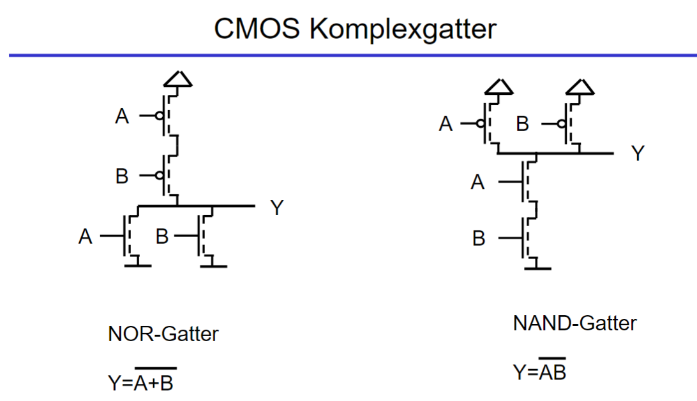
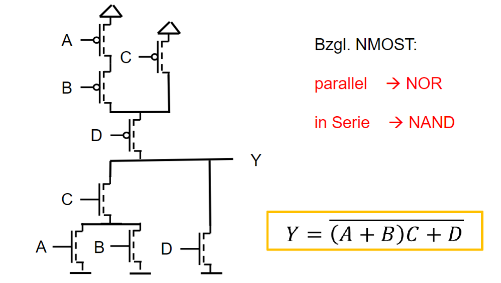

 

# CMOS

> [!SUCCESS] PMOS: macht die 1

> [!SUCCESS] NMOS: macht die 0

> [!WARNING] Fehler wenn beide Zustände gleichzeitig gelten:
> Also NMOS schaltet auf 0 und PMOS schaltet auf 1

> [!tip] nur nmos zweig (unten) betrachten
> Parallel: oder
> Seriell: und