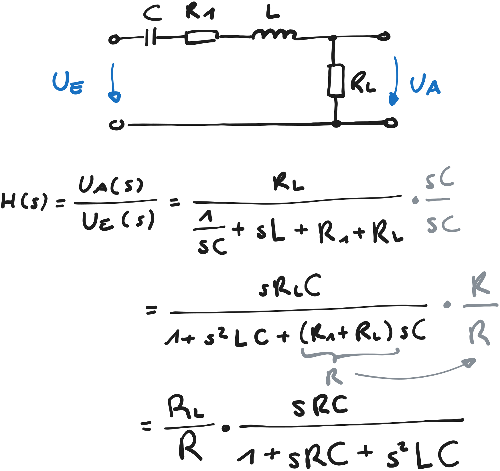

---
tags:
aliases:
keywords:
subject:
  - KV
  - Elektronische Systeme 1
  - VL
  - Einführung Elektronik
semester: WS24
created: 11. Oktober 2025
professor:
release: true
title: Bandpass
---

# Bandpass

> [!question] [Filter](Filter.md)

Ein Bandpass hat immer 2 Grenzfrequenzen und ist damit immer mindestens von 2. Ordnung

> [!info] Allgemeiner Bandpass 2. Ordnung: ^TRANSFERFUNCTION
> 
> $$
> H_{BP}(s) = \frac{V_{0}}{\frac{1}{Q} + \frac{s}{\omega_{0}} + \frac{\omega_{0}}{s}} = \frac{V_{0}\cdot \frac{s}{\omega_{0}}}{1+\frac{s}{\omega_{0}}\frac{1}{Q}+\left( \frac{s}{\omega_{0}} \right)^{2}} 
> $$
> 

**Normiertes Betragsspektrum**

Um das Betragsspektrum auf den Resonanzfall zu **normieren**, wird der Betragsgang durch $V_{0}$ und der Frequenzgang durch $\omega_{0}$ dividiert. 

-  $\Omega = \frac{\omega}{\omega_{0}}$ 
- $H'(j\Omega) = \frac{H(j\Omega)}{V_{0}}$

%%[🖋 Edit in Excalidraw](../../_assets/Excalidraw/Bandpass%202025-11-15%2017.24.56.excalidraw.md)%%

## Güte $Q$

Die Güte bestimmt die Verstärkung / Bandbreite in der Übertragungsfunktion:

- Hohe Güte: Kleine Bandbreite, große Verstärkung
- Kleine Güte: große Bandbreite, kleine Verstärkung

Notation in der Regelungstechnik oft: $Q =\frac{1}{2\xi}$

## LCR Bandpass 2. Ordnung

### Schaltung

%%[🖋 Edit in Excalidraw](../../_assets/Excalidraw/BPF-LCR.md)%%

### Resonanzfrequenz

Zur Betrachtung der Resonanzfrequenzen, wird $s = \jmath\omega$ gesetzt:

$$
H_{\text{BP}}(\jmath\omega) = \frac{R_{L}}{R} \frac{\jmath \omega RC}{1+\jmath \omega RC - \omega^{2}LC} 
$$
Zwei Möglichkeiten die Resonanzfrequenz zu ermitteln: Bei der Resonanzfrequenz $\omega_{0}$ ist

1. die Impedanz der LC Serienschaltung gleich null: $-\jmath\frac{1}{\omega_{0} C} + \jmath\omega_{0} L = 1 - \omega_{0}^{2}LC = 0$
2. der Betrag $\left| H_{\text{BP}}(\jmath\omega_{0}) \right|$ maximal ([Extremwert Aufgabe](../../Mathematik/Analysis/Extremwert.md))

Es folgt, dass 

$$
\omega_{0} = \frac{1}{\sqrt{ LC }} \quad \text{und} \quad H_{\text{BP}} (\jmath\omega_{0}) = V_{0} = \frac{R_{L}}{R}
$$

Das Normierte Betragsspektrum ist dann (noch nicht nach der Frequenz normiert)

$$
H_{\text{BP}}'(\jmath\omega) = \frac{R}{R_{L}} H_{\text{BP}}(\jmath\omega)= \frac{\jmath\omega RC}{1+\jmath \omega RC - \omega^{2}LC}
$$

### 3dB-Grenzfrequenzen

Um die 3-dB Grenzfrequenzen $\omega_{c}$ zu erhalten setzt man den Betragsgang gleich mit $\frac{1}{\sqrt{ 2 }}$ und löst die Quadratische gleichung nach $\omega$. 

### Bandbreite und Güte

> [!question] [Bandbreite](Hardwareentwicklung/Filter-Verstärker/Bandbreite.md) | [Güte](Hardwareentwicklung/Filter-Verstärker/Güte.md)