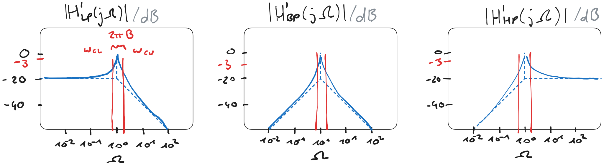

# Güte

Beschreibt, wie stark das Resonanzverhalten ausgeprägt ist.

- Güte vom [Kondensator](../../Elektrotechnik/Kapazität.md): dünnes [Dielektrikum](../../Physik/Konstanten/Dielektrikum.md) $\to$ hohe Güte
- Güte der [Spule](../../Elektrotechnik/Induktivität.md): geringer Serienwiderstand $\to$ hohe Güte

> [!hint] Bauelement mit der geringsten Güte dominiert die Gesamtgüte.
> Gute Dielektrika sind in Echt leichter zu realisieren als ein geringer Serienwiderstand in einem Draht.
> Spulen beeinflussen daher die Güte am meisten und werden deshalb vermieden, wo es möglich ist.

## Güte in Schwingkreisen

| [Serienschwingkreis](../Oszillatoren/Serienschwingkreis.md) | [Parallelschwingkreis](../Oszillatoren/Parallelschwingkreis.md) |
| :---: | :---: |
| $Q=\frac{\omega_r L}{R}=\frac{1}{R} \sqrt{\frac{L}{C}}$ | $Q=\frac{1}{\omega_{\mathrm{r}} L G}=\frac{1}{G} \sqrt{\frac{C}{L}}$ |
| $Q=\frac{1}{\omega_{\mathrm{r}} C R}=\frac{1}{R} \sqrt{\frac{L}{C}}$ | $Q=\frac{\omega_{\mathrm{r}} C}{G}=\frac{1}{G} \sqrt{\frac{C}{L}}$ |

- Für hohe Güte muss beim *Serienschwingkreis* der Widerstand $R$ möglichst *klein* sein 
- Für hohe Güte muss beim *Parallelschwingkreis* der Widerstand $R$ möglichst *groß* sein

## Güte in Filtern

Bei Filtern ab 2. Ordnung kann an der Resonanzfrequenz eine überhöhung auftreten. Ist das der Fall, definiert man

- $\omega_{0}$ ... Resonanzfrequenz
- $\omega_{\mathrm{c,upper}}$ ... Obere $3\mathrm{dB}$ Grenzfrequenz
- $\omega_{\mathrm{c,lower}}$ ... Untere $3\mathrm{dB}$ Grenzfrequenz

Die Güte ist dann

$$
Q = \frac{\omega_{0}}{\omega_{\mathrm{c,upper}}-\omega_{\mathrm{c,lower}}}
$$

Normierte Betragsspektren mit $\Omega = \frac{\omega}{\omega_{0}}$

%%[🖋 Edit in Excalidraw](../../assets/Excalidraw/Q-B-Filter-2O.md)%%

In diesen Betragsspektren ist auch der Zusammenhang mit der definition der [Bandbreite](Hardwareentwicklung/Filter-Verstärker/Bandbreite.md) zu sehen