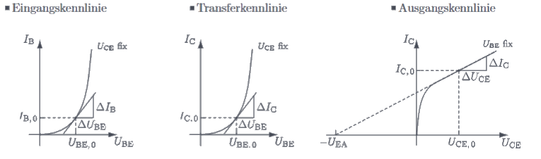

---
tags:
  - tikz/circuitikz
aliases:
  - Kleinsignalverhalten
  - KSESB
keywords: 
subject:
  - VL
  - Einführung Elektronik
semester: WS24
created: 18. November 2024
professor:
---
 

# Kleinsignalverhalten von BJT

> [!info] Kleinsignal Ersatzschaltbild (KSESB) eines Bipolartransistors
>
```tikz
\usepackage[european]{circuitikz}
\usepackage{amsmath}

\begin{document}
\begin{circuitikz}[thick, scale=1.5, font=\Large]

% Begin Schematic

\draw (0,0) to[I, i_<=$S\cdot u_{BE}$] (0,2);
\draw (2,0) to[R, l=$g_{EA}$, i_<=$i_C''$] (2,2);
\draw (-2,0) to[R, l=$r_{BE}$] (-2,2);

\draw (0,2) to[short, i<=$i_C'$] (2,2);
\draw (2,0) to[short, -*] (0,0);
\draw (0,0) to[short] (-2,0);

\draw (-1, 0) to[short, *-o, i=$i_E$] (-1, -1);
\draw (-2,2) to[short, -o] (-4,2);
\draw (4,2) to[short, o-*, i_=$i_C$] (2,2);

\node[right] at (4, 2) {$C$};
\node[left] at (-4, 2) {$B$};
\node[below] at (-1, -1) {$E$};


% Voltage Arrows

\draw (4, 2) to[open, v^=$u_{CE}$, voltage/bump b=7] (-1, -1);
\draw (-4, 2) to[open, v=$u_{BE}$, voltage/bump b=5] (-1, -1);

\end{circuitikz}
\end{document}
```


Beim Kleinsignalverhalten von [BJT](Bipolartransistor.md) wird die Transistorgleichung am Arbeitspunkt linearisiert.


#tikz/todo:

```tikz
\usepackage{pgfplots}
\usepackage{tikz}
\usepackage{amsmath}
\pgfplotsset{compat=1.16}

\begin{document}

\begin{tikzpicture}


% BJT Parameter

\newcommand{\IS}{1e-15}
\newcommand{\UT}{26e-3}
\newcommand{\B}{100}

% Kennlinien

\newcommand{\IC}[1]{\IS*(exp((#1)/\UT)-1)} % IC(UBE)
\newcommand{\IB}[1]{\IC{#1}/\B} % IB(UBE)

% Arbeitspunkt

\newcommand{\UCEAP}{5}
\newcommand{\UBEAP}{0.7}
\newcommand{\IBAP}{\IB{\UBEAP}}
\newcommand{\ICAP}{\IC{\UBEAP}}

\newcommand{\rBE}{\UT/\IBAP}

% Eingangskennlinie
\begin{scope}
\newcommand{\Ymax}{0.000015}
\begin{axis}[
    axis lines = left,
    xlabel = $U_{BE}$,
    ylabel = $I_{B}$,
    xtick={\UBEAP}, ytick={\IBAP},
    xticklabels={$U_{BE,0}$},
    yticklabels={$I_{B,0}$},
    ymin = 0,
    ymax = \IBAP*3,
    xmin = 0,
    xmax = 1.1,
    x = 3cm,
    title = $\Large\text{Eingangskennlinie}$
]

\addplot [
    restrict y to domain=0:{\Ymax},
    domain=0:\UBEAP+.1, 
    samples=100,
    color=red,
]
{\IB{x}};

\addplot[mark=*, mark size=1.5pt, color=red] coordinates {(\UBEAP, \IBAP)};

\addplot[
    restrict y to domain=0:{\Ymax},
    color=green,
    domain=0:\UBEAP,
    samples=100
]
{\IBAP+(x-\UBEAP)/\rBE};

\end{axis}
\end{scope}

% Transferkennlinie
\begin{scope}[xshift=5cm]
\newcommand{\Ymax}{0.0015}
\begin{axis}[
    axis lines = left,
    xlabel = $U_{BE}$,
    ylabel = $I_{C}$,
    xtick={\UBEAP}, ytick={\ICAP},
    xticklabels={$U_{BE,0}$},
    yticklabels={$I_{C,0}$},
    ymin = 0,
    ymax = {\ICAP*3},
    xmin = 0,
    xmax = 1.1,
    restrict y to domain=0:{\Ymax},
    x = 3cm,
    title = $\Large\text{Transferkennlinie}$
]

\addplot [
    domain=0:\UBEAP+0.2, 
    samples=100, 
    color=red,
]
{\IC{x}};

\end{axis}
\end{scope}

% Ausgangskennlinie
\begin{scope}[xshift=10cm]
\begin{axis}[
    width=12cm, height=8cm,
    xlabel={$U_{CE}$ [V]}, ylabel={$I_C$ [mA]},
    xmin=0, xmax=10, ymin=0, ymax=10,
    xtick={0,2,4,6,8,10}, ytick={0,2,4,6,8,10},
    grid=both,
    legend pos=north east, legend style={font=\small},
    axis lines=middle,
    enlarge x limits=false, enlarge y limits=false,
    title = $\Large\text{Ausgangskennlinie}$
]

% Plot for different I_B values

\addplot[domain=0:10, samples=100, thick, blue] {0.5*(1-exp(-3*x))}; \addlegendentry{$I_B = 0.5$ mA}
\addplot[domain=0:10, samples=100, thick, red] {1.0*(1-exp(-3*x))}; \addlegendentry{$I_B = 1.0$ mA}
\addplot[domain=0:10, samples=100, thick, green] {2.0*(1-exp(-3*x))}; \addlegendentry{$I_B = 2.0$ mA}
\addplot[domain=0:10, samples=100, thick, orange] {4.0*(1-exp(-3*x))}; \addlegendentry{$I_B = 4.0$ mA}

\end{axis}
\end{scope}

\end{tikzpicture}

\end{document}
```



$$
\begin{array}[b]{|c|c|c}
\text{Linearisierung der} &
\text{Linearisierung der} &
\text{Linearisierung der} &
\\
\text{Eingangskennlinie} &
\text{Transferkennlinie} &
\text{Ausgangskennlinie} &
\\
\begin{aligned}
\left.\frac{\partial I_{\mathrm{B}}}{\partial U_{\mathrm{BE}}}\right|_{\mathrm{AP}}&=\frac{1}{r_{\mathrm{BE}}} \approx \frac{\Delta I_{\mathrm{B}}}{\Delta U_{\mathrm{BE}}}\\ \\
\Rightarrow r_{\mathrm{BE}} & =\left.\frac{\partial U_{\mathrm{BE}}}{\partial I_{\mathrm{B}}}\right|_{\mathrm{AP}} \\
& =\underbrace{\left.\frac{\partial U_{\mathrm{BE}}}{\partial I_{\mathrm{C}}}\right|_{\mathrm{AP}}}_{\frac{1}{S}} \cdot\underbrace{\left.\frac{\partial I_{\mathrm{C}}}{\partial I_{\mathrm{B}}}\right|_{\mathrm{AP}}}_{\approx B}
\end{aligned}
&
\begin{aligned}
\left.\frac{\partial I_{\mathrm{C}}}{\partial U_{\mathrm{BE}}}\right|_{\mathrm{AP}}&=S \approx \frac{\Delta I_{\mathrm{C}}}{\Delta U_{\mathrm{BE}}} \\ \\
&=\frac{1}{U_{\mathrm{T}}} \underbrace{I_{\mathrm{S}} e^{\frac{U_{\mathrm{BE}, 0}}{U_{\mathrm{T}}}}}_{\approx I_{\mathrm{C}, 0}} \approx \frac{I_{\mathrm{C}, 0}}{U_{\mathrm{T}}} \\ \\ \\
\end{aligned}
&
\begin{aligned}
\left.\frac{\partial I_{\mathrm{C}}}{\partial U_{\mathrm{CE}}}\right|_{\mathrm{AP}}&=g_{\mathrm{EA}} \approx \frac{\Delta I_{\mathrm{C}}}{\Delta U_{\mathrm{CE}}} \\ \\
&=\frac{I_{\mathrm{C}, 0}}{U_{\mathrm{CE}, 0}+U_{\mathrm{EA}}} \\ \\ \\ \\
\end{aligned} \\  \\
 
\boxed{ r_{\mathrm{BE}} \approx \frac{B}{S} }
& \boxed{ S\approx \frac{I_{C,0}}{U_{T}} }
& \boxed{ g_{\mathrm{EA}}= \frac{I_{C,0}}{U_{CE,0}+U_{EA}} }
\end{array}
$$


> [!important] Diese Kleinsignal-Größen heißen:
> 
> $r_{B E}\dots$ Basis-Emitter-Kleinsignalwiderstand in $\Omega$
> $S\dots$ Steilheit in S (Siemens)
> $g_{E A}\dots$ Early-Leitwert in S
> 

Die Kleinsignal-Stromverstärkung $\beta=\frac{\partial I_C}{\partial I_B}$ ist wegen der fast linearen Stromsteuerkennlinie näherungsweise gleich der Gleichstromverstärkung $\beta \approx B$. In Datenblättern wird $B$ oft $h_{21}$ oder $h_{F E}$ genannt. Dabei bedeutet $h$ Element der Hybridmatrix, $F$ Betrieb in Vorwärtsrichtung (forward) und $E$ [Emitterschaltung](Kollektorfolger.md).

> [!important] Die Kleinsignalspannungen und -ströme werden im Folgenden klein geschrieben
> $$ \Delta U_{\mathrm{BE}}=u_{\mathrm{BE}}, \quad \Delta I_{\mathrm{B}}=i_{\mathrm{B}}, \quad \Delta U_{\mathrm{CE}}=u_{\mathrm{CE}}, \quad \Delta I_{\mathrm{C}}=i_{\mathrm{C}} $$

und werden durch folgende Zusammenhänge im KSESB miteinander verknüpft:

$$
\begin{gathered}
u_{\mathrm{BE}}=r_{\mathrm{BE}}\cdot i_{\mathrm{B}}  \\
i_{\mathrm{C}}' \approx S\cdot u_{\mathrm{BE}}=\beta \cdot i_{\mathrm{B}}, \quad i_{\mathrm{C}}''=g_{\mathrm{EA}} \cdot u_{\mathrm{CE}}, \quad i_{\mathrm{C}}=i_{\mathrm{C}}'+i_{\mathrm{C}}''  \\
i_{\mathrm{E}}=i_{\mathrm{B}}+i_{\mathrm{C}}
\end{gathered}
$$
