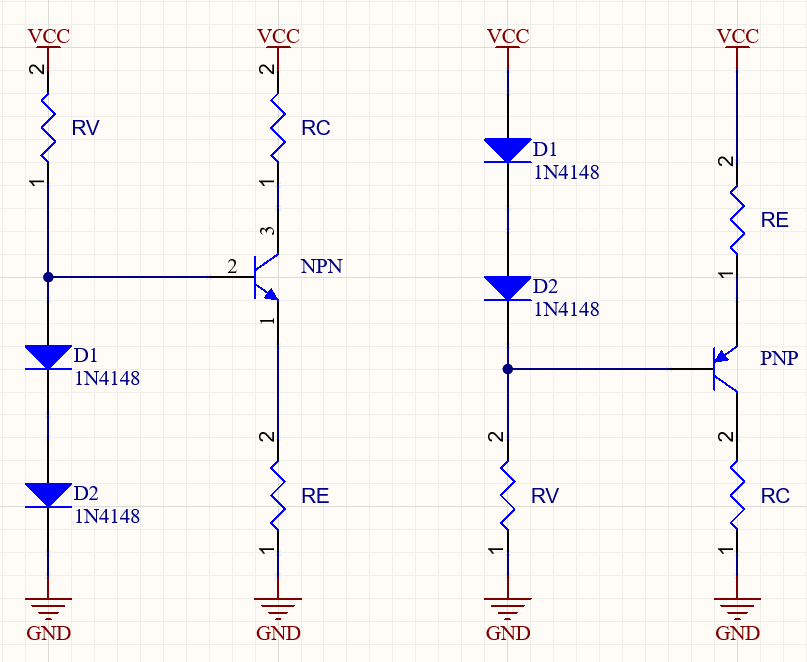

---
tags:
  - Baugruppen/Schalter
  - Baugruppen/Verstärker
  - Halbleiter/BJT
aliases:
  - Bipolartransistor
  - Bipolar Transistor
  - BJT
  - bipolar junction transistor
subject:
  - hwe
source:
  - Michael Offenhuber
  - Siegbert Schrempf
created: 24th March 2022
---

# Bipolartransistor als Schalter

| NPN                                | PNP                                |
| ---------------------------------- | ---------------------------------- |
|  |  | 

#
# Bipolartransistor als Verstärker / Endstufe

| Betriebsarten                                                                                                                       | Kennlinie                                          |
| ----------------------------------------------------------------------------------------------------------------------------------- | -------------------------------------------------- |
| > [A-Betrieb](A-Betrieb.md)  [B-Betrieb](B-Betrieb.md)  [AB-Betrieb](AB-Betrieb.md)  [C-Betrieb](C-Betrieb.md) |  |

# Bipolartransistor als Konstantstromquelle

Der Kollektorwiderstand $R_{C}$ ist hierbei die Last.

> [!SUMMARY] Berechnung des Emitterwiderstands $R_{E}$  
> $$R_{E}\approx \frac{U_{D_{1}}+U_{D_{2}}-U_{BE}}{I_{C}}$$

> [!SUMMARY] Berechnung des Konstant-Stroms $I_{C}$  
> $$I_{C}\approx \frac{U_{D_{1}}+U_{D_{2}}-U_{BE}}{R_{E}}$$

> [!SUMMARY] Berechnung des maximalen Lastwiderstands
> 		$$R_{C,max}= \frac{U_{B}-U_{RE}}{I_{C}}\qquad $$

[Stromspiegel](../Stromversorgungseinheiten/Stromspiegel.md)  
[Konstantstrom-Zweipol](Konstantstrom-Zweipol.md)

# Tags

- [Transistor_als_Schalter_intro](../assets/pdf/Transistor_als_Schalter_intro.pdf)
- [Wikipedia - Endstufe](https://de.wikipedia.org/wiki/Endstufe)
- [EK - BJT Betribsarten](https://www.elektronik-kompendium.de/sites/slt/0303311.htm)