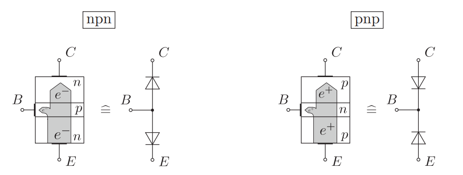
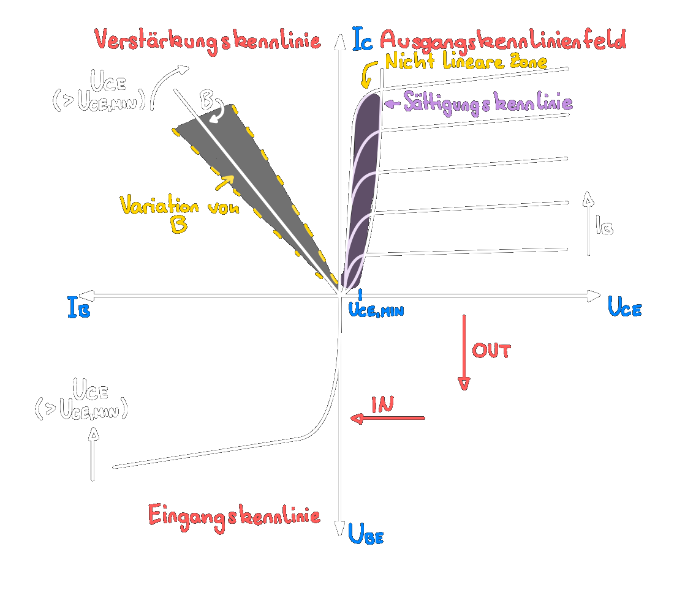
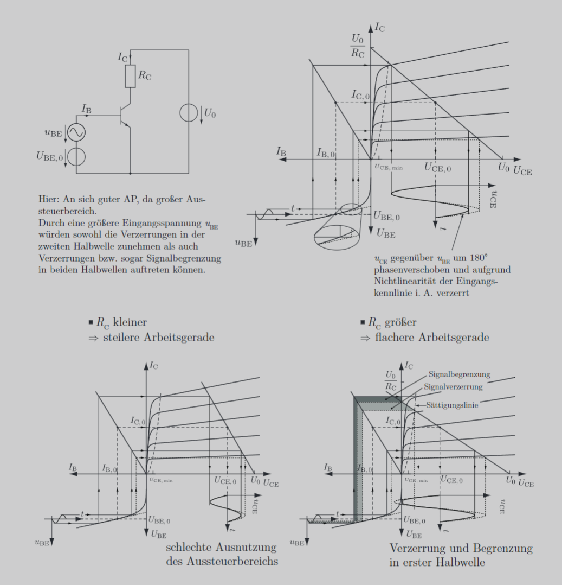
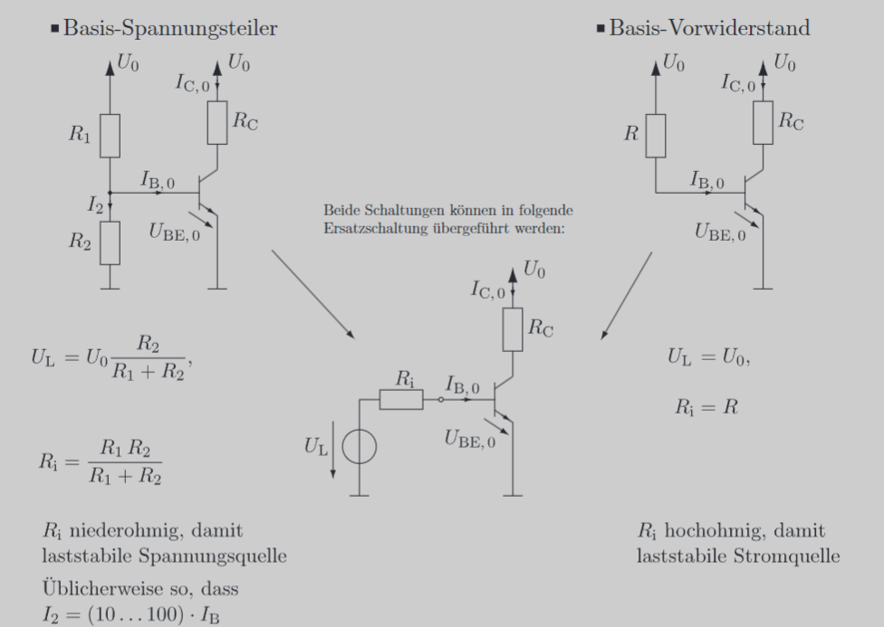
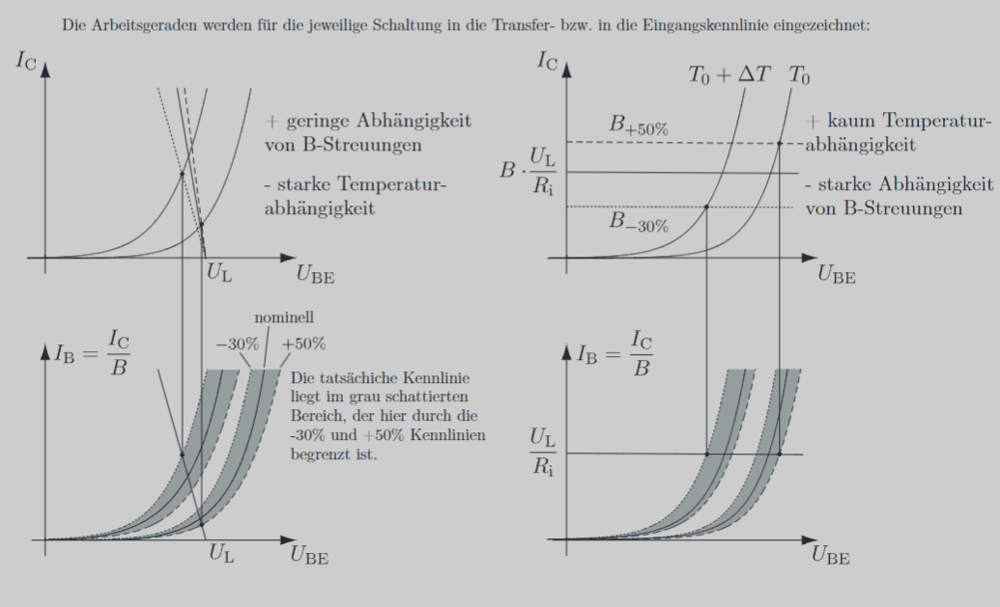

---
tags:
  - Baugruppen/Schalter
  - Baugruppen/Verstärker
  - Halbleiter/BJT
aliases:
  - Bipolartransistor
  - Bipolar Transistor
  - BJT
  - bipolar junction transistor
subject:
  - hwe
source:
  - Michael Offenhuber
  - Siegbert Schrempf
created: 24th March 2022
---

# Bipolar-Junction-Transistor

> weitergeleitet von [{MOC} Transistor]({MOC}%20Transistor.md)

## Aufbau

Ein Bipolartransistor besteht aus zwei gegeneinander geschalteten $p n$-Übergängen ([Dioden](Diode.md)) mit einer gemeinsamen, sehr kleinen ( $p$ oder $n$ ) Zone in der Mitte, der sogenannten Basis $(B)$. Die beiden anderen Zonen heißen Kollektor $(C)$ und Emitter $(E)$. Im regulären Betrieb (Durchlassbetrieb) wird die $B E$-Diode in Durchlass-, die $B C$-Diode in Sperrrichtung betrieben.

Prinzipdarstellungen eines $npn$- und $p n p$-Bipolartransistors (Elektronen bzw. Löcherstromrichtung).

> [!warning] Die Diodendarstellung dient nur als Gedankenmodell. Ein Transistor kann nicht diskret aus zwei Dioden aufgebaut werden.

### Verstärkungseffekt

- Bei leitender $B E$-Diode wird die Basis mit Elektronen **überschwemmt**, die in die Raumladungszone (RLZ) der gesperrten $B C$-Diode gelangen.
- Durch das durch $U_{\mathrm{CE}}$ hervorgerufene [E-Feld](../../Elektrotechnik/Elektrisches%20Feld.md) wird der Hauptanteil dieser Elektronen Richtung Kollektor **abgesaugt**.

> [!warning] Zu beachten ist:
> - Der Effekt tritt nur bei in **Flussrichtung** vorgespannter $BE$-Diode sowie in **Sperrrichtung** betriebener $B C$-Diode auf.
> - $I_{\mathrm{C}}$ wird hauptsächlich von $U_{\mathrm{BE}}$ und nicht von $U_{\mathrm{CE}}$ bestimmt!
> - $U_{\mathrm{CE}}$ muss nur die minimale Spannung $U_{\mathrm{CE}, \min }$ überschreiten, ab der die Ladungsträger abtransportiert werden.
> 
> Der Elektronenstrom der in Durchlassrichtung betriebenen $B E$-Diode wird praktisch fast komplett in den Kollektor transferiert. (Nur ein kleiner Teil gelangt in die Basis.)
>  > [!success] Für den pnp-Transistor gelten entsprechend umgekehrte Verhältnisse.

## Kennlinie

Die Transferkennlinie wird durch die [Shockley Gleichung](../../Physik/Shockley%20Gleichung.md) beschrieben:
$$
\begin{align}
I_{\mathrm{C}}&=I_{\mathrm{S}}\left(e^{\frac{U_{\mathrm{BE}}}{\mathrm{U}_{\mathrm{T}}}}-1\right) \\
I_{\mathrm{B}}&=\frac{I_{\mathrm{C}}}{B} \\
I_{\mathrm{E}}&=I_{\mathrm{B}}+I_{\mathrm{C}}
\end{align}
$$

### 4-Quadranten Kennlinienfeld

## Arbeitspunkteinstellung

Durch die Dimensionierung der Beschaltung wird der Arbeitspunkt der Transistorschaltung eingestellt.

Der Arbeitspunkt
- legt die Großsignalgrößen $I_{\mathrm{B}, 0}, U_{\mathrm{BE}, 0}, I_{\mathrm{C}, 0}$ und $U_{\mathrm{CE}, 0}$ sowie die
- Kleinsignalgrößen $r_{\mathrm{BE}}, S$ und $g_{\mathrm{EA}}$ fest,
- bestimmt den maximal möglichen Aussteuerbereich,
- soll für große Aussteueramplituden in die Mitte des Aussteuerbereiches $\left(U_{\mathrm{CE}, \min } \ldots U_0\right)$ gelegt werden.

### Temparatur und Verstärkungsabweichungen

Üblicherweise möchte man durch die Beschaltung des BJT die Einstellung eines bestimmten Kollektorstromes erzielen. Hierbei treten zwei Probleme auf:

- Es kann nicht sichergestellt werden, dass selbst vom selben Transistortypen die Verstärkung immer die gleiche ist. $\to$ statische Abweichung von $B$
- Durch die Shockleygleichung ist eine gewisse Temparaturabhängigkeit (empfindlichkeit) gegeben.

Nun gibt es zwei Einstellungen um jeweils eines dieser Probleme zu lösen:

> [!important] [[Stromeinstellung]]: Transistor mit Basisvorwiderstand
> $I_{B}$ ist *Konstant*
> - Beseitigt Temparaturinstabilität ✅
> - Empfindlich gegenüber Verstärkungsabweichungen ❌
> 
> > [!info] **Weiterführend**: AP-Einstellung mit Spannungsgesteuerte Stromgegenkopplung

> [!important] [[Spannungseinstellung]]: Transistor mit Basisspannungsteiler
> $U_{BE}$ ist *Konstant* (Muss daher genau dem DB entnommen werden. Annahme $\approx 0.7 V$ unzulässig)
> - Unempfindlich gegenüber Verstärkungsabweichungen ✅
> - Temparatur instabil ❌
> - Instabil gegenüber ungenaue Dimensionierung: Spannung muss **genauest möglich** stimmen ❌
>  
> > [!info] **Weiterführend**: AP Einstellung mit Stromgesteuerte Spannungsgegenkopplung

Funktionen der Arbeitsgeraden
$$
I_{\mathrm{B}}=\frac{U_{\mathrm{L}}-U_{\mathrm{BE}}}{R_{\mathrm{i}}} \quad I_{\mathrm{C}}=B \cdot \frac{U_{\mathrm{L}}-U_{\mathrm{BE}}}{R_{\mathrm{i}}}
$$

# Betriebsarten

## Bipolartransistor als Schalter

|                      NPN                      |                      PNP                      |
| :-------------------------------------------: | :-------------------------------------------: |
|  |  |

## Bipolartransistor als Verstärker / Endstufe

| Betriebsarten                     | Kennlinie                      |
| --------------------------------- | ------------------------------ |
| [A-Betrieb](A-Betrieb.md) [B-Betrieb](B-Betrieb.md) [AB-Betrieb](AB-Betrieb.md) [C-Betrieb](C-Betrieb.md) |  |

## Bipolartransistor als Konstantstromquelle

|          NPN           |           PNP           |
| :--------------------: | :---------------------: |
|  |   |

$$
\begin{align*}
R_{V} &= 10k\Omega\\
U_{D_{1} } &= 0.7V\\
U_{D_{2}}&= 0.7V
\end{align*}
$$

- Der Kollektorwiderstand $R_{C}$ ist hierbei die Last.
- Die Dioden $D_{1}$ und $D_{2}$ erhöhen die Spannung zwischen Basis und Masse.
- Die Spannung teilt sich zwischen der Basis-Emitter-Strecke des Transistors und dem Emitterwiderstand $R_{E}$ auf. Dort liegt dann eine bestimme Spannung an.
- Über den Widerstand $R_{E}$ lässt sich der Konstantstrom einstellen
- Dabei muss die Größe des Widerstands $R_{C }$ beachtet werden. Dieser darf nicht beliebig Groß sein

> [!WARNING] Bis zu einem Konstant-[Strom](../../Elektrotechnik/elektrischer%20Strom.md) $I_{C}$ ist die Schaltung brauchbar

> [!SUMMARY] Berechnung des Emitterwiderstands $R_{E}$  
> $$R_{E} = \frac{U_{D_{1}}+U_{D_{2}}-U_{BE}}{I_{C}+I_{B}}$$
> > [!NOTE] $I_{B}$ praktisch vernachlässigbar 

> [!SUMMARY] Berechnung des Konstant-[Stroms](../../Elektrotechnik/elektrischer%20Strom.md) $I_{C}$  
> $$I_{C}= \frac{U_{D_{1}}+U_{D_{2}}-U_{BE}}{R_{E}}-I_{B}$$
> > [!NOTE] $I_{B}$ praktisch vernachlässigbar 

> [!SUMMARY] Berechnung des maximalen Lastwiderstands  
> $$R_{C,max}= \frac{U_{VCC}-U_{RE}-U_{CE, min}}{I_{C}}\qquad U_{RE} = U_{D_{1}}+U_{D_{2}}-U_{BE} \qquad U_{CE, min}= 2\dots3V$$  
> Wird der Lastwiderstand größer, kann der [Strom](../../Elektrotechnik/elektrischer%20Strom.md) $I_{C}$ nicht konstant gehalten werden.  
> Über die Betriebsspannung lässt sich evtl. der Konstant-[Strom](../../Elektrotechnik/elektrischer%20Strom.md) erhöhen

## Weitere BJT Schaltungen

- [Stromspiegel](../Stromversorgungseinheiten/Stromspiegel.md)  
- [Konstantstrom-Zweipol](Konstantstrom-Zweipol.md)
- [BJT-Kippschaltung](../Oszillatoren/Kippstufe.md#BJT-Kippschaltung)

# Tags

- [Transistor_als_Schalter_intro](../assets/pdf/Transistor_als_Schalter_intro.pdf)
- [Wikipedia - Endstufe](https://de.wikipedia.org/wiki/Endstufe)
- [EK - BJT Betribsarten](https://www.elektronik-kompendium.de/sites/slt/0303311.htm)
- [EK - Transistorstromquellen mit Silizium-Dioden](https://www.elektronik-kompendium.de/public/schaerer/currled.htm)
- [EK - Konstantstromzweipol](https://www.elektronik-kompendium.de/public/schaerer/curr2pol.htm)
- [EK - Stromspoiegel](https://www.elektronik-kompendium.de/public/schaerer/currmr.htm)
$$
\begin{align}
t_{1} & =\ln 2 \cdot R_{2}\cdot C_{1}\\
t_{2} &= \ln 2\cdot R_{3}\cdot C_{2}
\end{align}
$$