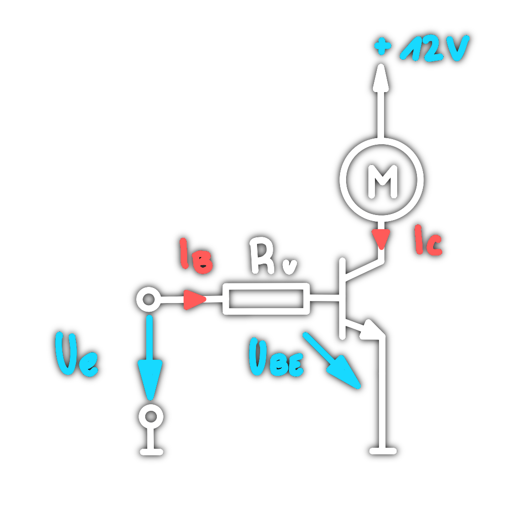
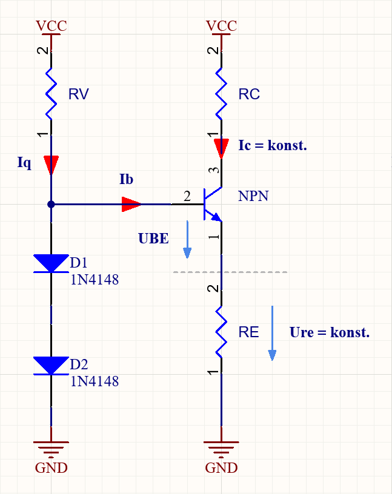
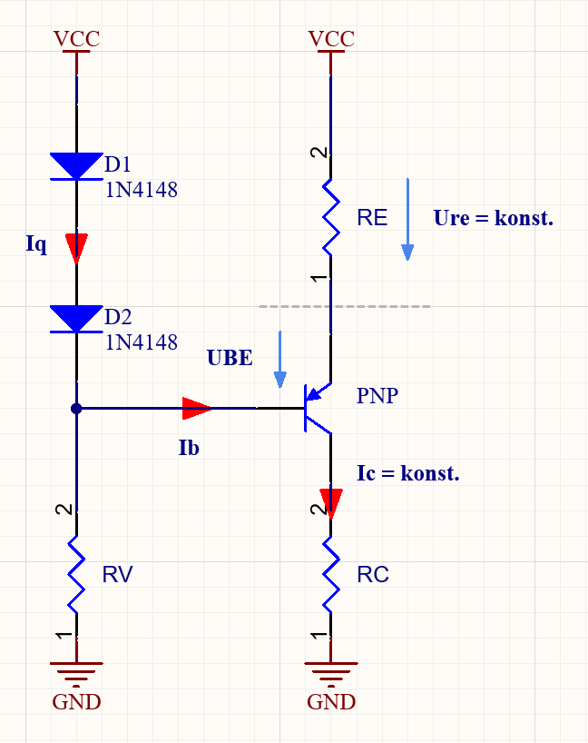

---
tags:
  - Baugruppen/Schalter
  - Baugruppen/Verstärker
  - Halbleiter/BJT
aliases:
  - Bipolartransistor
  - Bipolar Transistor
  - BJT
  - bipolar junction transistor
subject:
  - hwe
source:
  - Michael Offenhuber
  - Siegbert Schrempf
created: 24th March 2022
---

# Bipolartransistor als Schalter

|                NPN                 |                PNP                 |
|:----------------------------------:|:----------------------------------:|
|  |  |

# Bipolartransistor als Verstärker / Endstufe

| Betriebsarten                                                                                                                       | Kennlinie                                          |
| ----------------------------------------------------------------------------------------------------------------------------------- | -------------------------------------------------- |
| > [A-Betrieb](A-Betrieb.md)  [B-Betrieb](B-Betrieb.md)  [AB-Betrieb](AB-Betrieb.md)  [C-Betrieb](C-Betrieb.md) |  |

# Bipolartransistor als Konstantstromquelle

|         NPN         |         PNP         |
|:-------------------:|:-------------------:|
| >  | >  |

$$
\begin{align*}
R_{V} &= 10k\Omega\\
U_{D_{1} } &= 0.7V\\
U_{D_{2}}&= 0.7V
\end{align*}
$$

> - Der Kollektorwiderstand $R_{C}$ ist hierbei die Last.
> - Die Dioden $D_{1}$ und $D_{2}$ erhöhen die Spannung zwischen Basis und Masse.
> - Die Spannung teilt sich zwischen der Basis-Emitter-Strecke des Transistors und dem Emitterwiderstand $R_{E}$ auf. Dort liegt dann eine bestimme Spannung an.
> - Über den Widerstand $R_{E}$ lässt sich der Konstantstrom einstellen
> - Dabei muss die Größe des Widerstands $R_{C }$ beachtet werden. Dieser darf nicht beliebig Groß sein

> [!WARNING] Bis zu einem Konstant-[Strom](../../Elektrotechnik/elektrischer%20Strom.md) $I_{C}$ ist die Schaltung brauchbar

> [!SUMMARY] Berechnung des Emitterwiderstands $R_{E}$  
> $$R_{E} = \frac{U_{D_{1}}+U_{D_{2}}-U_{BE}}{I_{C}+I_{B}}$$
> > [!NOTE] $I_{B}$ praktisch vernachlässigbar 

> [!SUMMARY] Berechnung des Konstant-Stroms $I_{C}$  
> $$I_{C}= \frac{U_{D_{1}}+U_{D_{2}}-U_{BE}}{R_{E}}-I_{B}$$
> > [!NOTE] $I_{B}$ praktisch vernachlässigbar 

> [!SUMMARY] Berechnung des maximalen Lastwiderstands  
> $$R_{C,max}= \frac{U_{VCC}-U_{RE}-U_{CE, min}}{I_{C}}\qquad U_{RE} = U_{D_{1}}+U_{D_{2}}-U_{BE} \qquad U_{CE, min}= 2\dots3V$$  
> Wird der Lastwiderstand größer, kann der [Strom](../../Elektrotechnik/elektrischer%20Strom.md) $I_{C}$ nicht konstant gehalten werden.  
> Über die Betriebsspannung lässt sich evtl. der Konstant-[Strom](../../Elektrotechnik/elektrischer%20Strom.md) erhöhen

## Weitere BJT Schaltungen

- [Stromspiegel](../Stromversorgungseinheiten/Stromspiegel.md)  
- [Konstantstrom-Zweipol](Konstantstrom-Zweipol.md)
- [BJT-Kippschaltung](../Oszillatoren/Kippstufe.md#BJT-Kippschaltung)

# Tags

- [Transistor_als_Schalter_intro](../assets/pdf/Transistor_als_Schalter_intro.pdf)
- [Wikipedia - Endstufe](https://de.wikipedia.org/wiki/Endstufe)
- [EK - BJT Betribsarten](https://www.elektronik-kompendium.de/sites/slt/0303311.htm)
- [EK - Transistorstromquellen mit Silizium-Dioden](https://www.elektronik-kompendium.de/public/schaerer/currled.htm)
- [EK - Konstantstromzweipol](https://www.elektronik-kompendium.de/public/schaerer/curr2pol.htm)
- [EK - Stromspoiegel](https://www.elektronik-kompendium.de/public/schaerer/currmr.htm)
$$
\begin{align}
t_{1} & =\ln 2 \cdot R_{2}\cdot C_{1}\\
t_{2} &= \ln 2\cdot R_{3}\cdot C_{2}
\end{align}
$$