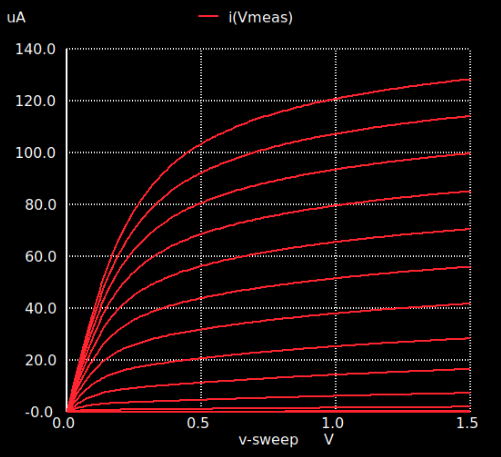

---
tags:
aliases:
  - MOSFET
keywords:
subject:
  - KV
  - Analoge Schaltungstechnik
  - VL
  - Technische Elektronik
  - Einführung Elektronik
semester: WS24
created: 27th February 2025
professor:
  - Bernhard Jakoby
  - Timm Ostermann
  - Harald Pretl
release: false
title: Metall-Oxid-Halbleiter-Feldeffekttransistor
---


# Metal Oxide Semiconductor Field Effect Transistor

## Aufbau


> [!tldr] Unter dem Gate entsteht ein Leitender Kanal und stellt somit eine Verbindung zwischen Drain und Source her. 

beim **N-MOS**:

- Schwach Dotierter P-Halbleiter als Substrat.
- Stark Dotierter N-Halbleiter an Drain und Source.
- Unter Dem Gate ist eine Dünne Oxidschicht welche Isoliert (kein Eingangsstrom).

Durch Anlegen einer Spannung am Gate entsteht ein Leitender Kanal zwischen Drain und Source. Ein Elektrische Feld (Kapazität!) welches durch die Spannung am Gate entsteht, hebt die Ladungsträger an. Diese gelangen zwischen Drain und Source und bilden einen Leitenden Kanal.

Heute: Nur noch Anreicherungstyp

## N- / PMOS Transistor


```tikz
\usepackage[european, straightvoltages]{circuitikz}
\begin{document}
\begin{circuitikz}[scale=2,transform shape]
\node[nfet, solderdot](N) at (0,0){};
\node[pfet, solderdot](P) at (4,0){};
\node[anchor=south] at (N.D) {NMOS};
\node[anchor=south] at (P.S) {PMOS};
\node[anchor=east] at (N.G) {N};
\node[anchor=east] at (P.G) {P};
\node[anchor=west] at (N.B) {P};
\node[anchor=west] at (P.B) {N};
\end{circuitikz}
\end{document}
```

> [!question] Merkhilfe zur unterscheidung des Symbols
> 
> - Erinnerung: dotierung der [Diode](Diode.md)
> 
> ```tikz
> \usepackage[european, straightvoltages]{circuitikz}
> \begin{document}
> \begin{circuitikz}[scale=2,transform shape]
> \draw (0,0) node[anchor=east]{P} to[diode, o-o] (2,0) node[anchor=west]{N};
> \end{circuitikz}
> \end{document}
> ```
> Durch die richtung der Bulk-Gate Diode kann man feststellen, um welchen Transistortypen es sich handelt, je nachdem welche seite der Diode nach innen zeigt.
> 
> - NMOS: N dotierung der BG-diode ist innen.
> - PMOS: P dotierung der BG-diode ist innen.

## Anwendung

Aus der Ausgangskennlinie des MOSFETs ist folgendes elektrisches verhalten abzuleiten:



- Im Sättigungsbereich (Flach): Transitor wirkt als **Spannungsgesteuerte Stromquelle**
- Im Linearen Bereich: Transistor wirkt als **Spannungsgesteuerter Widerstand**
