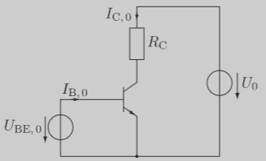
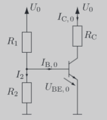

---
tags:
  - Halbleiter/BJT
aliases:
  - Stromgesteuerte Spannungsgegenkopplung
  - Basis-Spannungsteiler
  - Basisspannungsteiler
keywords: 
subject:
  - VL
  - Einführung Elektronik
semester: WS24
created: 9. November 2024
professor:
---
 

# [BJT](Bipolartransistor.md) Spannungseinstellung

> [!important] [[Spannungseinstellung]]: Transistor mit Basisspannungsteiler
> $U_{BE}$ ist *Konstant* (Muss daher genau dem DB entnommen werden. Annahme $\approx 0.7 V$ unzulässig)
> - Instabil gegenüber ungenaue Dimensionierung: Spannung muss **genauest möglich** stimmen
>  



## Basis-Spannungsteiler



> [!warning] Vor und Nachteile
> - ✅Unempfindlich gegenüber Verstärkungsabweichungen 
> - ❌Temparatur instabil 


## Stromgesteuerte Spannungsgegenkopplung

```tikz
\usepackage[european, straightvoltages]{circuitikz}
\usepackage{amsmath}

\begin{document}

\begin{circuitikz}[thick]

% Paths, nodes and wires:
\node[tlground] at (0, 0) {};
\node[tlground] at (2, 0) {};

\node[npn] at (2, 3) {};

\draw (0, 2) to[R, l^=$R_{2}$] (0, 0);
\draw (0, 6) to[R=$R_{1}$, i>^=$I_{q} + I_{B}$] (0, 4);
\draw (2, 6) to[R=$R_{C}$, v=$U_{E}$] (2, 4);
\draw (2, 2) to[R=$R_{E}$, v=$U_{E}$, color=red] (2, 0);

\node[vcc] at (0, 6) {$+12V$};
\node[vcc] at (2, 6) {$+12V$};

\draw (2, 4) -- (2, 3.75);
\draw (1.16, 3) -| (0, 4);
\draw (0, 2) -- (0, 3);
\draw (2, 2) -- (2, 2.23);

\end{circuitikz}
\end{document}
```

> [!info] Gegenkopplungs Funktionsprinzip
> > [!warning] **Annahme:** Die Spannung am Widerstand $R_{2}$ ist nahezu konstant
> 
> Steigt nun $I_{C,0}$ zufolge einer Temparaturerhöhung, fällt am Emitterwiderstand $R_{E}$ eine *höhere* Spannung ab. Demzufolge sing $U_{BE,0}$, was der $I_{C}$-Zunahme entgegenwirkt.


