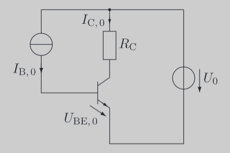
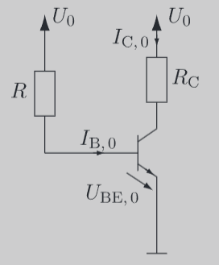
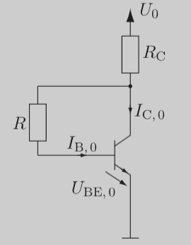

---
tags:
  - Halbleiter/BJT
aliases:
  - Spannungsgsteuerte Stromgegenkopplung
  - Basis-Vorwiderstand
  - Basisvorwiderstand
keywords:
  - Temparaturkompensation
subject:
  - VL
  - Einführung Elektronik
semester: WS24
created: 21. September 2023
professor:
  - Bernhard Jakoby
  - Christian Diskus
---
 

# [BJT](Bipolartransistor.md) Stromeinstellung

> [!important] $I_{B}$ wird konstant in die Basis eingespeist um $I_{C}$ zu kontrollieren.
> 

## Basisvorwiderstand

Eine simple Art dieses Prinzip zu realisieren ist mittels eines Basisvorwiderstandes.

> [!warning] Vor und Nachteile
> ✅Kaum Abhängig von Temparaturschwankungen
> ❌Stark Abhängig von der $B$-Streuung (wegen konstantem $I_{B}$)

## Spannungsgsteuerte Stromgegenkopplung

> [!info] Robustheit gegenüber der $B$-Streuung:
> 
>Da hier $I_{B}$ nicht mehr konstant in die Basis eingeprägt wird, wirkt diese Regelung auch gegen die $B$-Streuung.

> [!warning] **Annahme:** Die Basis-Emitterspannung ist nahezu konstant.
> Steigt nun $I_{C,0}$ zur Folge einer Temparaturerhöhung, fällt am Kollektorwiderstand $R_{C}$ eine höhere Spannung ab.
> 
> Dadurch sinkt auch die Spannung am Basisvorwiderstand $R$ welches den Basisstrom verringert. Somit wird auch $I_{C}$ verringert.

---

# Related

[Spannungseinstellung](Spannungseinstellung.md)