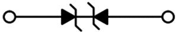

# TVS-[Diode](Diode.md)

## Kennwerte von TVS-[Dioden](Diode.md)

### Unioder Bidirektional

Je nachdem ob die zu schützende Leitung über oder unter dem Massepotential liegt, muss man bei unidirektionalen TVS-[Dioden](Diode.md) die Polung beachten.  
Bidirektionale arbeiten in beide Richtungen.  

### Anzahl von Kanälen

Oft haben Konnektoren eine Vielzahl an Pole (z.B. HDMI) die geschützt werden müssen.  
Deshalb gibt es mehrere TVS-[Dioden](Diode.md) in einem einzigen Package.  

### Arbeitsspannung

Die Arbeitsspannung ist die maximale [elektrische Spannung](../../Elektrotechnik/elektrische%20Spannung.md), welche im Normalbetrieb auf der [Leitung](../../HF-Technik/Eingangsimpedanz.md) vorkommt. z.B. 3.3V

### Klemmspannung

Im Falle eines [ESD](../ESD.md)-Spikes, wirkt die TVS-[Diode](Diode.md) niederohmig gegen Masse.  
Die [elektrische Spannung](../../Elektrotechnik/elektrische%20Spannung.md), die dabei an der [Diode](Diode.md) abfällt, ist die Klemmspannung.  
Obwohl sie immer noch signifikant höher ist als die Betriebsspannung, ist sie aufgrund der kurzen Dauer nicht weiter gefährlich, trotzdem sollte sie in jedem Anwendungsfall möglichst gering gewählt werden.  
Einen genauen Wert dafür findet man nur sehr schwer.  
Man sollte im Datenblatt der TVS-[Diode](Diode.md) auf Verweise für typische Applikationen achten.

### Intrinsische [Kapazität](../../Elektrotechnik/Kapazität.md)

Wie bei jedem Bauteil, gibt es gewisse parasitäre Kenngrößen, die im Inneren präsent sind. Bei der TVS [Diode](Diode.md) ist die [Kapazität](../../Elektrotechnik/Kapazität.md) eine störende, dennoch unvermeidbare, Größe.  
Bei TVS-[Dioden](Diode.md) mit hoher [Kapazität](../../Elektrotechnik/Kapazität.md) besteht die Gefahr, dass sehr kurze [ESD](../ESD.md)-Stöße nicht gefiltert werden können.  
Abgesehen von der intrinsischen [Kapazität](../../Elektrotechnik/Kapazität.md), ist zu berücksichtigen, dass auch die Leiterbahn von der Buchse zur [Diode](Diode.md) keine eigene signifikante [Kapazität](../../Elektrotechnik/Kapazität.md) aufweisen darf. Dies wird durch eine möglichst kurze Leiterbahnführung sowie eine dünne Leiterbahnbreite realisiert.

### IEC61000−4−2 Rating

Die TVS-[Diode](Diode.md) verfügt über eine Rating-Stufe der IEC61000-4-2 Norm, welche Aussagen über die absoluten Höchstwerte des [ESD](../ESD.md)-Spikes liefert.
