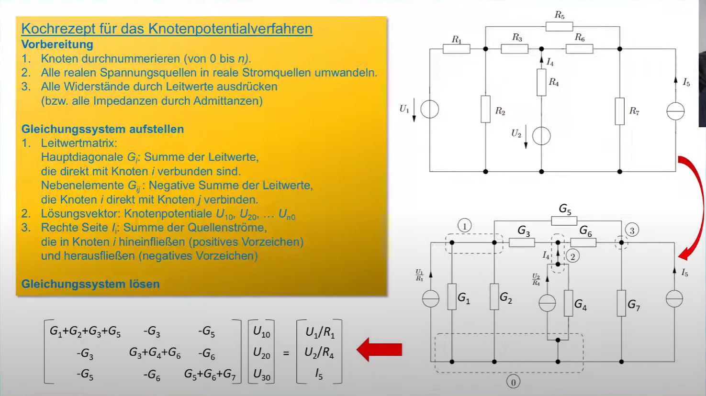

---
tags:
  - Schaltungsanalyse
  - Algorithmus/Elektrotechnik
aliases:
  - Knotenpotential
  - Knotenspannung
  - Knotenspannungs
keywords: 
subject:
  - VL
  - Elektrotechnik
semester:
  - SS24
  - B2
created: 8. Januar 2024
professor:
  - Andreas Springer
---
 

# Knotenpotential Verfahren

Grundidee
Wir eliminieren die Maschengleichungen, indem wir Knotenspannungen einführen.
Knotenpotentiale sind die Spannungen aller knoten zu einem Gewählten Bezugsknoten.

Wenn wir ein [elektrisches Netzwerk](../Elektrotechnik/Schaltungsanalyse.md) vor uns haben, eliminieren wir alle Spannungsquellen, indem wir das [Norton](../Elektrotechnik/lineare%20Quellen.md)-Ersatzbild auf alle Spannungsquellen anwenden.

Die Verwendung des Leitwertes erleichtert die Berechnung.

> [!success] Allgemeines Ergebnis:
> mit der *Knotenadmittanzmatrix* $\mathbf{G}$, dem *Vektor* $\mathbf{U}$ der unbekannten *Knotenspannungen* und dem Vektor der Quellströme $\mathbf{I}_{q}$
> ![[../assets/Excalidraw/Knotenpotentialverfahren 2024-03-13 21.34.50.excalidraw]]

# Quellen

