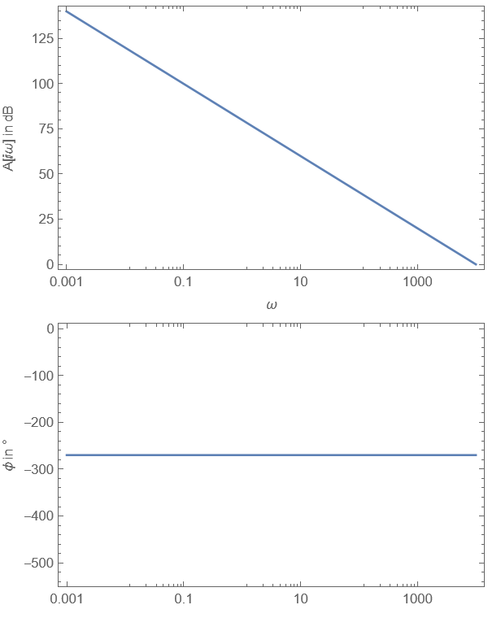

---
tags:
  - OPV
aliases:
  - Integrator
  - Integrierer
keywords:
  - Aktiver Tiefpass
subject:
  - VL
  - Einführung Elektronik
semester: WS24
created: 13. Dezember 2024
professor:
---
 

# Integrator

```tikz
\usepackage[european, straightvoltages]{circuitikz}
\usepackage{amsmath}

\begin{document}
\begin{circuitikz}[very thick, scale=2, font=\Large]
% Begin Schematic

\draw (0,0) node[op amp, yscale=-1.0] (opv) {};

\draw (opv.out) to[short, *-] ++(0, 1) to[C] (-1,1) to[short, -*] ++(0, -1);

\end{circuitikz}
\end{document}
```


## Übertragungsfunktion

$$
\boxed{ A(j\omega)=\frac{\underline{ U }_{a}}{\underline{ U }_{e}} = -\frac{1}{j\omega R C} }
$$

> [!question]- **Herleitung**
>
> [Knotenregel](../Elektrotechnik/Kirchhoffsche%20Regeln.md)
> 
> $$
> \begin{align}
> I_{R}+I_{C}=\frac{U_{e}}{R} + \frac{U_{a}}{Z_{C}} = 0\iff\frac{U_{e}}{R} =- \frac{U_{a}}{Z_{C}} \iff \frac{U_{a}}{U_{e}}= -\frac{Z_{C}}{R} = -\frac{1}{j\omega R C}
> \end{align}
> $$

> [!info]+ Bode-Diagramm 
> 
>                              

## Funktionsweise


