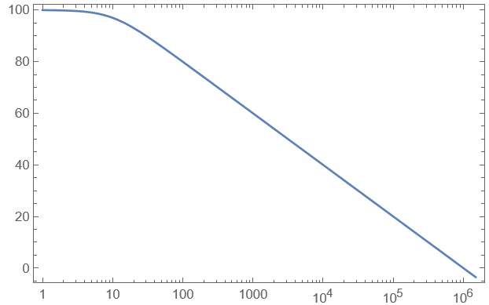
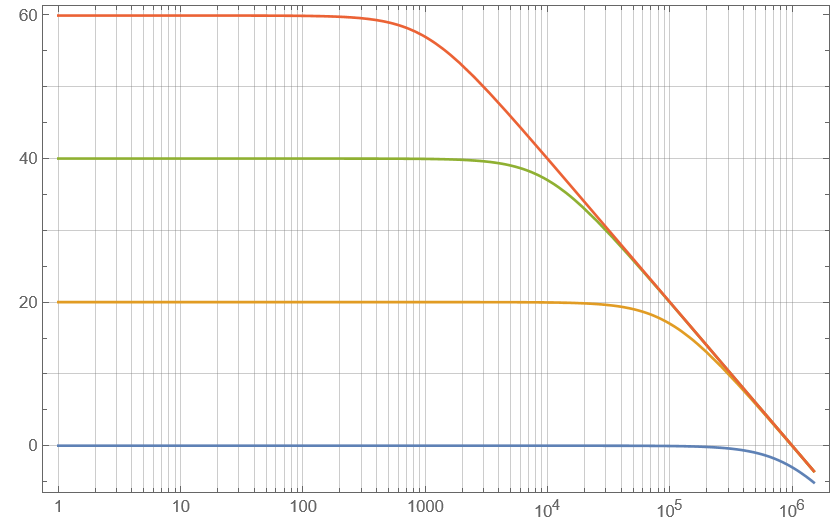

---
tags:
  - OPV
  - Baugruppen/Verstärker
aliases:
  - OPV
subject:
  - hwe
source:
  - Siegbert Schrempf
created: 2nd January 2023
---

# Operations-Verstärker

## Grundschaltungen

> [!important] Wichtig bei Grundschaltungen von Invertierenden Verstärkern:
> - Die Eingangsspannung $U_e$ wird immer invertiert, d.h. das Vorzeichen wird umgekehrt.
> - Das Bauteil am Eingang Prägt den Strom in das Bauteil der Rückkopplung ein 

- Nicht-Invertierender Verstärker
- Invertierender Verstärker
- [Umkehrsummierer](OPV-Addierer.md) / Addierer
- [Subtrahierer](OPV-Subtrahierer.md)
- Integrator ([Aktiver Tiefpass](Aktiver%20Filter.md))
- Differenzierer ([Aktiver Hochpass](Aktiver%20Filter.md))
- Instrumentenverstärker
- [Schmitttrigger](Schmitt%20Trigger.md)
- Konstantstromquelle

## Praxistipps

Slew-Rate: $SR>\dfrac{du}{dt}\rightarrow u(t)\dots$ Beschaltungssignal 

## Reale Eigenschaften von OPVs

### charakteristische Größen

$A_D$... Frequenzabhängige Verstärkung
$A_{D 0} \ldots$ Verstärkung ohne nachgeschaltetem Tiefpass
$\tau_0 \quad \ldots$ Zeitkonstante des Tiefpasses
$k$ ... Rückkopplungsfaktor, abhängig von externer Beschaltung
$f_{g 0} \ldots$ Grenzfrequenz des OPs für den unbeschalteten Fall
$f_g \quad \ldots$ Grenzfrequenz des beschalteten OPs
$f_T \quad \ldots$ Transitfrequenz, Frequenz bei $\operatorname{der}\left|A_D(f)\right|$ eins ist

| **Unbeschalteter OPV**                              | **Beschalteter OPV**                                       |
| --------------------------------------------------- | ---------------------------------------------------------- |
| $A_{D}(f) = \dfrac{A_{D0}}{1+j_{2}\pi f\uptau_{0}}$ | $A_{D}(f)=\dfrac{A_{D0}}{1+A_{D 0}k+j_{2}\pi f\uptau_{0}}$ |
| $f_{g_{0}} = \dfrac{1}{2\pi\uptau_{0}}$             | $f_{g}=f_{g 0}\cdot A_{D 0}$                               |
|                                                     | $\lvert A_{D}(f) \rvert=1\to f=f_{T}$                      |
|                       |                            |

#### Größenordnungen der Größen

| Größe                    | ideal    | bipolar |       | JFET  |       | CMOS |       | Einheit          | Bezeichung      |     |
| :----------------------- | :------- | :------ | :---- | :---- | :---- | :--- | :---- | :--------------- | --------------- | --- |
|                          |          | std.    | präz. | std.  | präz. | std. | präz. |                  |                 |     |
| $U_{\text {offs}}$ (max) | 0        | 3       | 0.025 | 2     | 0.1   | 2    | 0.1   | $mV$             | Offsetspannung  |     |
| $I_B$ (typ)              | 0        | 50 nA   | 25 pA | 50 pA | 40 fA | 1 pA | 2 fA  | $@ 25^{\circ} C$ | Biasstrom       |     |
| $f_T$ (typ)              | $\infty$ | 2       | 2000  | 5     | 400   | 2    | 10    | $MHz$            | Transitfrequenz |     |
| $SR$ (typ)               | $\infty$ | 2       | 4000  | 15    | 300   | 2    | 10    | $V / \mu s$      | Slew-Rate       |     |
| $U_0$ (min)              | 0        | 5       | 1.5   | 10    | 5     | 2    | 1     | $V$              |                 |     |
| $U_0$ (max)              | $\infty$ | 36      | 44    | 36    | 36    | 15   | 15    | $V$              |                 |     |
| $k_{\text {offs}}$ (max) | 0        | 5       | 0.1   | 20    | 1     | 10   | 3     | $\mu V /K$       |                 |     |
| $e_n$ (typ)              | 0        | 10      | 1     | 20    | 3     | 30   | 7     | $nV / \sqrt{Hz}$ |                 |     |

> [!info] **std**: Standard-OPV, **präz**: Präzisions-OPV

# Quellen

[uni-muenster.de/Physik.AP/Veranstaltungen/F-Praktikum/anleitungen/Operationsverstaerker.pdf](https://www.uni-muenster.de/Physik.AP/Veranstaltungen/F-Praktikum/anleitungen/Operationsverstaerker.pdf)

