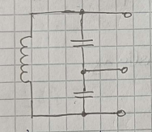

# Colpitts Oszillator

Besteht aus Emitter/Basis/Kollektor Schaltung mit einer Rückkopplung:

| Colpitts: [kapazitiv](../../Elektrotechnik/Kapazität.md) | Hartley: [induktiv](../../Elektrotechnik/Induktivitäten.md) | Meissner: transformatorisch |
| ---------------------------------------------------------------------------------- | ------------------------------------------------------------------------------------- | ----------------------------------------------------------------------- |
|                                               |                                                             |                                              |

Häufigste [Kombination](Kombination.md): Colpitts Oszillator (mit kapazitiver Rückkopplung)  
Vorteil: 
- einfache [Kapazitäten](../../Elektrotechnik/Kapazität.md)
- nur eine [Induktivität](../../Elektrotechnik/Induktivitäten.md)  
Schwingt wenn die Schleifenverstärkung $=1$ und die Phasendrehung über die Schlefe $0\degree$ bzw. $k\cdot2\pi$ ist.

$$V_{ges}=1 \qquad \varphi = k\cdot2\pi \qquad k=0\dots n$$

## Schaltung

## Funktionsweise

- [Emitterschaltung](../Halbleiter/Kollektorfolger.md): $\varphi = 180\degree$ zwischen $U_{a}$ und $U_{e}$
- kapazitive 3-Punkt Schaltung bringt weitere $180\degree\rightarrow\sum=360\degree$
- [Barkhausen Kriterium](Barkhausen%20Kriterium.md) ist erfüllt
- [Emitterschaltung](../Halbleiter/Kollektorfolger.md) mit Basisspannungs-Teiler
- $R_{E}$ zur Temperaturkompensation
- RFC ([Radio](../../HF-Technik/Rundfunk.md) Frequency Choke) dt. Drosselspule
	- hebt den Massebezug des Oszillatorsignal zur Betriebsspannung auf
- Analyse der Schleifenverstärkung bringt …
	- … einerseits $\mathcal{Im}(T(f))=0$ -> $\omega_{0}$ (Resonanzfrequenz)
	- … andererseits $\frac{C_{2}}{C_{1}}=S\cdot R_{L}$ -> Steilheit $S=\frac{\Delta I_{C}}{\Delta U_{BE}}$

## Herleitung

### Kapazitive 3-Punktschaltung

Ein Teil der [Schwingkreis](../../Physik/Schwingkreise.md) Spannung muss phasenrichtig rückgekoppelt werden.  
  

