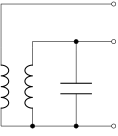

---
tags:
  - Baugruppen/Oszillator
  - tikz/circuitikz
aliases:
  - Colpitts
subject:
  - hwe
source:
  - Siegbert Schrempf
created: 22nd November 2022
---

# Colpitts Oszillator

Besteht aus Emitter/Basis/Kollektor Schaltung mit einer Rückkopplung:

| Colpitts: [kapazitiv](../../Elektrotechnik/Kapazität.md) | Hartley: [induktiv](../../Elektrotechnik/Induktivitäten.md) | Meissner: transformatorisch                              |
| -------------------------------------------------------- | ----------------------------------------------------------- | -------------------------------------------------------- |
|         |              |  |

Häufigste Kombination: Colpitts Oszillator (mit kapazitiver Rückkopplung)  
Vorteil: 
- einfache [Kapazitäten](../../Elektrotechnik/Kapazität.md)
- nur eine [Induktivität](../../Elektrotechnik/Induktivitäten.md)  
Schwingt wenn die Schleifenverstärkung $=1$ und die Phasendrehung über die Schlefe $0\degree$ bzw. $k\cdot2\pi$ ist.

$$V_{ges}=1 \qquad \varphi = k\cdot2\pi \qquad k=0\dots n$$

## Schaltung

```tikz
\usepackage[european]{circuitikz}
\usepackage{amsmath}

\begin{document}

\begin{circuitikz}[thick, font=\Large]

% Paths, nodes and wires:
\node[npn] at (5, 6) {};

\draw (3, 6) to[R={$R_1$}, *-] (3, 9);
\draw (3, 3) to[R={$R_2$}] (3, 6);
\draw (5, 3.75) to[R={$R_E$}] (5, 5.23);

\draw (0, 6) to[C={$C_B$}] (3, 6);
\draw (7, 3.75) to[C={$C_E$}] (7, 5.25);
\draw (11, 5) to[C={$C_1$}] (11, 7);
\draw (11, 3) to[C={$C_2$}] (11, 5);
\draw (12, 7) to[C={$C_{\text{out}}$}, -o] (14, 7);

\draw (5, 6.77) to[L={$L_{\text{RFC}}$}] (5, 8.25);
\draw (9, 2) to[L={$L$}] (9, 7);

\draw (5, 3) -- (5, 3.75);
\draw (7, 5.25) -- (5, 5.25);
\draw (4.16, 6) -- (3, 6);
\draw (3, 9) -- (5, 9) -- (5, 8.25);
\draw (7, 3) -- (7, 3.75);
\draw (5, 6.75) -- (7, 6.75) -- (7, 7) -- (11, 7) -- (12, 7);
\draw (0, 6) -- (0, 2) -- (11, 2) -- (11, 3);
\draw (11, 5) -- (12, 5) -- (12, 4.5);
\draw (14, 4.5) -- (14, 5);

\node[tlground] at (5, 3) {};
\node[tlground] at (3, 3) {};
\node[tlground] at (7, 3) {};
\node[tlground] at (12, 4.5) {};
\node[tlground] at (14, 4.5) {};

\node[ocirc] at (14, 7) {};
\node[ocirc] at (14, 5) {};

\node[circ] at (9, 7) {};
\node[circ] at (11, 7) {};
\node[circ] at (11, 5) {};
\node[circ] at (9, 2) {};
\node[circ] at (5, 5.25) {};
\node[circ] at (5, 6.75) {};

\end{circuitikz}

\end{document}
```

$$
\begin{gathered}
C_{r} = \frac{C_{1}\cdot C_{2}}{C_{1}+C_{2}} \\
f_{r} = \frac{1}{2\pi \cdot \sqrt{ L\cdot C_{r} }}
\end{gathered}
$$

## Funktionsweise

- [Emitterschaltung](../Halbleiter/Kollektorfolger.md): $\varphi = 180\degree$ zwischen $U_{a}$ und $U_{e}$
- kapazitive 3-Punkt Schaltung bringt weitere $180\degree\rightarrow\sum=360\degree$
- [Barkhausen Kriterium](Barkhausen%20Kriterium.md) ist erfüllt
- [Emitterschaltung](../Halbleiter/Kollektorfolger.md) mit Basisspannungs-Teiler
- $R_{E}$ zur Temperaturkompensation
- RFC ([Radio](../../HF-Technik/Rundfunk.md) Frequency Choke) dt. Drosselspule
	- hebt den Massebezug des Oszillatorsignal zur Betriebsspannung auf
- Analyse der Schleifenverstärkung bringt …
	- … einerseits $\mathrm{Im}(T(f))=0$ -> $\omega_{0}$ (Resonanzfrequenz)
	- … andererseits $\frac{C_{2}}{C_{1}}=S\cdot R_{L}$ -> Steilheit $S=\frac{\Delta I_{C}}{\Delta U_{BE}}$

## Herleitung

### Kapazitive 3-Punktschaltung

Ein Teil der [Schwingkreis](../../Physik/Schwingkreise.md) Spannung muss phasenrichtig rückgekoppelt werden.  
  

