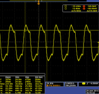

# Pierce-Gate Oszillator

> [!info] Wegen der Verzerrten Wellenform eines Schwingquarzes, ist intern zu einem Mikrocontroller ein Pierce-Gate Oszillator (PGO) verbaut.
> - Der Inverter treibt den [Schwingquarz](Quarzoszillator.md).
> - Der [Schmitt Trigger](../Schmitt%20Trigger.md) am Ausgang dient als Ausgangstreiber und sorgt dafür, dass die Flanken mit der Slewrate des [Schmitt-Triggers](../Schmitt%20Trigger.md) am Ausgang ansteigen und der [Quarz](Quarzoszillator.md) nicht Belastet wird.

|      |
| :----------------------------: |
| Reale Wellenform des Quarzes | 

> [!summary] $C_{L}= \dfrac{(C_{1}+C_{in})\cdot(C_{2}+C_{out})}{C_{1}+C_{in}+C_{2}+C_{out}} +C_{streu}$
> 
$R_{1} = 1M\Omega$
$R_{2} = 2k\Omega$ Begrenzt die Treiberstärke um den [Quarz](Quarzoszillator.md) nicht zu übersteuern
$C_{1}, C_{2} \dots 20-30pF \rightarrow$ bilden $C_{Last}$. Werte sind im Datenblatt des [XTAL](Quarzoszillator.md) angegeben
$C_{streu} = 2-3pF$

# Tags

[Quarzoszillator](Quarzoszillator.md)

[Schmitt Trigger](../Schmitt%20Trigger.md)
