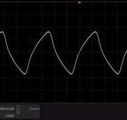

---
tags:
  - MCU
  - Baugruppe/Oszillator
aliases:
  - Schwingquartz
  - XTAL
  - Crystaloscillator
  - Quartz
subject:
  - hwe
created: 17th January 2023
---

# Quartzoszillator

> [!question] [Oszillator](Oszillatoren.md)

Der Schwingquartz weist eine Sehr stabile Frequenz auf d.h. er hat eine hohe Güte. Viel höher als bei einem Elektrischen Schwingkreis realistisch erzielt werden kann. Ein Nachteil ist jedoch, dass die Schwingfrequenz bis maximal in den MHz bereich reicht. Die Abhilfe ist der [Phase Locked Loop](Phase%20Locked%20Loop.md), welcher die Phasenabweichung eines schneller schwingfähigen Elektrischen Schwingkreises (VCO) mit einem Quartzoszillator als Referenz regelt.

> [!INFO] Schwingquartze beruhen auf dem Prinzip des Piezoelektrischen Effekts
> Der Quartz ist daher ein Mechanisches Bauelement 

## Symbol

> [!hint] Elektrisches Ersatzschaltbild des mechanischen Verhaltens  
> 
> 
> 
> 
> $L_{1}\dots$ Serien-[Induktivität](../../Elektrotechnik/Induktivität.md) (das Schwingen der Masse des Resonators)
> $C_{1}\dots$ Serien-[Kapazität](../../Elektrotechnik/Kapazität.md) (Elektrizitätskonstante des Quartzes)
> $R_{1}\dots$ Verlustwiderstand (Dämpfer. Innere [Reibung](../../Physik/Kinematik/Reibungskraft.md)/mechanische Verluste)
> $C_{0}\dots$ Streukapazität der Elektroden

## [Ableitung](../../Mathematik/Analysis/Differenzialrechnung.md) Der Resonanzfrequenz

$R_{1}$ vernachlässigbar

> [!NOTE] $s=\sigma+j\omega$
> $$
\begin{align*}
Z_{1} &= \frac{1}{sC_{1}}+sL_{1}= \frac{1+s^{2}L_{1}C_{1}}{sC1}\\
Z_{2} &= \frac{1}{sC_{0}}
\end{align*}
> $$
>
>$$
\begin{align*}
Z_{g} &=\frac{1+s^{2}L_{1}C_{1}}{s(C_{0}+C_{1})+s^{2}C_{0}C_{1}L_{1}} = \frac{Z(s)}{N(s)} \rightarrow \frac{=0 \text{ bei Reihenresonanz}}{=0\text{ bei Parallelresonanz}}\\
\end{align*}
> $$

## Bauteileigenschaften

Reale Wellenform des Schwingquartz

|  |  |     |
| ------------------------ | ------------------------ | --- |
|                          |                          |     |

## Übersteuerung

Der Quartz wird in Anwendungen von einem Aktiven Element Getrieben

> [!question] [Pierce-Gate Oszillator](Pierce-Gate%20Oszillator.md)

Zu Beachten ist, dass ab einer bestimmten amplitude die Schwingung nichtlinear wird -> Übersteuerung.

Dafür ist die Leistung (Bereich 100µW - 1mW) im Datenblatt zu beachten. 

## Messung eines Quartz

[Crystal oscillator - Drive Level measurement - YouTube](https://www.youtube.com/watch?v=DQ1Gsfw5nk0)

# Tags

[ST Application Note](https://www.st.com/resource/en/application_note/an2867-oscillator-design-guide-for-stm8afals-stm32-mcus-and-mpus-stmicroelectronics.pdf)
[Crystal oscillator - Drive Level measurement - YouTube](https://www.youtube.com/watch?v=DQ1Gsfw5nk0)

