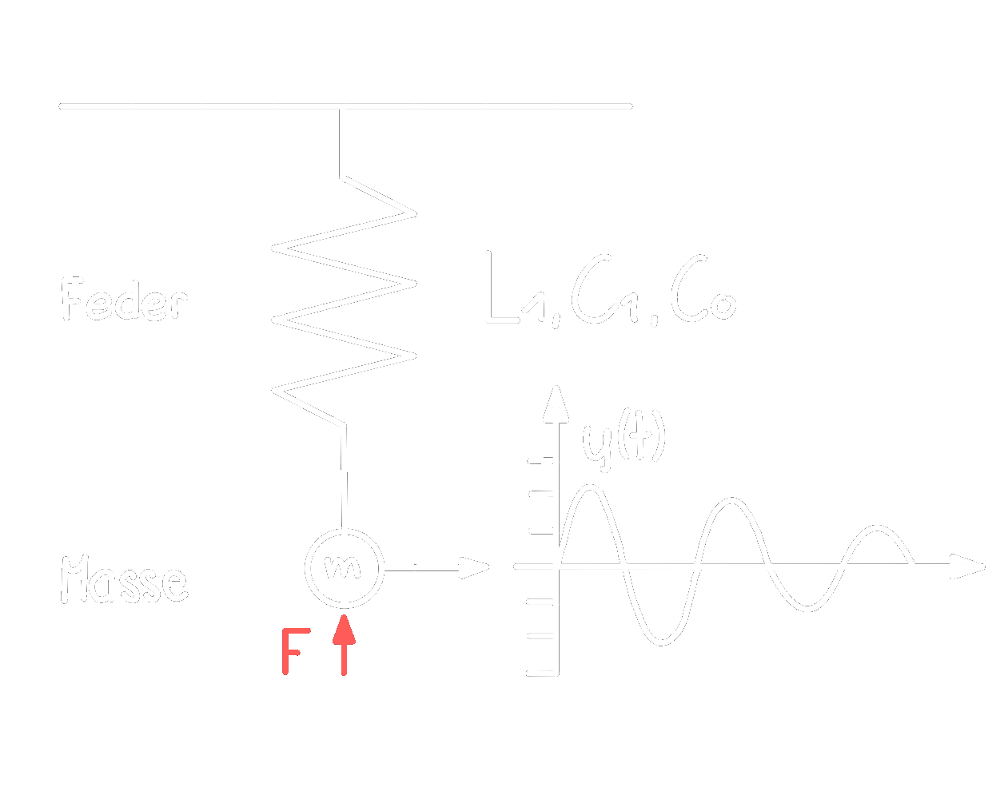

# Quarzoszillator

> [!INFO] Schwingquarze beruhen auf dem Prinzip des   
> Der Quarz ist daher ein Mechanisches Bauelement 

## Symbol

> [!hint] Elektrisches Ersatzschaltbild des mechanischen Verhaltens  
> 

$L_{1}\dots$ Serien-[Induktivität](../../Elektrotechnik/Induktivitäten.md) (das Schwingen der Masse des Resonators)

$C_{1}\dots$ Serien-[Kapazität](../../Elektrotechnik/Kapazität.md) (Elektrizitätskonstante des Quarzes)

$R_{1}\dots$ Verlustwiderstand (Dämpfer. Innere Reibung/mechanische Verluste)

$C_{0}\dots$ Streukapazität der Elektroden

## [Ableitung](../../Mathe/mathe%20(3)/Differenzialrechnung.md) der Resonanzfrequenz

$R_{1}$ vernachlässigbar

> [!NOTE] $s=\sigma+j\omega$

$$
\begin{align*}
Z_{1} &= \frac{1}{sC_{1}}+sL_{1}= \frac{1+s^{2}L_{1}C_{1}}{sC1}\\
Z_{2} &= \frac{1}{sC_{0}}
\end{align*}
$$

$$
\begin{align*}
Z_{g} &=\frac{1+s^{2}L_{1}C_{1}}{s(C_{0}+C_{1})+s^{2}C_{0}C_{1}L_{1}} = \frac{Z(s)}{N(s)} \rightarrow \frac{=0 \text{ bei Reihenresonanz}}{=0\text{ bei Parallelresonanz}}\\
\end{align*}
$$

## Bauteileigenschaften

# Tags

[ST Application Note](https://www.st.com/resource/en/application_note/an2867-oscillator-design-guide-for-stm8afals-stm32-mcus-and-mpus-stmicroelectronics.pdf)
