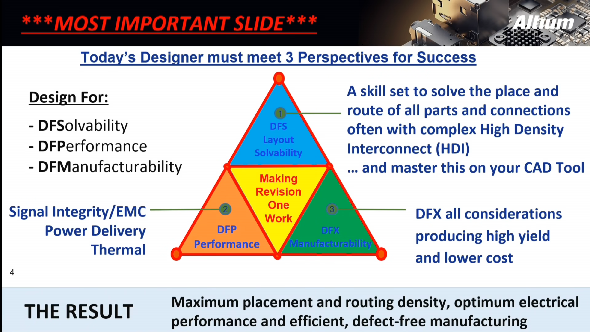

# PCB-Layout

- **Design For Solvability: DFS - Lösbarkeit:** Kann das Board gelöst werden, EDA Kompetenz, Schaltung Abschätzen
- **Design For Performance: DFP - Leistung:** Signal Integrität, EMV (Strahlt das PCB, ist das PCB empfindlich zu Strahlung), [Thermisch](../Physik/Temperatur%20und%20Teilchenmodell.md), [Strom](../Elektrotechnik/elektrischer%20Strom.md) 
- **Design For Manufacturability: DFM - Produzierbarkeit:** So Früh wie möglich die Bauteil Versorgung/Verfügbarkeit prüfen, mit dem Produktionshaus auseinander setzen. Erst Materialien/Stack-Up wählen

## Hochfrequenz Leitungen

## [Schirmung](Schirmung.md) Von Leiterbahnen

## Maßnahmen Zur Elektromagnetischen Verträglichkeit ([EMV](Elektromagnetische%20Verträglichkeit.md#Komponenten%20und%20Konzepte%20zur%20Verbesserung))

### Stack-Up

1. Dünnes [Dielektrikum](../Elektrotechnik/Dielektrikum.md) zwischen Signal-Layer und GND-Layer
	- Verbessert die Kopplung zwischen Signal und GND
	- verringert [Induktivität](../Elektrotechnik/Induktivität.md)
	- erhöht [Kapazität](../Elektrotechnik/Kapazität.md) zwischen Flächen  
	$\Big(C=\dfrac{\varepsilon_{0}\cdot\varepsilon_{r}\cdot A}{d}\Big)$
2. Mindestens 1x GND Layer über/unter einem Signal/Power Layer
	- Grenzt Eund H-Felder ein
	- verringert [Induktivität](../Elektrotechnik/Induktivität.md)
	- gute Stromrückfluss
	- gute Leistungsverteilung
3. Keine aneinander angrenzenden Signal-Layer

### [Leiterbahnen](../HF-Technik/Eingangsimpedanz.md) Und [Anpassung](../Elektrotechnik/Impedanz.md)

1. Leiterbahnen kurz halten
2. Wellenwiderstand / [Impedanz](../Elektrotechnik/Impedanz.md) [Anpassen](../Elektrotechnik/Impedanz.md)
	- Abschlusswiderstand
3. Man strebt grundsätzlich [elektrisch kurze Leitungen](../HF-Technik/Eingangsimpedanz.md) an
4. Leiterbahnen am Rand der Platine vermeiden
	- Niedriges [VSWR](../HF-Technik/Stehwellenverhältnis.md)
	- keine [Reflexionen](../HF-Technik/Reflexionsfaktor.md)
5. Leiterbahnen *niemals* über Referenzlücken routen

### Durchkontaktierungen / Vias

> [!hint] Induktivität wird mit der Distanz größer  
> Vias in paaren Platzieren
> - Power und GND Vias ==dicht== nebeneinander Platzieren
> - Mit jedem Signal Via ein Referenz-Via ==dicht== daneben Platzieren 

# Tags

- [Altium Edu Courses](https://education.altium.com/courses)
- Produkt [Zertifizieren](Certification.md)

