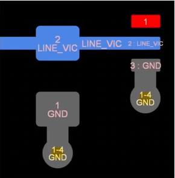
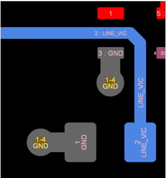
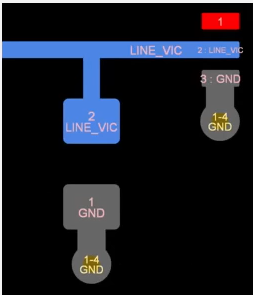

# Paralleler Leitungsabschluss

> [!INFO] Oft ist die [Impedanz](Impedanz.md) der Quelle und der [Leitung](../HF-Technik/Leitungstheorie.md) niedrig ($10\Omega-100\Omega$) gegenüber der Abschlussimpedanz ($>1000\Omega$)
> Ohne Maßnahmen treten [Reflexionen](../HF-Technik/Reflexionsfaktor.md) in hohem Maße auf

> [!CHECK] Transmissionline (TL) wird an der Quell-Seite mit einem parallelen Abschlusswiderstand $R_{T}$ terminiert. 
> Der Widerstand wird so gewählt dass: $Z_{A}\mid\mid R_{T} = Z_{0}$.
> Aufgrund der hohen [Impedanz](Impedanz.md) der Last gilt: $R_{T}\approx Z_{0}$ (kleinere Widerstände dominieren in Parallelschaltungen)
> Widerstand absorbiert die Reflektierte Energie
> 

> [!QUESTION] Wann wird ein paralleler Abschluss benötigt?
> Flankenanstiegszeiten beachten
> Ist die [Leitung](../HF-Technik/Leitungstheorie.md) elektrisch lang?
> Anwendungen:
> - DDR ($V_{TT}$ Abschluss)
> - [CAN](../Digitaltechnik/CAN.md) (Split-Parallelabschluss)
> - LVDS

> [!BUG] Nachteile
> - Die Quelle stark genug sein das Signal an der Last, sowie die abfallende [Leistung](../Physik/Elektrische%20Leistung.md) an $R_{T}$  zu versorgen.
> - Wenn die Quelle im passiven Zustand eine Spannung $\neq V_{T}$ ausgibt wird passiv Strom verbraucht.
> - Große parallele Busse (z.B. DDR) die für jede [Leitung](../HF-Technik/Leitungstheorie.md) einen $R_{T}$ benötigen:
> 	- Obere Aspekte haben stärkeren Einfluss
> 	- komplexes Routing
> 	- benötigt viel Platz

> [!TIP] Tips
> - $V_{TT}$ wählen, dass wenig [Leistung](../Physik/Elektrische%20Leistung.md) wie möglich verschwendet wird.
> - Toleranz bei $Z_{0}$ ($5\%, 10\%$) beachten
> - Toleranz bei $R_{T}$ ($1\%, 10\%$) beachten
> - Um Undershoot ($R_{T}<Z_{0}$) zu vermeiden $\to$ *$R_{T}$ $10\%$ höher als $Z_{0}$ wählen*

## [PCB](PCB-Layout.md) Layout Guidelines

|         $\checkmark$          | $\approx\checkmark$    nur elektrisch kurze [Leitung](../HF-Technik/Leitungstheorie.md) |  x  |
|:-----------------------------:|:------------------------------------------------------------------------------------------:|:---:|
|  |                                                               |     |
