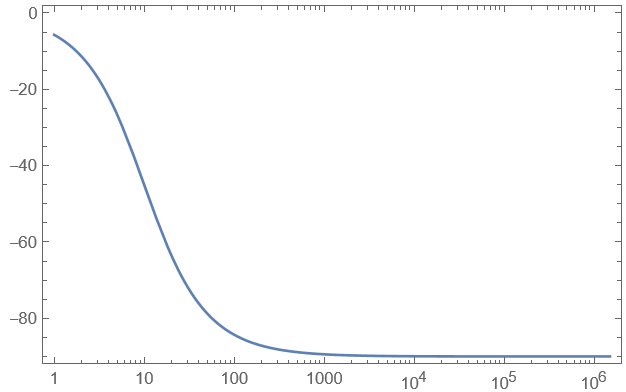

## Passive Filter

### Bodé Diagramm

Zeigt wie der das Filternetzwerk auf den Eingang reagiert

Zeigt den Frequenzgang bestehend aus
- Amplitudengang
- Phasengang

es werden zwei Diagramme benötigt, da mit komplexer [Wechselstromtechnik](Wechselstromtechnik.md) gerechnet wird

Allgemein wird die [[Dämpfung]] des Filters mit logarithmischem Verhältnis dargestellt -> dezibel
- Dezibel ist die Pseudo einheit zur Darstellung von logarithmischen Leistungsverhältnissen

| Diagramm       |                                  |
| -------------- | -------------------------------- |
| **Amplitudengang** $A=\lvert T(j\omega) \rvert$ (Hier nicht in dB) |    |
| **Phasengang** $\varphi=\arctan \left( \frac{\mathrm{Im}(T(j\omega))}{\mathrm{Re}(T(j\omega))} \right)$     |  |