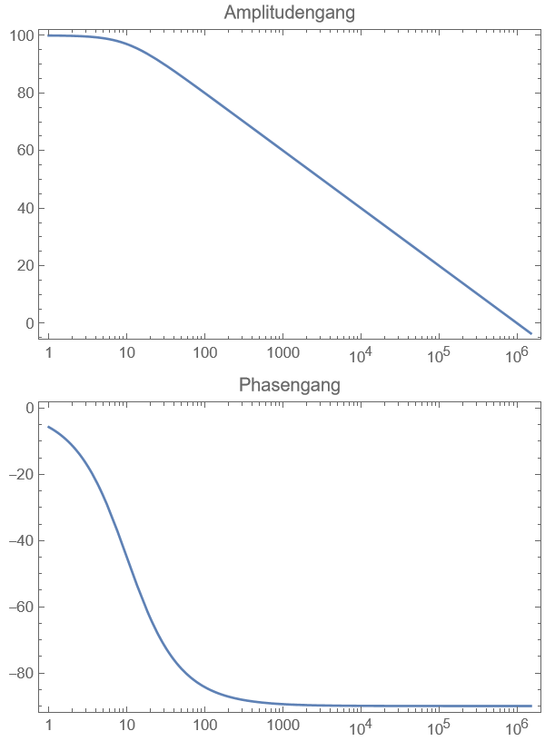

## Passive Filter

> [!question] [Filter](Filter-Verstärker/Filter.md)

### Bodé Diagramm

Zeigt wie der das Filternetzwerk auf den Eingang reagiert

Zeigt den Frequenzgang bestehend aus
- Amplitudengang
- Phasengang

es werden zwei Diagramme benötigt, da mit komplexer [Wechselstromtechnik](Wechselstromtechnik.md) gerechnet wird

Allgemein wird die [[Filter-Verstärker/Dämpfung]] des Filters mit logarithmischem Verhältnis dargestellt -> dezibel
- Dezibel ist die Pseudo einheit zur Darstellung von logarithmischen Leistungsverhältnissen

| Diagramm                                                                                                                                                                                   |                              |
| ------------------------------------------------------------------------------------------------------------------------------------------------------------------------------------------ | ---------------------------- |
| **Amplitudengang** $A=\lvert T(j\omega) \rvert$ (Hier nicht in dB)  **Phasengang** $\varphi=\arctan \left( \frac{\mathrm{Im}(T(j\omega))}{\mathrm{Re}(T(j\omega))} \right)$ |  |

### Messungen

Die Grenzfrequenz eines passiven RC Filters 1. Ordnung lässt sich mit 2 Methoden bestimmen:

Zeitkonstante $\tau = RC$ ermitteln.

3dB dämpfung ermitteln

Sinus einspeisen, bei der der Filter sehr nahe an

# ToDo

- LC filter
- RC Filter
- Pi-/T-Glieder