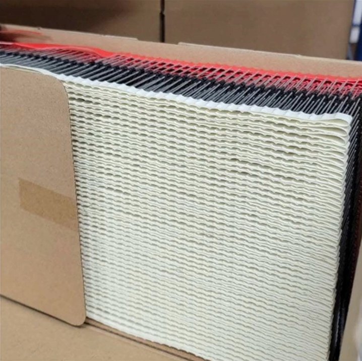
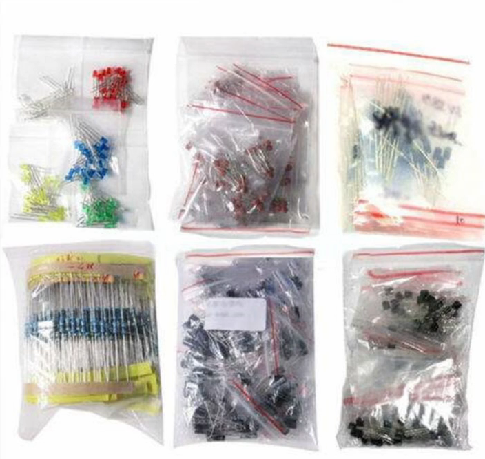
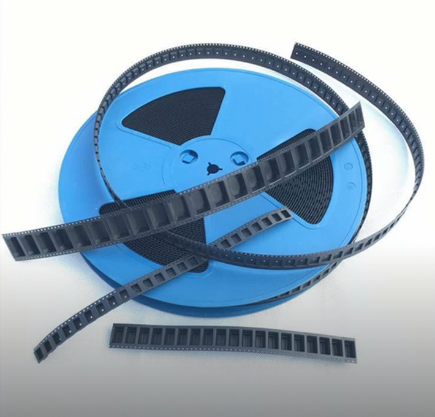
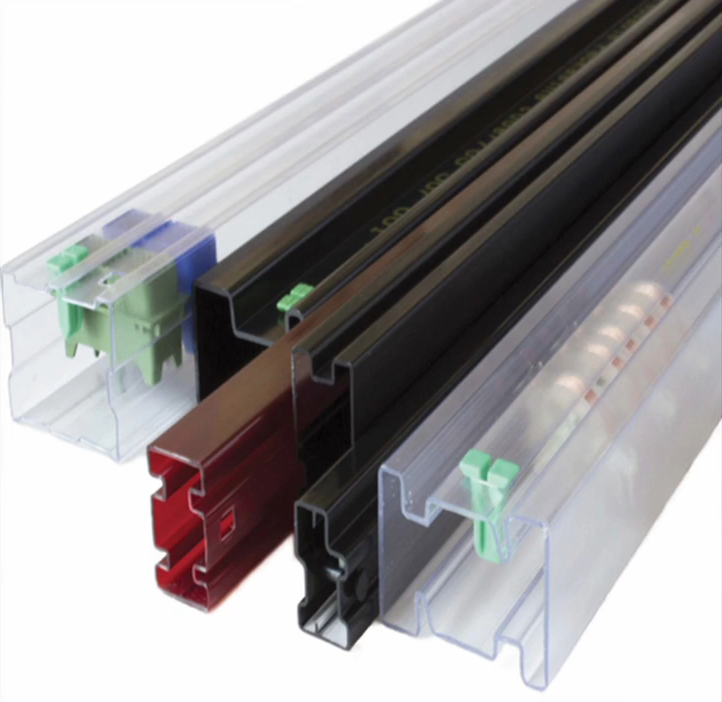
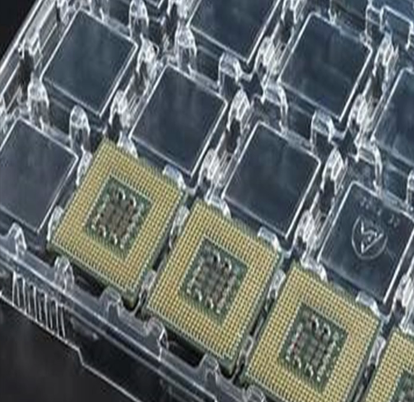
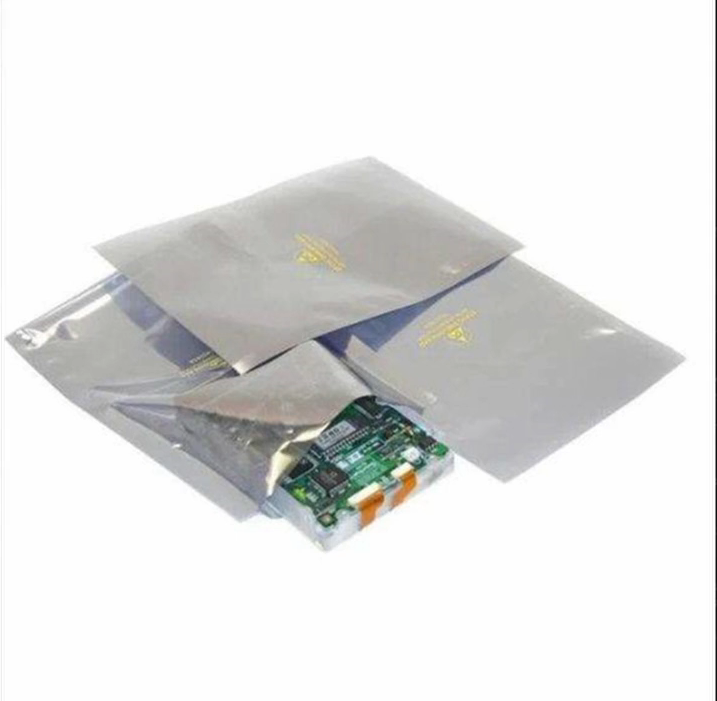
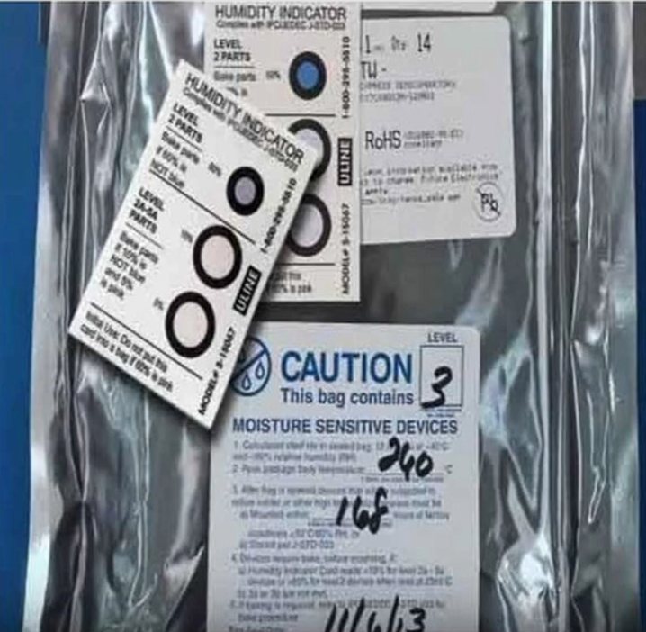

---
tags:
  - Product-Development
aliases: 
created: 19. September 2024
cited:
---

# Elektronik Produktentwicklung

- Prototyp
- Testing
- [Zertifizierung](../../../../Hardwareentwicklung/Certification.md)
- Einkauf

## Prototyp

- Zusätzliche Test Pins
- Pilot Run 

## Einkauf

### Dokumente und Software

1. **MRP - Material Requirements Planning**: Software zur Verwaltung von Inventar und Einkauf von Parts 
2. **BOM - Bill of Materials (Stückliste)**: [Beschreibeung, Part NR, Designator, Preis, Distributor]
    - Mouser Forte
3. **PO**: Purchase Order (Generiert vom MRP)

### Händler / Vendor / Distributor / Supplier

1. **AVL - Approved Vendor List:** Liste im MRP
2. **P&A - Price and Availability:** Quote, Info auf der Website des Händlers
3. **ATS - Available to Ship**

### Part

#### Life Cycle

1. **==Active==**
2. *==NRND==* - Not Recommended for New Designs
3. *==EOL==* - End of Life
4. *==Obsolete==* - Ersetzt durch neueres Produkt
5. ==NPI== - New Product Introduction

#### Packaging

>  
> ### Ammo Packaging***
> 
> - Papier Tape
> - nur für THT
> 
> > [!warning] Leads **Abzwicken**
> > - Sonst verbleiben Klebereste auf den Mounting Holes
> > - Verursacht Kalte Lötstellen und verschmutzung
> >
> 

 &nbsp **Bulk Packaging**

        

 **Cut Tape & Reel Packaging**

        

---

 &nbsp **Tube**

        

---

 **Tray**

        

---

 &nbsp **ESD Sackal** 

        

---

 **MSL**
