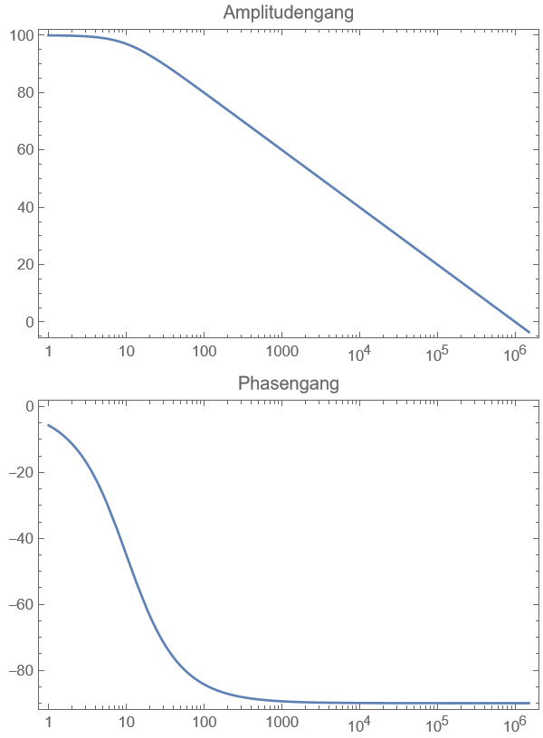

---
tags:
aliases:
  - Slew-Rate
  - Offset-Spannung
  - Biasstrom
  - Transitfrequenz
  - Realer OPV
  - Reales Verhalten von OPVs
keywords:
subject:
  - PR
  - Elektrische Messtechnik und Sensorik
  - UE
  - Einführung Elektronik
semester: WS25
created: 5th November 2025
professor:
  - Christian Diskus
  - Andreas Tröls
---

# Reale Eigenschaften von OPVs

**Modell:**

Charakteristische Größen und deren Größenordnungen

| Bezeichung                                                         | Größe                    | Einheit          | ideal    | bipolar |       | JFET  |       | CMOS |       |
| ------------------------------------------------------------------ | :----------------------- | :--------------- | :------- | :------ | :---- | :---- | :---- | :--- | :---- |
|                                                                    |                          |                  |          | std.    | präz. | std.  | präz. | std. | präz. |
| **Offsetspannung**                                                 | $U_{\text {offs}}$ (max) | $\mathrm{mV}$    | 0        | 3       | 0.025 | 2     | 0.1   | 2    | 0.1   |
| **Biasstrom**                                                      | $I_B$ (typ)              | $@ 25^{\circ} C$ | 0        | 50 nA   | 25 pA | 50 pA | 40 fA | 1 pA | 2 fA  |
| **Transitfrequenz** Jene Frequenz, bei der $\|A_{D}(f_{T})\|=1$ | $f_T$ (typ)              | $MHz$            | $\infty$ | 2       | 2000  | 5     | 400   | 2    | 10    |
| **Slew-Rate**                                                      | $SR$ (typ)               | $V / \mu s$      | $\infty$ | 2       | 4000  | 15    | 300   | 2    | 10    |
|                                                                    | $U_0$ (min)              | $V$              | 0        | 5       | 1.5   | 10    | 5     | 2    | 1     |
|                                                                    | $U_0$ (max)              | $V$              | $\infty$ | 36      | 44    | 36    | 36    | 15   | 15    |
|                                                                    | $k_{\text {offs}}$ (max) | $\mu V /K$       | 0        | 5       | 0.1   | 20    | 1     | 10   | 3     |
|                                                                    | $e_n$ (typ)              | $nV / \sqrt{Hz}$ | 0        | 10      | 1     | 20    | 3     | 30   | 7     |

> [!info] **std**: Standard-OPV, **präz**: Präzisions-OPV

| **Unbeschalteter OPV** (also $k=0$)       | **Rückgekoppelter OPV**                         |
| ----------------------------------------- | ----------------------------------------------- |
| $A_{D}(s) = \dfrac{A_{D0}}{1+s\tau_{0}}$  | $A_{D}(s)=\dfrac{A_{D0}}{1+A_{D 0}k+s\tau_{0}}$ |
| $f_{g_{0}} = \dfrac{1}{2\pi\tau_{0}}$     | $f_{g}=f_{g 0}\cdot A_{D 0}$                    |
|                                           | $\lvert A_{D}(f) \rvert=1\to f=f_{T}$           |
|  |      |

$A_D\ldots$ Frequenzabhängige Verstärkung
$A_{D 0}\ldots$ Verstärkung ohne nachgeschaltetem Tiefpass
$\tau_0\ldots$ Zeitkonstante des Tiefpasses
$k\ldots$  Rückkopplungsfaktor, abhängig von externer Beschaltung
$f_{g 0}\ldots$ Grenzfrequenz des OPs für den unbeschalteten Fall
$f_g\ldots$ Grenzfrequenz des beschalteten OPs
## Differenzenverstärkung

Die Differenz oder auch Leerlaufverstärkung $A_{D}$ gibt das Verhältis einer Änderung der **Ausgangsspannung** $U_{A}$ zu einer Änderung der **Eingangsspannungsdifferenz** $U_{D}$ an:

> [!def] Differenzenverstärkung $A_{D}$
> $$A_{D} := \frac{\partial U_{A}}{\partial U_{D}}$$

## Slew-Rate

> [!info] Slew-Rate: $SR>\frac{du}{dt}\rightarrow u(t)\dots$ Beschaltungssignal
> Die Slewrate muss größer als der größte Signalflankenanstieg in einer Schaltung sein.

## Ausgangsaussteuerbarkeit

Die Ausgangsspannung ist im Bereich $U_{\mathrm{A,min}} < U_{\mathrm{A}} <U_{\mathrm{A,max}}$ näherungsweise linear von $U_{D}'$ ($=U_{D}$ um die [Offset Spannung](#Offset%20Spannung) verschoben). Dieser Bereich heißt Aussteuerbereich. Bei den meisten OPVs liegen die Aussteuergrenzen betragsmäßig ca. $3\mathrm{V}$ unter der Betriebsspannung $U_{\mathrm{B}}$.

> [!hint] Bei speziellen Rail-to-Rail OPVs leigen die Aussteuergrenzen bis einige $\mathrm{mV}$ unter der Betriebsspannung.

## Offset Spannung

Als Offsetspannung $U_{\mathrm{OS}}$ wird jene Spannungsdifferenz beziechnet, die an die Eingänge angelegt werden muss, um bei $U_{\mathrm{P}} = U_{\mathrm{D}} = 0$ am Ausgang $U_{\mathrm{A}} = 0\mathrm{V}$ zu erhalten.

> [!warning] Die tatsächlich mit $A_{\mathrm{D}}$ verstärke Spannung ist $U_{\mathrm{D}} = U_{\mathrm{D}}'-U_{\mathrm{OS}}$

Einige OPVs führen Anschlüsse nach außen um die Offsetspannung zu kompensieren.

## Gleichtaktverstärkung und -unterdrückung

> [!question] [Gleich und Gegentaktgrößen](Filter-Verstärker/Gleich%20und%20Gegentaktgrößen.md)

Legt man bei einem abgeglichenen OPV ($U_{\mathrm{OS}} = 0\mathrm{V}$) an den invertierenden und den nicht-invertierenden Eingang die selbe Spannung $U_{\mathrm{GL}}$ an, bleibt $U_{\mathrm{D}} = 0\mathrm{V}$. Demnach müsste auch die Ausgangsspannung $U_{\mathrm{A}}=0\mathrm{V}$ bleiben.  Bei einem realen OPV greift diese Spannung jedoch etwas auf den Ausgang durch: 

Als Gleichtaktunterdrückung $G_{\mathrm{U}}$ bezeichnet man das Verhältnis zwischen Differenzverstärkung $A_{\mathrm{D}}$ und Gleichtaktverstärkung $A_{\mathrm{GL}}$

## Bias-Ströme

> [!def] Eingangsruhestrom
> $$I_{B} = \frac{I_{\mathrm{B,P}}+I_{\mathrm{B,N}}}{2}$$

> [!def] Eingangsoffsetstrom
> $$I_{\mathrm{OS}} = \left| I_{\mathrm{B,P}}-I_{\mathrm{B,N}} \right| $$

## Eingangswiderstand

> [!question] [Betriebsparameter von Verstärkern](Betriebsparameter.md)

Reale OPV haben einen endlichen Eingangswiderstand. Man unterscheidet zwischen Differenzeingsgangswiderstand

> [!def] Differenzeingangswiderstand $r_{\mathrm{D}}$
> $$r_{\mathrm{D}} = \frac{\partial U_{\mathrm{D}}}{\frac{1}{2}\partial (I_{\mathrm{P}}-I_{\mathrm{N}})}$$

und dem Gleichtakteingangswiderstand

> [!def] Gleichtakteingangswiderstand $r_{\mathrm{GL}}$
> $$r_{\mathrm{GL}} = \frac{\partial U_{\mathrm{GL}}}{\frac{1}{2}\partial (I_{\mathrm{P}}+I_{\mathrm{N}})}$$

Wie diese Widerstände verschalten sind, ist im Modell zu sehen.

## Ausgangswiderstand

> [!question] [Betriebsparameter von Verstärkern](Betriebsparameter.md)

Reale Operationsverstärker weisen (im Gegensatz zu idealen) einen Ausgangswiderstand größer als $0\Omega$ auf:

> [!def] Ausgangswiderstand $r_{\mathrm{A}}$
> $$r_{\mathrm{A}} = -\frac{\partial U_{\mathrm{A}}}{\partial I_{\mathrm{A}}}$$