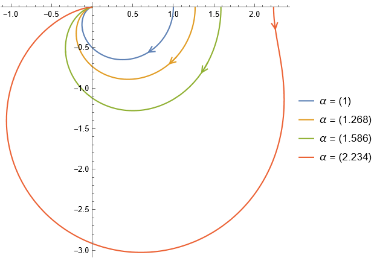

---
tags:
  - Baugruppen/Filter
  - HTL-Diplomarbeit
  - Mathematica
aliases:
  - Sallen-Key
keywords: 
subject:
  - VL
  - Einführung Elektronik
semester: WS24
created: 13. Dezember 2024
professor:
---
 

# Sallen-Key Filter Topologie

> [!question] Siehe: [Aktiver Filter](Aktiver%20Filter.md), [Gegenkopplung](Kopplungsarten.md)


Der Sallen-Key Filter basiert auf einer Einfachen Gegenkopplung von Wechselsignalen, welches ein Tiefpassverhalten 2. Ordnung erzeugt. 

```tikz
\usepackage[european, straightvoltages]{circuitikz}
\usepackage{amsmath}

\begin{document}
\begin{circuitikz}[thick, scale=1.5, font=\Large]
% Begin Schematic

\draw (0,0) node[op amp, yscale=-1] (opv) {};
\draw (opv.-) to[short] (opv.- |- 0, -1.5) to[short,-*] (opv.out |- 0, -1.5) to[R, l_=$(\alpha-1)\cdot R_3$] ++(0,1.5) to[short, *-] (opv.out) to[short,-o] ++(1,0) node[right] {$U_A$};
\draw (opv.out |- 0, -1.5) to[R, l=$R_3$] (opv.out |- 0, -3) node[tlground] {};

\draw (opv.+) to[short, -*] (opv.+ -| -1.5, 0) to[R, l_=$R_2$, -*] (opv.+ -| -3, 0) to[R, l_=$R_1$, -o] ++(-1.5,0) node[left] {$U_E$};
\draw (opv.+ -| -1.5, 0) to[C, l_=$C$] (-1.5, -3) node[tlground] {};
\draw (opv.+ -| -3, 0) to[short] (-3, 1.5) to[C, l=$C$] (opv.out |- 0, 1.5) to[short] (opv.out);

\end{circuitikz}
\end{document}
```

## Übertragungsfunktion

> [!question]- **Herleitung**

|                    Bode Diagramm                     |                        Ortskurve                         |
|:----------------------------------------------------:|:--------------------------------------------------------:|
|  |  |

<center><a href="./assets/SallenKey.nb" class="internal-link">📈Mathematica Notebook</a></center>


> [!info] Unterschiedliche Wahlen des Verstärkungsfaktors $\alpha$ ergeben unterschiedliche [Filtercharakteristiken](Aktiver%20Filter.md#Filter%20Charakteristiken):
> 
> $\alpha=1$: Kritische Dämpfung
> $\alpha = 1.268$: Bessel
> $\alpha = 1.586$: [Butterworth](Butterworth%20Filter%20Charakteristik.md)
> $\alpha=2.234$: [Tschebyscheff](Tscheybyscheff%20Filter%20Charakteristik.md)

## Funktionsweise