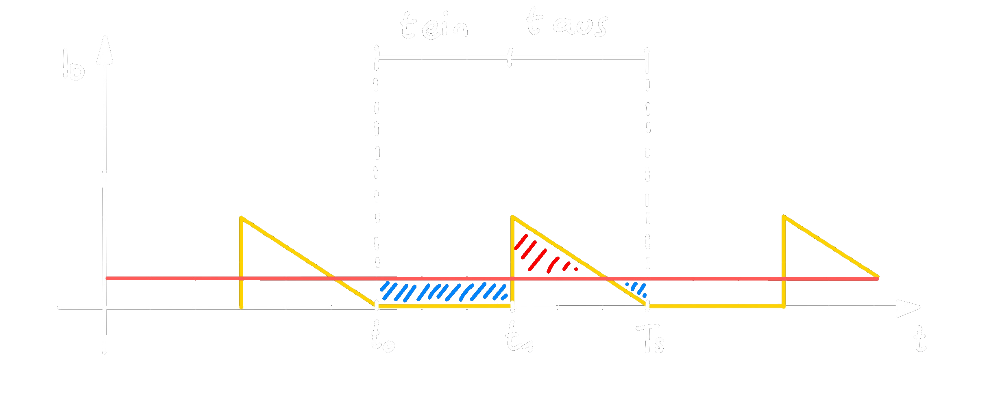

# Boost Converter

## Schaltung

$$
U_{a}\approx U_{e} \cdot \frac{1}{1-DC}
$$
Während der Einschaltphase des [Transistors](../Halbleiter/{MOC}%20Transistor.md) $(T)$ Fällt die Eingangsspannung $U_{e}$ an der Indukitivät $(L)$ ab.  
Schaltet der [Transistor](../Halbleiter/{MOC}%20Transistor.md) $(T)$ ab, so fließt der [Strom](../../Elektrotechnik/elektrischer%20Strom.md) $I_{L}$ über die [Diode](../Halbleiter/Diode.md) (D) weiter und lädt den [Kondensator](../../Elektrotechnik/Kapazität.md) $C_{a}$.

## Impuls-Zeit Diagramm

## Schalter $S$ bzw. [Transistor](../Halbleiter/{MOC}%20Transistor.md) $T$

### $0<t<t_{1}$: $S_{geschlossen}$

Bei geschlossenen Schalter $S$ $(T)$ liegt $U_{e}$ über $L$ an und treibt $I_{L}$ durch die [Spule](../../Elektrotechnik/Induktivitäten.md).
 - Dabei *speichert die [Spule](../../Elektrotechnik/Induktivitäten.md) Energie*.
 - Die [Diode](../Halbleiter/Diode.md) sperrt in dieser Zeit.
 - Der [Kondensator](../../Elektrotechnik/Kapazität.md) $C_{A}$ liefert den [Strom](../../Elektrotechnik/elektrischer%20Strom.md) für den Verbraucher.

### $t_{1}<t<T_{s}$: $S_{geöffnet}$

Nach dem öffnen von $S$ $(T)$ treibt die [Spule](../../Elektrotechnik/Induktivitäten.md), aufgrund der in ihr gespeicherten Energie den [Strom](../../Elektrotechnik/elektrischer%20Strom.md) $I_{L}$, durch die, jetzt in *Druchlass-Richtung* liegende, [Diode](../Halbleiter/Diode.md).

Ein Teil der in der [Spule](../../Elektrotechnik/Induktivitäten.md) gespeicherten Energie, wird in der Sperrphase auf den [Kondensator](../../Elektrotechnik/Kapazität.md) übertragen.  
$\rightarrow$ **[Sperrwandler](Sperrwandler.md)**, Da die [Spule](../../Elektrotechnik/Induktivitäten.md) dem [Kondensator](../../Elektrotechnik/Kapazität.md) nur in dieser Phase [Strom](../../Elektrotechnik/elektrischer%20Strom.md) liefert.

### Herleitung der Dimensionierung

#### $0<t<t_{1}$: $S_{geschlossen}$

$$
\begin{align*}
	\Delta I_{L1} &= \frac{1}{L}\int^{t_{1}}_{0} U_{e}dt = \frac{1}{L}\cdot U_{e}\cdot t_{1} \qquad (1)\\
\end{align*}
$$

#### $t_{1}<t<T_{s}$: $S_{geöffnet}$

$$U_{L} = -(U_{a}+U_{FO}-U_{e})$$
$$
\begin{align*}
\Delta I_{L2} &= \frac{1}{L}\int_{t_{1}}^{T_{S}}- (U_{a}+U_{FO}-U_{e})dt
\\
&= -\frac{1}{L}\Big(U_{a}+U_{FO}-U_{e}\Big)\cdot\Big(T_{S}-t_{1}\Big) \qquad (2)
\end{align*}
$$

#### $\Delta I_{L1}= -\Delta I_{L2}$

$$
\begin{align*}\\
\frac{1}{L}\cdot U_{e}\cdot t_{1} &= \frac{1}{L}\Big(U_{a}+U_{FO}-U_{e}\Big)\cdot\Big(T_{S}-t_{1}\Big)
\\
&\dots
\\
U_{A} &= \frac{U_{e}\cdot T_{s}}{t_{aus}}-U_{Fo}
\\
&\approx U_{e} \cdot \frac{1}{1-DC}
\end{align*}
$$
$t_{aus}= T_{S} - t_{1}$  
$DC = \frac{t_{ein}}{T_{S}}$  
$1-DC = \frac{t_{aus}}{T_{S}}$

## [Induktivität](../../Elektrotechnik/Induktivitäten.md)

Die Mindestinduktivität wird mittelt de, Mindestlaststrom Berechnet
>  
>$\overline{I_{D}} = I_{a,min}$  
>$A_{+}$ = $A_{-}$ (Fläche zwischen dem Stromverlauf von $\Delta I_{L}$ und $I_{a,min}$)

>

## [Kapazität](../../Elektrotechnik/Kapazität.md)

>  
> $I_{a,min}$ = $\overline{I_{D}}$ 

$Q=C\cdot U$  
$C_{min}= \dfrac{\Delta Q}{\Delta U_{a}} = \dfrac{I_{a,max}-t_{ein}}{\Delta U_{a}}$  
Mit etwas Überdimensionierung ($\rightarrow T_{S}$ statt $t_{ein}$) erhält man:  
$C_{min}= \dfrac{\Delta Q}{\Delta U_{a}} = \dfrac{I_{a,max}-T_{S}}{\Delta U_{a}}$

---

# Tags

