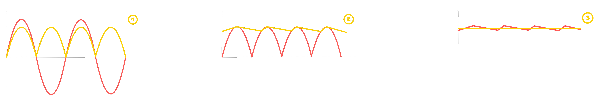

---
tags:
  - Baugruppe/Versorgung
aliases:
  - Stabilisierungsschaltung
  - Stabilisierungsschaltungen
  - LVR
  - Spannungsstabilisierung
subject:
  - hwe
source:
  - Siegbert Schrempf
created: 16th March 2022
---

# Linearregler

Stabilisierung Und Regelung Von [elektrische Spannung](../../Elektrotechnik/elektrische%20Spannung.md)

Die notwendigen Kenngrößen zur Beurteilung der Qualität einer Stabilisierungsschaltung sind wiefolgt:
1. Eingangsspannung und Toleranz
2. Ausgangsspannung und Toleranz
3. Eingangsschwankungs-Regelung **(Line Regulation)**
	- $\dfrac{\Delta U_{a}}{\Delta U_{e}}$
4. Belastungs-Regelung **(Load Regulation)**
	- $\dfrac{\Delta U_{a}}{\Delta i_{a}}$
5. [Temperatur](../../Physik/Temperatur%20und%20Teilchenmodell.md) Koeffizienten
6. Ausregelzeit
	- Wie lange eine Veränderung am Eingang zu einer Veränderung am Ausgang dauert.

> [!question] Die Klassifizierung von Schaltungen zur Spannungsstabilisierung, kann in die Kategorien
>  - Geregelte Spannungsstabilisierung
>  - [Ungeregelte Spannungsstabilisierung](Ungeregelte%20Spannungsstabilisierung.md)

## Typische Schaltung Eines Netzteils Mit Linearregler

1. Gleichrichterschaltung (inkl. Transformation)
2. Siebschaltung zur Glättung der Gleichspannung
3. Spannungsstabilisierung der Gleichspannung gegen Schwankungen …
	- … der Eingangsspannung
	- … der Last
	- … der [Temperatur](../../Physik/Temperatur%20und%20Teilchenmodell.md) 
4. Last
	- bei der Last werden üblicherweise Analoge und Digitale Versorgung mittels einer Sternförmigen[^1] Masse getrennt.
		- (Über dem Spalt in der Masse dürfen auf einer Platine keine [Leiterbahnen](../../HF-Technik/Eingangsimpedanz.md) Verlegt werden)

> [!example] Verwendung in einem Netzteil:
> 
> 

Verlauf der [elektrische Spannung](../../Elektrotechnik/elektrische%20Spannung.md):
- Rot: vor der Stufe
- Gelb: nach der Stufe

# Tags

- [[Linear Dropout Regulator]]
- [Linearregler - HTL Mitschrift](../../_assets/pdf/Linearregler.pdf)

[^1]: Kontrovers 
