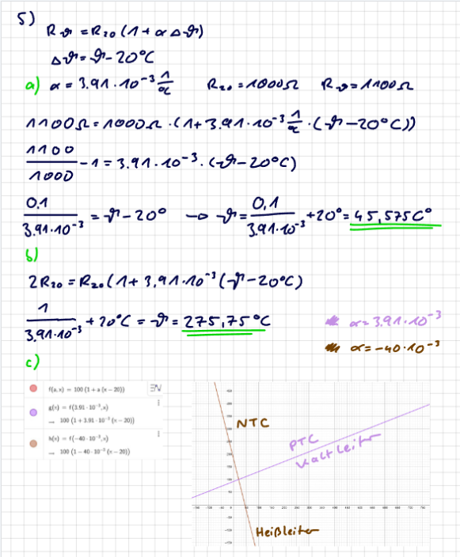

 

# [Temperatur](../Physik/Temperatur%20und%20Teilchenmodell.md) Abhängiger Widerstand

## NTC - Heißleiter

> [!info] Der NTC (negative temperature coefficient) weist bei *höheren* Temperaturen einen *niedrigeren* Widerstand auf.  
> Der Widerstand ist also *indirekt* proportional zur [Temperatur](../Physik/Temperatur%20und%20Teilchenmodell.md) 

## PTC - Kaltleiter

> [!info] Der PTC (positive temperature coefficient) wiest bei *höheren* Temperaturen einen *höheren* Widerstand  
> Der Widerstand ist also *direkt* proportional zur [Temperatur](../Physik/Temperatur%20und%20Teilchenmodell.md).

# Beispiele

> [!example] Gegeben sei ein temperaturabhängiger Widerstand $R_{\vartheta}=R_{20}(1+\alpha \Delta \vartheta)$ mit:
>
> - $\alpha$ : Temperaturbeiwert des Materials in $\frac{1}{{ }^{\circ} \mathrm{C}}$.
> - $\Delta \vartheta$ : Temperaturänderung zum Bezugswert.
> - $R_{20}$ : Widerstand bei $20^{\circ} \mathrm{C}$ in $\Omega$.
> 
> *a)* Berechnen Sie die Temperatur des Widerstandes für $R_{20}=1000, R_{\vartheta}=1100$ und $\alpha=3.91 \cdot 10^{-3} \frac{1}{{ }^{\circ} \mathrm{C}}$.
> *b)* Bei welcher Temperatur verdoppelt sich der Widerstand?
> *c)* Skizzieren Sie die beiden qualitativen Widerstandsverläufe $R(T)$ für $R_{20}=$ $100 \Omega, \alpha_1=3.91 \cdot 10^{-3} \frac{1}{{ }^{\circ} \mathrm{C}}$ und $\alpha_2=-40 \cdot 10^{-3} \frac{1}{{ }^{\circ} \mathrm{C}}$.
> Welcher der Widerstände ist ein Heißleiter, welcher ein Kaltleiter?
> 
> > [!success]- Lösung  
> > 