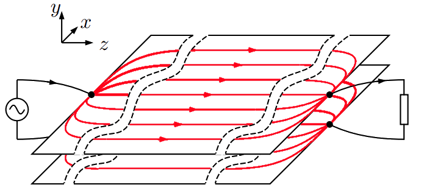
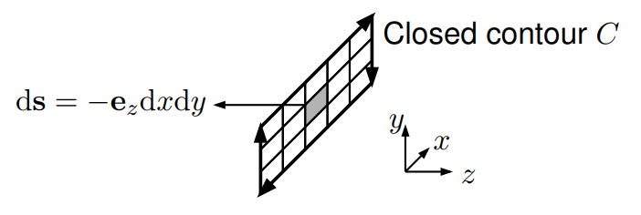

 

# Leitergeometrien von HF-Leitungen

> [!success] Die charakteristische Impedanz $Z_{0}$ beschreibt unter anderem die Geometrie einer Leitung
> Man muss daher nicht immer die Maxwellgleichungen für eine Leitungsgeometrie lösen, sondern kann mit der charateristischen Impedanz 

## TEM-Moden

siehe: [Transversale EM-Welle](Transversale%20Elektromagnetische%20Welle.md)

> [!success] Nicht frequenzabhängig. Funktionieren für Alle frequenzen (auch DC) gleich

### Herleitung zu HF-Leitermodelle

> [!warning] Herleitung der Parallelplattenleitung mittels der Maxwellgleichungen
> Jedoch ist das verfahren gleich für andere geometrien
> 1. Annahmen zum Feldverlauf
> 2. Kontur Wählen
> 
> 

#### Annahmen zum Feldverlauf

Vorraussetzung für TEM-Moden:

> [!info] E-Feld
> - E-Feld hat keine komponente die in $z$-Richtung zeigt
> - wir nehmen an dass die E-Feld Komponente in $x$-Richtung 0 ist
> 
> $$\mathbf{E} = \begin{bmatrix} 0 \\ E_{y}(x,y,z,t) \\ 0 \end{bmatrix} = E_{y}(x,y,z,t)\cdot \mathbf{e}_{y}\quad \text{für} \quad 0 < y < d$$
> 

 > [!info] H-Feld
 > - H-Feld hat auch keine komponente in $z$-Richtung
 > - wir nehmen an dass das H-Feld nur in $x$-Richtung zeigt (gegensatz zum E-Feld)
 >
 > $$\mathbf{H}=\begin{bmatrix} H_{x}(x,y,z,t) \\ 0 \\ 0\end{bmatrix} = H_{x}(x,y,z,t)\cdot e_{x} \quad \text{für} \quad 0<y<d$$
 
Vereinfachte Lösung mit annahme einer idealen TEM mode (es gibt genauere Lösungen)

#### Kontur des Leitermodell-Querschnitts

Konturintegral über dem Modellquerschnitt

Stokessche Integralsatz
$$
\nabla \times \mathbf{E}=-\frac{\partial}{\partial t} \mathbf{B} \implies \oint_C \mathbf{E} \cdot \mathrm{~d} \mathbf{l}=-\frac{\partial}{\partial t} \iint_S \mu \mathbf{H} \cdot \mathrm{~d} \mathbf{s}
$$

> [!warning] Projektion der Feld-Komponenten: Nur Feldkomponenten die auf die..
> 
> - ... Kontur Projiziert werden, tragen zum Konturintegral $\oint_{C}$ bei.
> - ... [Flächennormale](Elektrotechnik/Flächenvektor.md) Projiziert werden, Tragen zum [Flächenintegral](Elektrotechnik/Flächenintegral.md) $\iint_{S}$ bei 

## Andere Moden

HF-Leitungen höherer ordnung

> [!warning] Funktionieren nicht für alle Frequenzen gleich

- Rectangular Waveguide (Rechteck Hohlleiter)
- [LWL](Lichtwellenleiter.md) - Dielektrischer Wellenleiter Licht Als EM-Welle durch nicht leitendes Dielektrikum
- Coplanarer Microstrip

