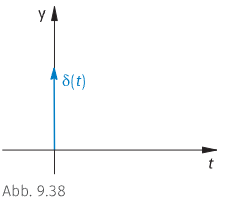
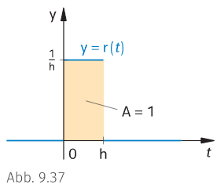
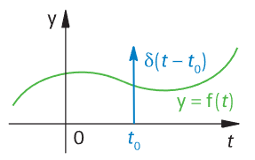

# Delta-Impuls $\delta(t)$

Der **Delta-Impuls** dient zur idealisierten, aber bequemen mathematischen Beschreibung eines sehr **kurzen Impulses**, durch etwa ein *mechanisches oder elektrisches* schwingfähiges System, dass aus dem Ruhezustand angeregt wird.  

> [!def] **D1 - DIR-$\delta$ )** Dirac-Distribution / Einheitsimpuls ^DIRD
> $$
> \begin{align*}
> \delta(t) = \begin{cases}
> \to \infty & \text{für} & t = 0 \\
> 0 & \text{für} & t \neq 0
> \end{cases} && \text{mit} && \int_{-\infty}^{\infty}\delta (t)dt = 1
> \end{align*}
> $$
> 

$\delta(t)$ ist jedoch im eigentlichen Sinn keine Funktion mehr, da $\infty$ kein Funktionswert ist. Ebenfalls ist das Integral $\int_{-\infty}^{\infty}\delta (t)dt = 1$ im üblichen Sinn nicht mehr möglich. Symbolisch wird der Delta-Impuls durch einen Pfeil dargestellt.  

$d(t)$ ist eine verallgemeinerte Funktion bzw. Distribution

## Herleitung

Zu seiner Einführung kann man von einem kurzen Rechtecksimpuls **$y=r(t)$** ausgehen:

$$
\begin{align*}
	(h<0): r(t) = \begin{cases}
		\frac{1}{h} & \text{für} & 0\leq t < h\\
		0 & \text{sonst} & 
	\end{cases} && = \frac{1}{h} \Big{[}\sigma(t) - \sigma(t-h) \Big{]}
\end{align*}
$$

Zur Normierung der *Wirkung* einer solchen Impulsfunktion wurde gewählt, dass die **Impulsfläche 1 ist**:

$$
A = \int_{-\infty}^{\infty}r(t)dt=\int_{0}^{h}r(t)dt = 1 
$$

Wird $h$ kleiner, so wird $r(t)$ wegen der konstanten "Impulsfläche" 1 während der Impulsdauer $h$ größer.  
Man möchte nun den gesamten Impuls "auf einen Zeitpunkt konzentrieren", Dazu geht man zum Grenzfall $h\rightarrow 0$ über und erhält die 

$$
\lim_{h\rightarrow 0} r(t) := \delta(t)
$$

## Abtasteigenschaft

$$ f(t_{0}) = \int_{-\infty}^{\infty}f(t)\cdot\delta(t-t_{0})dt $$

## Ausblendeigenschaft

$$
x(t)\delta(t-t_{0}) = x(t_{0})\delta(t-t_{0})
$$

## Verschiebung und Skalierung

$$
\delta(at) = \frac{1}{|a|}\delta(t) \qquad
\delta(t-t_{0}) = \begin{cases}
1  & \text{wenn } t = t_{0} \\ 0 & \text{sonst}
\end{cases}
$$

# Kronecker Delta

Der Einheitsimpuls ist im Zeitdiskreten tatsächliche eine Funktion.

> [!def] **D2 - KRO-$\delta$ )** Kronecker-Delta / Zeitdiskreter Einheitsimpuls ^KROD
> 
> $$
> \delta_{k m} := \begin{cases}
> 1 & \text {für } k=m \\
> 0 & \text {für } k \neq m
> \end{cases} \quad \text{oder} \quad \delta[n] := \begin{cases}
> 1 & \text {für } n=0 \\
> 0 & \text {sonst}
> \end{cases}
> $$
> 

---

- [Faltung](../../Systemtheorie/Faltung.md)
- [Impulsanwort](../../Systemtheorie/Impulsanwort.md)

 
