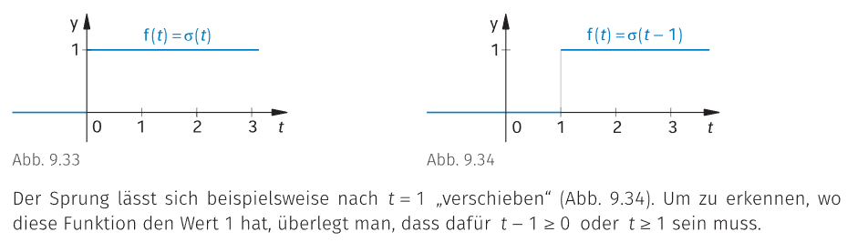

# Die Einheitssprungfunktion

$$
\sigma(t) =
\begin{cases}
0 & \text{für} & t<0\\
1 & \text{für} & t\geq 0
\end{cases}
$$

Diese an der Stelle $t=0$ unstetige Funktion heißt auch **Heaviside**-Funktion und wird auch mit **$\mathscr{H}$**, **$\varepsilon$** oder **$\mathcal{u}$** bezeichnet. Sie wird zur Beschreibung von Einschaltvorgängen verwendet.

> [!EXAMPLE] $f(t) = (t-2)\cdot\sigma(t-2)$

---

# Tags

[Delta-Impuls](Delta-Impuls.md)
