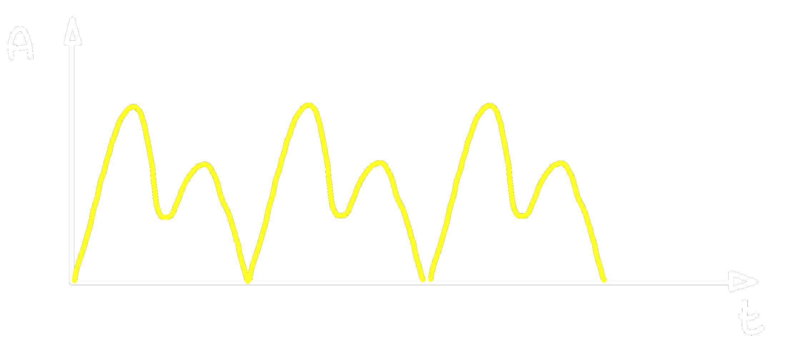
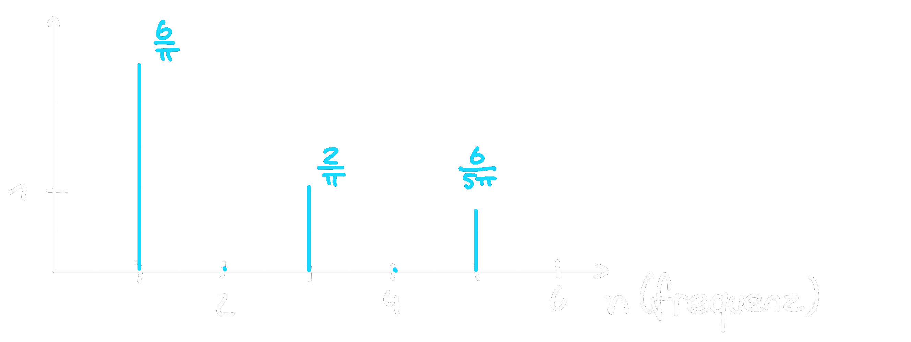

---
tags:
  - HTL-Diplomarbeit
  - Mathe/Reihen
aliases:
  - Fourierreihen
  - Fourier Reihen
  - Fourier-Reihe
  - Fourierreihe
subject:
  - mathe
source:
  - Rudolf Frauenschuh
  - Laurenz Hölzl
  - Daniel Ch. v. Grüningen
created: 24th March 2022
---

# Fourierreihe

1807 fand Jean Baptiste Fourier heraus, dass sich eine periodische [Funktion](Abbild.md) als eine [Koordinatenmatrix](Koordinatenmatrix.md) von Sinusund Cosinus-Schwingungen, eine so-genannte Fourierreihe, ausdrücken lässt:

$$
	x_{p} = \frac{a_{0}}{2} + \sum^{\infty}_{k=1} \Big[a_{k} \cdot \cos(2\pi k f_{0} t) + b_{k}\cdot\sin (2\pi k f_{0} t)\Big]
$$

> [!INFO] Hierbei sind $a_{k}$ und $b_{k}$ sogenannte Fourier-Koeffizienten, welche den Amplituden der entsprechenden (also $k$-ten) Schwingungsanteile gleichkommen.

> [!INFO] Für den Fall „$k=0$“ existiert das, den arithmetischen Mittelwert darstellende, zeitunabhängige Glied $\frac{a_{0}}{2}$. Die Grundfrequenz der Fourierreihe ist über $f_{0}$ dargestellt.

Jede periodische [Funktion](Abbild.md) kann als aus einer Summe von Sinus und/oder Cosinus Schwingungen zusammengesetzt werden:

## Periodische [Funktion](Abbild.md)

$f(x)=f(x+a)$  

> [!HINT] Sei $f$ eine $2\pi$-periodische [Funktion](Abbild.md).  
> Ist das Perioden-Intervall in **endlich viele Teilintervalle** zerlegbar, in denen $f$ sowohl **stetig, als auch monoton** ist, so kann die [Funktion](Abbild.md) in eine **Fourierreihe** zerlegt werden.
> 
> $f(x)\dots$**Trigonometrisches [Polynom](Polynom.md)**

## Amplituden-Phasenform

> [!summary] $$A_{n}\sin(b\cdot x+\varphi_{n})=a_{n}\cdot cos(n \cdot x)+b_{n} \cdot\sin(n\cdot x)$$
>
> - $A_{n}=\sqrt{a_{n}^{2}+b_{n}^{2}}$
> - $\varphi=\arctan\left(\dfrac{a_{n}}{b_{n}}\right)$

- $A_{1}\cdot\sin(x+\varphi)$: 1. Harmonische oder Grundschwingung
- $A_{2}\cdot\sin(2x+\varphi)$: 2. Harmonische oder 1. Oberschwingung
- $A_{3}\cdot\sin(3x+\varphi)$: 3. Harmonische oder 2. Oberschwingung

>[!EXAMPLE] Rechteckschwingung  
>   
> [Klirrfaktor](../../Hardwareentwicklung/Klirrfaktor.md) … $k=\dfrac{\sqrt{(\frac{2}{\pi})^{2}+(\frac{6}{5\pi})^{2}}}{\sqrt{(\frac{6}{\pi})^{2}+(\frac{2}{\pi})^{2}+(\frac{6}{5\pi})^{2}}} = 0.3623$

## Fourier Koeffizienten

> [!hint] Das Integrationsintervall kann beliebig verschoben werden

---

# Tags

