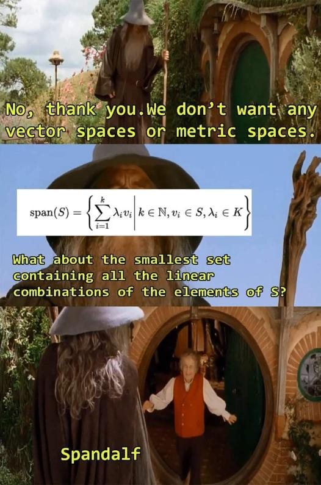

 

# Lineare Hülle

> [!important] [Definition 6.5](Koordinatenmatrix.md) **(b)** Sei $X$ ein $\mathbb{K}$-Vektorraum:
> 
> Sei $M \subset X, M \neq \emptyset$. Die Menge aller endlichen Linearkombinationen von Elementen aus $M$ heißt **lineare Hülle** von $M$ bezeichnet mit:
> $$
> \operatorname{lin}(M):=\left\{\sum_{i=1}^n \lambda_i v_i: n \in \mathbb{N}, \lambda_i \in \mathbb{K}, v_i \in M, i=1, \ldots, n\right\}
> $$
> 
> Dazu legen wir noch fest: $\operatorname{lin}(\emptyset):=\{0\}$
