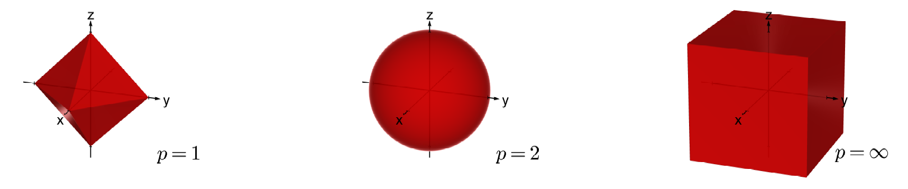

---
tags:
  - Axiome/Norm
  - tikz/pgfplot
aliases:
  - Definition 6.11
  - Satz 6.15
  - Parallelogrammgleichung
  - Cauchy-Schwarzsche Ungleichung
  - euklidsche Norm
  - euklidschen Norm
  - Normaxiome
keywords: 
subject:
  - VL
  - Mathematik 1
  - Signale und Systeme
semester: WS23
created: 28. September 2024
professor: 
axiome:
  - N1
  - N2
  - N3
---
 

# Norm

> [!quote] Wir haben bereits in $\mathbb{C}$ gesehen, dass man den [Betrag](Betrag.md) der komplexen Zahl $z=x+i y$ angeben kann, der in der Zahlenebene der Länge des Vektors $(x, y)$ entspricht. Dieser Betrag erfüllt die Dreiecksungleichung.
> 
> Es stellt sich nun die Frage, ob man auf allgmeinen Vektorräumen auch so einen **Abstandsbegriff** einführen kann. Das führt uns zu Normen.
> 

Der [Körper](../Algebraische%20Strukturen.md) $\mathbb{K}$ sei im Folgenden entweder $\mathbb{R}$ oder $\mathbb{C}$. Mit $|\cdot|$ bezeichnen wir jeweils den Betrag in $\mathbb{K}$ :


> [!important] **Definition 6.11** Sei $X$ ein $\mathbb{K}$-[Vektorraum](Algebra/Vektorraum.md). Eine Abbildung $\|\cdot\|: X \rightarrow \mathbb{R}_{0}^{+}$ heißt Norm auf $X$, falls folgende Bedingungen gelten:
> **(N1)** $\forall x \in X:\|x\|=0 \Longleftrightarrow x=0\quad$ (**[Definitheit](Algebra/Definitheit.md)**)
> **(N2)** $\forall x \in X,\, \forall \lambda \in \mathbb{K}:\|\lambda x\|=|\lambda|\|x\|\quad$ (**Homogenität**)
> **(N3)** $\forall x, y \in X:\|x+y\| \leq\|x\|+\|y\|\quad$ (**[Dreiecksungleichung](Betrag.md)**)
> 
> $(X,\|\cdot\|)$ heißt **normierter (Vektor-)Raum**.

## Euklidsche Norm

 Standardnorm im Euklidschen Raum $\mathbb{R}^2$ :

$$\|\mathbf{x}\|=\sqrt{x_1^2+x_2^2}$$

Erweiterung der Euklidschen Norm auf $\mathbb{R}^n$

$$\|\mathbf{x}\|=\sqrt{x_1^2+x_2^2+\ldots+x_n^2}$$

Der nächste Satz besagt, dass jeder [Prähilbertraum](Skalarprodukt.md) auch ein normierter Raum ist:

> !important] **Satz 6.15** Sei $(X,\langle\cdot, \cdot\rangle)$ ein Prähilbertraum. Dann ist $\|x\|:=\sqrt{\langle x, x\rangle}$ eine Norm auf $X$ und für alle $x, y \in X$ gilt:
> **(a)** Cauchy-Schwarzsche Ungleichung: $|\langle x, y\rangle| \leq\|x\| \cdot\|y\|$
> **(b)** Parallelogrammgleichung: $\|x+y\|^2+\|x-y\|^2=2\left(\|x\|^2+\|y\|^2\right)$
> - $\langle\cdot,\cdot \rangle$: [[Skalarprodukt]]

### Weitere Normen in $\mathbb{R}^n$

> [!summary] Betragssummennorm
> 
> $$ \|\mathbf{x}\|_1=\left|x_1\right|+\left|x_2\right|+\ldots+\left|x_n\right|$$
> 

$$\Downarrow$$

> [!summary] **$p$-Norm**
> 
> $$ \|\mathbf{x}\|_p=\left(\sum_{i=1}^n\left|x_i\right|^p\right)^{1 / p}$$
> 
> mit $p \geq 1$ und $p=2$ für die Standardnorm.

$$\Downarrow$$


 > [!summary] **[Maximumnorm](../Maximumsnorm.md)**
> 
> $$
> \|\mathbf{x}\|_{\infty}=\sup \left\{\left|x_1\right|,\left|x_2\right|, \ldots,\left|x_n\right|\right\}
> $$

# Geometrische Interpretation

> [!hint] Jede Norm hat ihre eigene **geometrische** Form im $\mathbb{R}^{2}$.

Wir betrachten die Definition der **Einheitsfläche** $S_p=\left\{\mathrm{x} \in \mathbb{R}^2:\|\mathbf{x}\|_p \leq 1\right\}$ für verschiedene $p$ mit $p \geq 1$.

```tikz
\usepackage{pgfplots}
\usepackage{tikz}
\usepackage{amsmath}
\pgfplotsset{compat=1.16}

\begin{document}
\begin{tikzpicture}

\begin{scope}
\begin{axis} [
    xmin=-1.5, xmax=1.5, ymin=-1.5, ymax=1.5,
    axis equal, axis lines=middle, title={\Large $p=1,\, \|x\|_1 \leq 1$}]
\draw[fill=gray, fill opacity=0.1, thick] (1,0) -- (0,1) -- (-1,0) -- (0,-1) -- (1,0);
\end{axis}
\end{scope}

\begin{scope}[xshift=10cm]
\begin{axis}[
    xmin=-1.5, xmax=1.5, ymin=-1.5, ymax=1.5,
    axis equal, axis lines=middle, title={\Large $p=2,\, \|x\|_2 \leq 1$}]
\addplot[fill=gray, fill opacity=0.1, thick, domain=0:2*pi] ({cos(deg(x))}, {sin(deg(x))});
\end{axis}
\end{scope}

\end{tikzpicture}
\end{document}
```


```tikz
\usepackage{pgfplots}
\pgfplotsset{compat=1.16}

\begin{document}
\begin{tikzpicture}

\begin{scope}
\begin{axis}[
    xmin=-1.5, xmax=1.5, ymin=-1.5, ymax=1.5,
    axis equal, axis lines=middle, title={\Large$p=4,\,\|x\|_4 \leq 1$}]
\draw[fill=gray, fill opacity=0.1, thick, rounded corners=1cm] (-1, -1) rectangle (1, 1) {};
\end{axis}
\end{scope}

\begin{scope}[xshift=10cm]
\begin{axis} [
    xmin=-1.5, xmax=1.5, ymin=-1.5, ymax=1.5,
    axis equal, axis lines=middle, title={\Large $p\to\infty,\, \|x\|_\infty \leq 1$}]
\draw[fill=gray, fill opacity=0.1, thick] (-1, -1) rectangle (1, 1) {};
\end{axis}
\end{scope}

\end{tikzpicture}
\end{document}
```


> [!hint] Jede Norm hat ihre eigene geometrische Form im $\mathbb{R}^{3}$.


Wir betrachten die Definition des **Einheitsvolumens** $S_p=\left\{\mathbf{x} \in \mathbb{R}^3:\|\mathbf{x}\|_p \leq 1\right\}$ für verschiedene $p$ mit $p \geq 1$.

