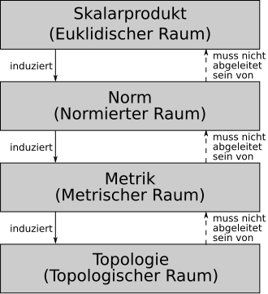

 

# Raum

Ein Raum ist eine Menge aus mathematischen Objekten mit einer **Struktur**. Ein zentrales Beispiel ist der Vektorraum

**Euklidischer Raum**

**[Normierter Raum](Norm.md)**

**[Metrischer Raum](Metrischer%20Raum.md)**