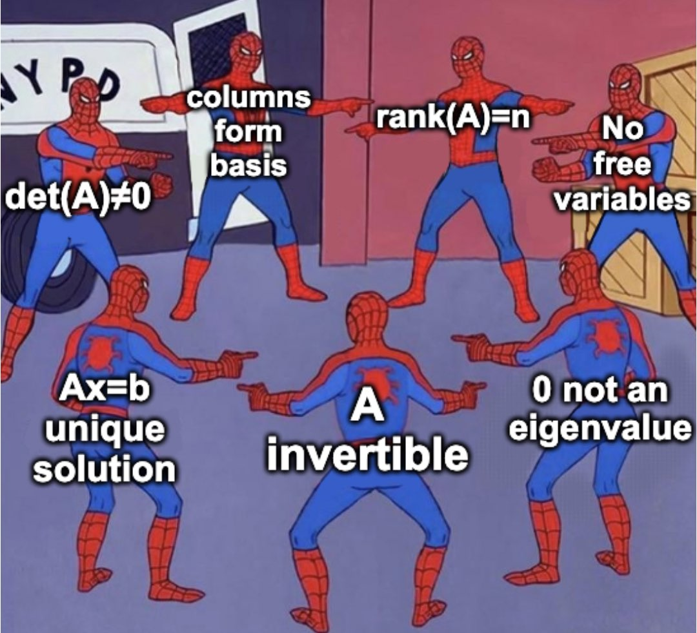

# Reguläre Matrizen

> [!question] [Matrix](Matrix.md), [Determinante](Determinante.md)

---

> [!def] Eine Matrix $\mathbf{M}$ heißt regulär. Folgende Aussagen dafür sind äquivalent:
> - $\det \mathbf{M} \neq 0$
> - Matrix ist invertierbar
> - Die Matrix hat vollen Rang
> - Es gibt keine linearen Abhängigkeiten innerhalt der Matrix
> - Transformation bewirkt, dass der Raum die Gleiche Dimension wie der Eingangsvektor hat.

