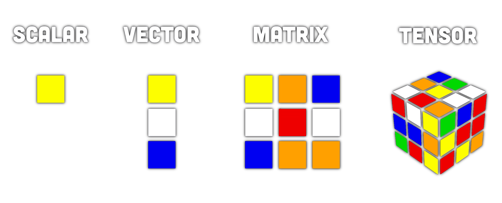

---
tags:
aliases:
  - Vektorrechnung
  - Vektoren
subject:
  - VL
  - Theoretische Elektrotechnik
created: 3rd May 2026
title: Vektor
semester: SS26
professor:
	- Bernhard Jakoby
release: false
---

# Vektoren

> [!def] **D)** Vektornotation
> 
> **Spaltenvektor**
> 
> $$
> \begin{align}
> \mathbf{w} && {(w_i)}_{i=0}^{p-1} && \begin{pmatrix}
> w_0 \\ w_1 \\ \vdots \\ w_{p-1}
> \end{pmatrix}
> \end{align}
> $$
> 
>   
> 
> **Zeilenvektor**
> 
> $$
> \begin{align}
> \mathbf{w}^{T} && {(w_j)}_{j=0}^{p-1} && \begin{pmatrix}
> w_0 & w_1 & \cdots & w_{p-1}
> \end{pmatrix}
> \end{align}
> $$
> 

Ein Vektor $\mathbf{v}$ ist ein Element, welches anstatt eines einzigen Zahlenwertes, aus mehreren Größen besteht. Ein Vektor kann interpretiert werden als:

- Punkt in einem Koordinatenssytem. *(Elemente sind die Koordinaten)*
- Pfeil mit einer Richtung und einer Länge
- Eine Liste *(genauer ein Tupel)*

Hierbei ist es wichtig, dass die Elemente nicht vertauscht werden können: $\begin{pmatrix}0\\1\end{pmatrix} \neq \begin{pmatrix}1\\0\end{pmatrix}$

## Physikalische Relevanz

> [!example] Wozu Vektoren? Darstellung Physikalischer Größen
> - **Skalare Größen:** Masse $m$, Dichte $\rho$, Temperatur $T$, Ladung $Q$, elektrisches Potenzial $\varphi$
> - **Vektorielle Größen:** Gerichtete physikalische Größen; Position $\mathbf{r}$, Geschwindigkeit $\mathbf{v}$, Elektrisches Feld $\mathbf{E}$

## Referenzen

- [Skalarprodukt](Skalarprodukt.md)
- [Matrix](Matrix.md)
- [Tensor](Tensor.md)
- [Vektor Basis](index.md)
- [Vektorfeld](../Analysis/Vektoranalysis/index.md)