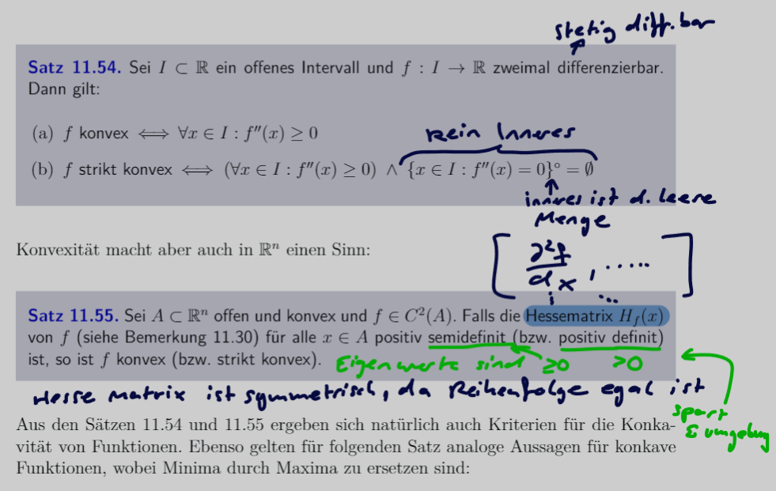

---
tags:
  - Kurvendiskussion
aliases:
  - Extremum
  - Extrema
  - Minimum
  - Maximum
  - Konvex
  - Konkav
  - Satz 11.57
  - Satz 11.56
keywords: 
subject:
  - VL
  - Mathematik 2
semester: SS24
created: 2. Oktober 2023
professor: 
cited:
---
 

# Extremwert

> [!important] Die Funktion $f(x)$ hat an der Stelle ein Maximum wenn gilt:
 >$$\dfrac{df(x_{0})}{dx} = 0 \text{ und } \dfrac{d^{2}f(x_{0})}{dx^{2}} < 0$$

> [!important] Die Funktion $f(x)$ hat an der Stelle ein Maximum wenn gilt:
> $$\dfrac{df(x_{0})}{dx} = 0 \text{ und } \dfrac{d^{2}f(x_{0})}{dx^{2}} > 0$$

Für den Allgemeinen Fall für Funktionen beliebiger Dimenion $A \in \mathbb{R}^{n}$.
Es gilt dass $f$ zwei mal Differnzierbar sein muss ($f\in C^{2}$)

> [!satz] **S1 - EXTR)** Sei $A \subset \mathbb{R}^n$ offen, $f \in C^2(A)$ und $x_0 \in A$:
> $$\operatorname{grad} f\left(x_0\right)=0$$
> Falls die Hessematrix $H_f\left(x_0\right)$ von $f$ an der Stelle $x_0$ *positiv* (**negativ**) definit ist, dann ist $x_0$ Stelle eines lokalen *Minimums* (**Maximums**) von $f$.
> - [Definitheit](../Algebra/Definitheit.md) der Hessenmatrix
> - [Gradient](Vektoranalysis/Gradient.md)

## Konvex / Konkav

# Beispiele

> [!example]- Bezeichne $c(t)$ die Konzentration eines Wirkstoffes im Blut $t$ Stunden nach der Injektion und gilt $c(t)=\frac{16 t}{(10 t+20)^2}$.
> Finden Sie die maximale Konzentration und den Zeitpunkt ihres Auftretens.
> 
> Erste Ableitung:
> 
> $$
> \begin{aligned}
> \frac{d c(t)}{d t} & =\frac{16 \cdot(10 t+20)^2-16 t \cdot(200 t+400)}{(10 t+20)^4} \\
> & =\frac{16}{(10 t+20)^2}-\frac{320 t}{(10 t+20)^3}
> \end{aligned}
> $$
> 
> Zweite Ableitung:
> 
> $$
> \begin{aligned}
> \frac{d^2 c(t)}{d t^2} & =-\frac{320}{(10 t+20)^3}-\frac{320(10 t+20)^3-320 t \cdot 30(10 t+20)^2}{(10 t+20)^6} \\
> & =-\frac{320}{(10 t+20)^3}-\frac{320}{(10 t+20)^3}+\frac{9600 t}{(10 t+20)^4} \\
> & =-\frac{640}{(10 t+20)^3}+\frac{9600 t}{(10 t+20)^4}
> \end{aligned}
> $$
> 
> Erste Ableitung gleich null
> 
> $$
> \frac{d c(t)}{d t}=0=\frac{16}{(10 t+20)^2}-\frac{320 t}{(10 t+20)^3} \Rightarrow \frac{16}{(10 t+20)^2}=\frac{320 t}{(10 t+20)^3}
> $$
> 
> $$
> \begin{aligned}
> 16(10 t+20)^3 & =320 t(10 t+20)^2 \\
> 160 t+320 & =320 t \\
> -160 t+320 & =0 \\
> t-2 & =0 \\
> t & =2
> \end{aligned}
> $$
> 
> In die zweite Ableitung einsetzen und Vorzeichen überprüfen
> 
> $$
> \frac{d^2 c(2)}{d t^2}=-\frac{1}{400}<0 \Rightarrow t=2 \text { ist ein Maximum }
> $$
> 
> Maximale Konzentration
> $$c(2) = 0.02$$