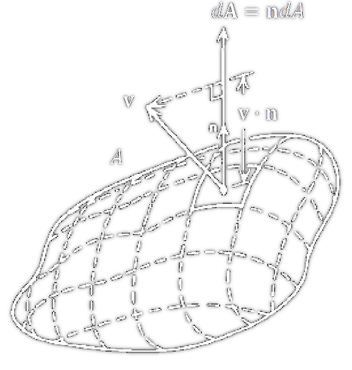

 

# Flächenintegral

Das in Zusammenhang mit der [Stromdichte](Stromdichte.md) auftretende Flächenintegral ist eine spezielle Form zur Berechnung eines so genannten Flusses.

Die vielleicht naheliegendste Form eines Flusses ist die [Strömung](../Physik/Strömung.md) einer Flüssigkeit. Das Strömungsfeld wird dabei durch das Geschwindigkeitsfeld der $\vec{v}$ [Strömung](../Physik/Strömung.md) beschrieben.

> [!question] Der Volumenstrom $\dot{V}$ einer Flüssigkeit durch eine gerichtete Fläche $\Delta \vec{A}$ ist dann gegeben durch $\vec{v} \cdot \Delta \vec{A}$ (Warum?)
> Das [innere Produkt](../Algebra/Skalarprodukt.md) sorgt dafür, dass nur der "passend" projizierte Flächenanteil gezählt wird.
> Zerlegt man eine Fläche in kleine Flächenelemente und summiert die einzelnen Beiträge, erhält man den Gesamtfluss durch die Fläche.

Da die [Geschwindigkeit](../../Physik/Kinematik.md) lokal variieren kann, wird der Ausdruck exakt, wenn die Flächenelemente gegen *null* gehen lässt- „[Integral](Integralrechnung.md)"

$$
\dot{V}=\lim _{\Delta A_i \rightarrow 0} \sum_i \vec{v} \cdot \Delta \vec{A}_i \quad=\quad\int_A \vec{v} \cdot d \vec{A}
$$

