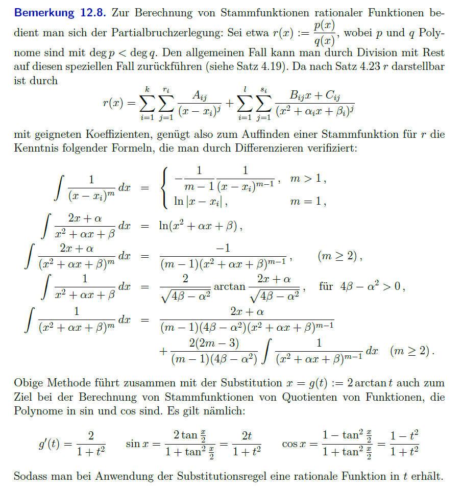
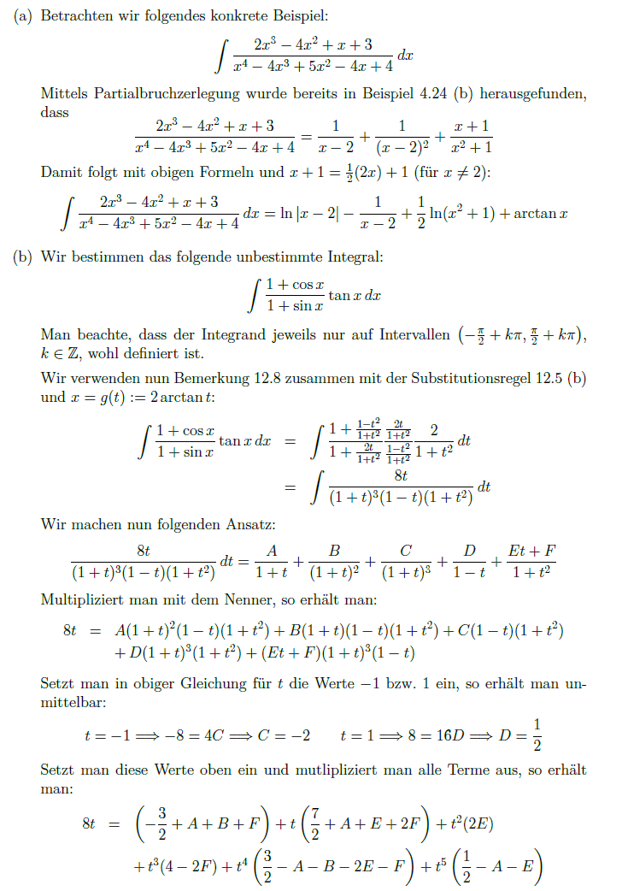
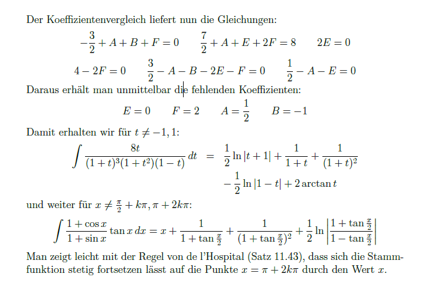

# Integralrechnung

- [Partielle Integration](Partielle%20Integration.md)
- [Integration durch Substitution](Integration%20durch%20Substitution.md)

## Unbestimmtes Integral

> [!INFO] Ermittlung der Stammfunktion  
> $F(x) = \int f(x) \, dx$

- Trigonometrische Substitution
- Integrieren von rationalen Polynomen $\to$ anwendung der [Partialbruchzerlegung](Partialbruchzerlegung.md)

> [!example]- Beispiel
> 
> 

### Stammfunktion Vektorwertiger Funktionen

$$
f(x,y,z) := \begin{pmatrix}
f_{1}(x,y,z) \\
f_{2}(x,y,z) \\
f_{3}(x,y,z)
\end{pmatrix}
$$

$$
F(x,y,z) =\int f \, d(x,y,z) = \int \begin{pmatrix}
f_{1} \\
f_{2} \\
f_{3}
\end{pmatrix} \, d (x,y,z)
$$
Auswertung mittels [Skalarprodukt](../Algebra/Skalarprodukt.md):

$$
\begin{align}
\int f_{1} \, dx = \dots+C(y,z) \\
\int f_{2} \, dy = \dots+C(x,z) \\
\int f_{3} \, dz = \dots+C(x,y) \\
\end{align}
$$

Anschließend Terme zusammenfassen: $\left( \int f_{1} \, dx \right)\,\cup\left( \int f_{2} \, dy \right)\,\cup\left( \int f_{3} \, dz \right)$
- Jeder Term kommt nur einmal vor
- Zusätzliche Terme sind in den Integrationskonstanten $C(\dots)$ enthalten

> [!example] Beispiel

## Bestimmtes Integral

- [Riemann-Integral](Riemann-Integral.md)

## Sätze und Folgerungen

- [Wegunabhängig](Wegunabhängig.md)

---

# Tags