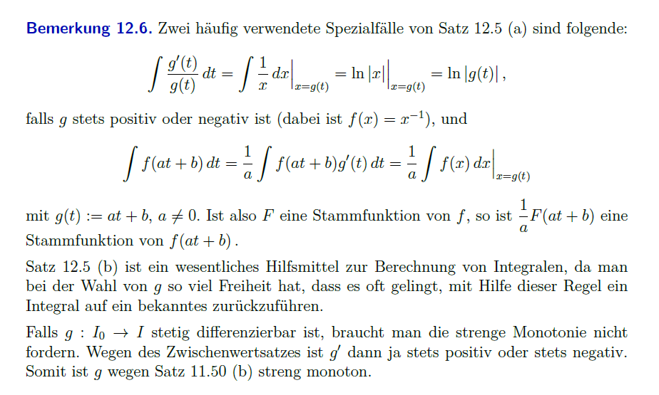

# Integration durch Substitution

> [!important] **Substitutionsregel**: Seien $I_0, I \subset \mathbb{R}$ Intervalle, $g: I_0 \rightarrow I$ differenzierbar und $f: I \rightarrow \mathbb{R}$.
> **(a)** $F$ sei Stammfunktion von $f$. Dann ist $F \circ g$ eine Stammfunktion von $(f \circ g) g^{\prime}$, also:
> $$\left.\int f(x) d x\right|_{x=g(t)}=\int f(g(t)) g^{\prime}(t) dt$$
> **(b)** Sei $g$ streng monoton, $g\left(I_0\right)=I, g^{\prime}(t) \neq 0$ für alle $t \in I_0$ und $(f \circ g) g^{\prime}$ besitze auf $I_0$ eine Stammfunktion $\varphi$.
> Dann existiert $g^{-1}: I \rightarrow I_0$ und $\varphi \circ g^{-1}$ ist Stammfunktion für $f$ auf $I$, also:
> $$\int f(x) d x=\left.\int f(g(t)) g^{\prime}(t) d t\right|_{t=g^{-1}(x)}$$

> [!success]- Beweis:
(a) Die Aussage folgt unmittelbar aus der Kettenregel, da:
> 
> $$
> (F \circ g)^{\prime}(t)=F^{\prime}(g(t)) g^{\prime}(t)=f(g(t)) g^{\prime}(t)
> $$
> 
> (b) Die Existenz von $g^{-1}: I \rightarrow I_0$ folgt aus Satz 9.33. Nach Satz 11.16 ist $g^{-1}$ differenzierbar, und es gilt für alle $x \in I:\left(g^{-1}\right)^{\prime}(x)=\left(g^{\prime}\left(g^{-1}(x)\right)\right)^{-1}$. Da $\varphi$ nach Voraussetzung differenzierbar ist, ist $\varphi \circ g^{-1}$ differenzierbar und es gilt für alle $x \in I$ :
> 
> $$
> \left(\varphi \circ g^{-1}\right)^{\prime}(x)=\varphi^{\prime}\left(g^{-1}(x)\right)\left(g^{-1}\right)^{\prime}(x)=f\left(g\left(g^{-1}(x)\right)\right) \frac{g^{\prime}\left(g^{-1}(x)\right)}{g^{\prime}\left(g^{-1}(x)\right)}=f(x)
> $$

## Nützliche Folgerungen

$$
\begin{aligned}
\int \sin^{n}(t) \cos (t) \,dt=\frac{1}{n+1} \sin^{n+1}(t)\qquad g(x):= \sin(t)\\
\int \cos^{n}(t) \sin (t) \,dt=-\frac{1}{n+1} \cos^{n+1}(t)\qquad g(x):= \cos(t)
\end{aligned}
$$
---

# Beispiele

