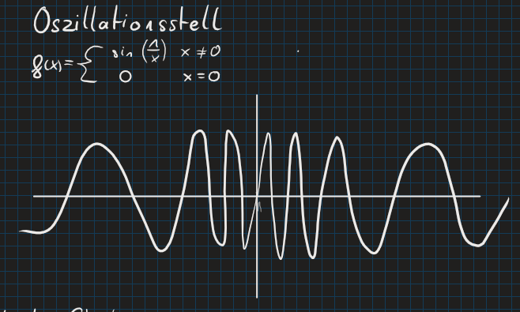

---
tags:
  - Mathe
  - Kurvendiskussion
aliases:
  - Oszillationsstelle
created: 30th August 2023
title: Polstelle
---

# Polstelle

$x$-Wert an dem $f(x)$ unbestimmt ist.

>[!EXAMPLE] Beispiel:  
> $f(x)=\dfrac{1}{x}\rightarrow x_{pol}=0$

# Oszillationsstelle

