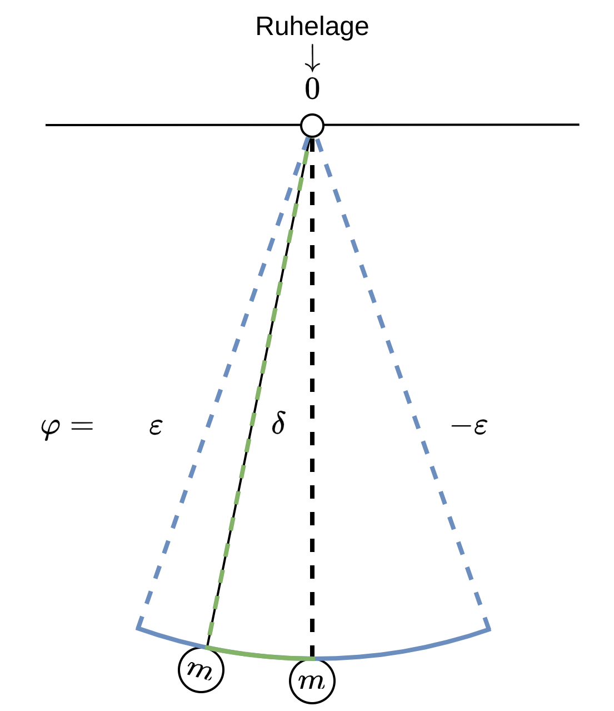

 

# Stabilität nach Ljapunov

Hier sind Wir daran Interessiert, wie sich zwei Lösungen einer DGL, welche sich durch leicht unterschiedliche Anfangswerte $(t_{0},x_{0})$ unterscheiden, im Grenzwert $x\to \infty$ verhalten.

Wir bringen ein $\varepsilon$ und ein $\delta$ ins spiel, sodass zwei bedinungen erfüllt sind:

- $\varepsilon$ ist eine Zahl die uns ein Gebiet abschränkt. 
- das $\delta$ ist der Anfangswert.

Wir starten bei einer abweichung $\delta$ von der Ruhelage und bleiben im Gebiet $\varepsilon$, für jedes $\delta$ muss es ein solches gebiet geben, dass die Lösung stabil ist, das hießt im Grenzwert nahe der Ruhelage ist.

> [!example] Pendel
> Pendel hat zwei ruhelagen:
> - Ruhelage unten ist stabil
> - Ruhelage oben ist instabil. Eine kleine Abweichung eskaliertdas System
>     - Das Pendel kehrt nicht mehr in die Ursprüngliche Ruhelage zurück, verlässt also das $\varepsilon$ Gebiet der Phase des Pendels
> 

| **Stabil**                                                                                                                                     | **Attrahierend**                                                                                                        | **Asymptotisch Stabil** Stabil & Attrahierend                                                        |
| ---------------------------------------------------------------------------------------------------------------------------------------------- | ----------------------------------------------------------------------------------------------------------------------- | ------------------------------------------------------------------------------------------------------- |
| Die Differenz bleibt für alle $t$ innerhalb einer Grenze $\varepsilon$, wenn man nur um einen kleinen Abstand $\delta$ vom Startwert abweicht. | Die Differenz geht für $t \to \infty$ gegen $0$, wenn man nur um einen kleinen Abstand $\delta$ vom Startwert abweicht. | Die Differenz überschreitet den kleinen $\delta$ des Startwertes nicht und geht für $t \to 0$ gegen $0$ |
|                                                                                                      |                                                                                 |                                                          |

> [!def] **D1 - LJAP)** 