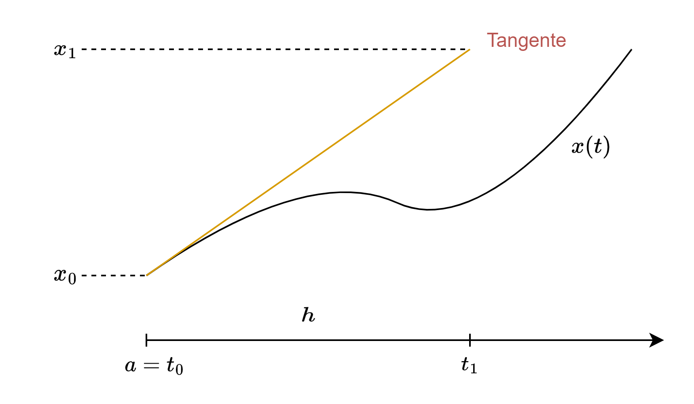

 

# Numerische DGL

> [!quote] Wozu Numerische Verfahren?
>  Bei nichtlinearen Gleichungen stößt man sehr bald an Grenzen. Schon für einfach aussehende Gleichungen, wie z.B.
> 
> $$x^{\prime}=t-x^2 \quad \text { oder } \quad x^{\prime \prime}=6 x^2+t$$
> 
> lässt sich die Lösung nicht mehr mit Hilfe elementarer Funktionen darstellen.
> 
> Man braucht daher Näherungsmethoden. Dabei unterscheidet man zwischen **analytischen** und **numerischen** Näherungsverfahren.
> 
> Ein analytisches Verfahren:
> - Aus dem Satz von Lindelöf: [Sukzessive Approximation](../sukzessive%20Approximation.md).
> - Falls die Funktion $f$ in der der [AWP](../{MOC}%20DGL.md) höher differenzierbar ist, kann man auch mit Hilfe der Taylorentwicklung weitere Näherungsverfahren herleiten.
> 
> Was die Rechengeschwindigkeit für große Systeme betrifft, haben sich im computerbasierten numerischen Rechnen sogenannte **Diskretisierungsverfahren** durchgesetzt.
> - Das Grundprinzip dieser Verfahren besteht darin, dass das *unendlich* dimensionale Problem der Bestimmung von Funktionen in eine *endlich* dimensionale Aufgabe transformiert wird: die Berechnung von [Vektoren](Vektor.md) mit reellwertigen Komponenten.
> - Das einfachste Verfahren dieser Art ist das Euler-Verfahren. 
> 
> Im Folgenden werden Verfahren für Anfangswert-, Randwert- und Eigenwertprobleme definiert.
> 

## Diskretisierungsverfahren

Zeitintervall $[a, b]$ auf dem man sich die Lösung ausrechnen möchte wird in $N$ Teilintervalle unterteilt. 

> [!info] **Äquidistande Diskretisierung**: Man nimmt sich also endlich viele Punkte und berechnet sich an diesen Punkten eine Näherungslösung berechnet:
> 
> **Intervall**: $I=[a,b], t \in I$
> **Diskretisierung** (äquidistand):
> 
> 
> Das intervall wird also in gleiche Teile mit der länge $h$ unterteilt. Der letzte Teil ist jedoch möglicherweise kleiner, da $N$ nicht unbedingt durch $h$ teilbar ist.
> Der Abbildung kann man entnehmen, dass:
> $$\boxed{ t_{k}=t_{k-1}+h\iff t_{k}=t_{0}+kh }$$

> [!hint] **Vorraussetzung:** Eindeutige Lösbarkeit
>  Wir nehmen an: das [AWP](../{MOC}%20DGL.md)
>  $$x^{\prime}=f(t, x), \quad x\left(t_0\right)=x_0\tag{AWP}$$
> ist eindeutig lösbar in $I$ für alle $t_0 \in I$ und $x_0 \in \mathbb{R}^m$ mit $f \in C\left(I \times \mathbb{R}^m, \mathbb{R}^m\right), \quad I:=[a, b], \quad a<b$.

Wir möchten näherungen $x_{k}$ für $x(t_{k})$ berechnen

> [!info] Euler-Verfahren (EV)
> 
>  
> $$
> \begin{gathered}
> x_{1} = x_{0}+h\cdot x'= x_{0}+h\cdot f(t_{0}, x_{0}) \\
> \dots \\
> \boxed{ x_{k} = x_{k-1} + h\cdot f(t_{k-1}, x_{k-1}) }
> \end{gathered}
> $$

## Explizite Einschrittverfahren

Das sogenannte **expliziten Einschrittverfahren** verallgemeinert die Funktion $f(t_{k-1}, x_{k-1})$ zu einer **Verfahrensfunktion** $\phi$.

> [!important] **ESV D1):** Definition des expliziten Einschrittverfahrens
> 
> Ein ESV Erzeugt eine Gitterfunktion nach der Vorschrift:
> $$x_{k} = x_{k-1} + h\cdot \underbrace{ \phi(t_{k-1}, x_{k-1}, h) }_{ \text{Verfahrensfunktion} }\tag{ESV}$$
>    
> (beim Euler-Verfahren ist $\phi(t, x, h) = f(t,x)$)
> Je Kleiner die Schrittweite $h$, desto genauer ist die Approximation. Jedoch ist der Rechenaufwand größer.

Man möchte wissen, wie gut die Approximation ist und ob Konvergenz gegen die exakte Lösung vorliegt, wenn die Schrittweite $h$ gegen 0 geht.

Der Fehler $x\left(t_k\right)-x_k$ setzt sich kumulativ aus den Einzelfehlern der vorherigen Schritte zusammen und ist daher einer direkten Bestimmung nicht zugänglich.

Daher wird in einem ersten Schritt den Fehler an der Stelle $t_k$ nach nur einem Schritt des ESV mit dem Startwert $x\left(t_{k-1}\right)$ an der Stelle $t_{k-1}$ und zwar den zwischen der exakten Fortschreiterichtung und der durch die Verfahrensfunktion $\phi$ vorgegebenen:

### Lokaler Diskretisierungsfehler

> [!important] **LDF D2):** Definition des lokalen Diskretisierungsfehlers
> 
> Es gilt die **Eindeutige Lösbarkeit** des AWP und $\phi$ sei wie beim **ESV**
> 
**(i)** Der lokale Diskretisierungsfehler des ESV an der Stelle $t_k$ lautet
> 
> $$\tau_k:=\frac{x\left(t_k\right)-x\left(t_{k-1}\right)}{h}-\phi\left(t_{k-1}, x\left(t_{k-1}\right), h\right), \quad k=1, \ldots, N\tag{LDF}$$
> 
> **(ii)** Das ESV heißt konsistent mit dem AWP, wenn
> 
> $$\lim _{h \rightarrow 0} \max _{1 \leq k \leq N}\lVert\tau_k\rVert=0$$
> 
> **(iii)** Die Konsistenzordnung ist $q \in \mathbb{N}$, wenn gilt:
> $$\max _{1 \leq k \leq N}\left\|\tau_k\right\|=O\left(h^q\right)\quad \text{ für } h\to 0$$
> 
> > [!info]- Erläuterung
> > 1. Der lokale Diskretisierungsfehler ist die Differenz zwischen der exakten Lösung und der Näherungslösung des ESV.
> > 2. Die Konsistenz ist gegeben wenn alle Diskretisierungsfehler ([Maximumnorm](../Maximumsnorm.md) des Fehlervektors) gegen 0 konvergieren,
> > wenn die Schrittweite $h$ gegen $0$ [konvergiert](Grenzwert.md).
> > 3. Ist der Größte Fehler ist von der Ordnung $O(h^q)$ Dann heißt $q$ Konvergenzordnung.
> > Die Konsistenzordnung ist ein maß, wie schnell der Diskretisierungsfehler gegen 0 konvergiert,
> > falls das ESV konsistent ist. (Konvergenzgeschwindigkeit)
> 

> [!important] **ORD D3):** Definition der Ordnung $O(h^{q})$: 
> $$\exists C>0\, \exists h_{0}\!>0\,\forall h\leq h_{0}: \lVert \tau \rVert_{\infty}\leq C h^q $$
> Es gibt eine Konstante $C>0$ und eine Kleine Zahl $h_{0}>0$, die hinreichend nahe bei Null ist, sodass für alle $h$ die kleiner sind als $h_{0}$, gilt, dass der Maximale Fehler $\lVert \tau \rVert_{\infty}$ auf keinen Fall schneller wächst als $C h^q$.
> 
> > [!info]- Erläuterung
> > Je höher das $q$ ist, desto schneller Konvergiert der Fehler gegen 0.
> > $$\iff \lim_{ h \to 0 }\operatorname{sup} \frac{\lVert \tau \rVert_{\infty}}{h^{q}}<\infty  $$
> > $\lVert \tau \rVert_{\infty}$ fällt nicht schwächer ab als $h^{q}$ für $h \to 0$.
> > $\lVert \cdot \rVert_{\infty}\iff \underset{ 1\leq k\leq N }{ \max }\lVert \cdot \rVert$: Ist die[ Maximumsnorm](../Maximumsnorm.md)

> [!question] Was passiert, wenn beim **LDF** $h\to 0$ geht? 
> 
> Durch die **Äquidistande Diskretisierung** lässt sich der Linke Term des LDF schreiben wie:
> 
> $\underset{ h\to 0 }{ \lim }\dfrac{x(t +h)-x(t)}{h}\overset{ (*) }{ = }x'(t)=f(t,x(t))\quad$ $(*)\dots$ Definition der [Ableitung](Differenzialrechnung.md) und $f$ wie im [AWP](../{MOC}%20DGL.md)
> 
> Für die **Verfahrensfunktion** $\phi$ gilt:
> 
> $\underset{ h \to 0 }{ \lim } \phi(t,x(t),h) = \phi(t,x(t),0)\quad$ wenn $\phi$ stetig ist.
> 
> > [!success] Daraus folgt das für stetige $f$ das **ESV** konsistent ist, genau dann wenn:
> > $$\boxed{ \phi(t,x(t),0)=f(t,x(t)) }$$ 

#### Beispiel am Euler-Verfahren

>[!example]

### Globaler Diskretisierungsfehler

Beim LDF wird nur der Fehler vom $k-1$-ten Schritt zum $k$-ten Schritt betrachtet, nicht jedoch der bereits aus vorherigen Schritten entstandener Fehler.

> [!important] **GDF D4)** Es gilt die Vorraussetzung zur Eindeutigen Lösbarkeit des AWP und $\phi$ sei wie in 
**(i)** Der globale Diskretisierungsfehler des ESV (13.2) an der Stelle $t_k$ lautet

$$
e_k:=x\left(t_k\right)-x_k, \quad k=1, \ldots, N .
$$

**(ii)** Das ESV heißt konvergent, wenn

$$
\lim _{h \rightarrow 0} \max _{1 \leq k \leq N}\left\|e_k\right\|=0
$$

**(iii)** Die Konvergenzordnung ist $q \in \mathbb{N}$, wenn gilt:

$$
\max _{1 \leq k \leq N}\left\|e_k\right\|=O\left(h^q\right) .
$$
